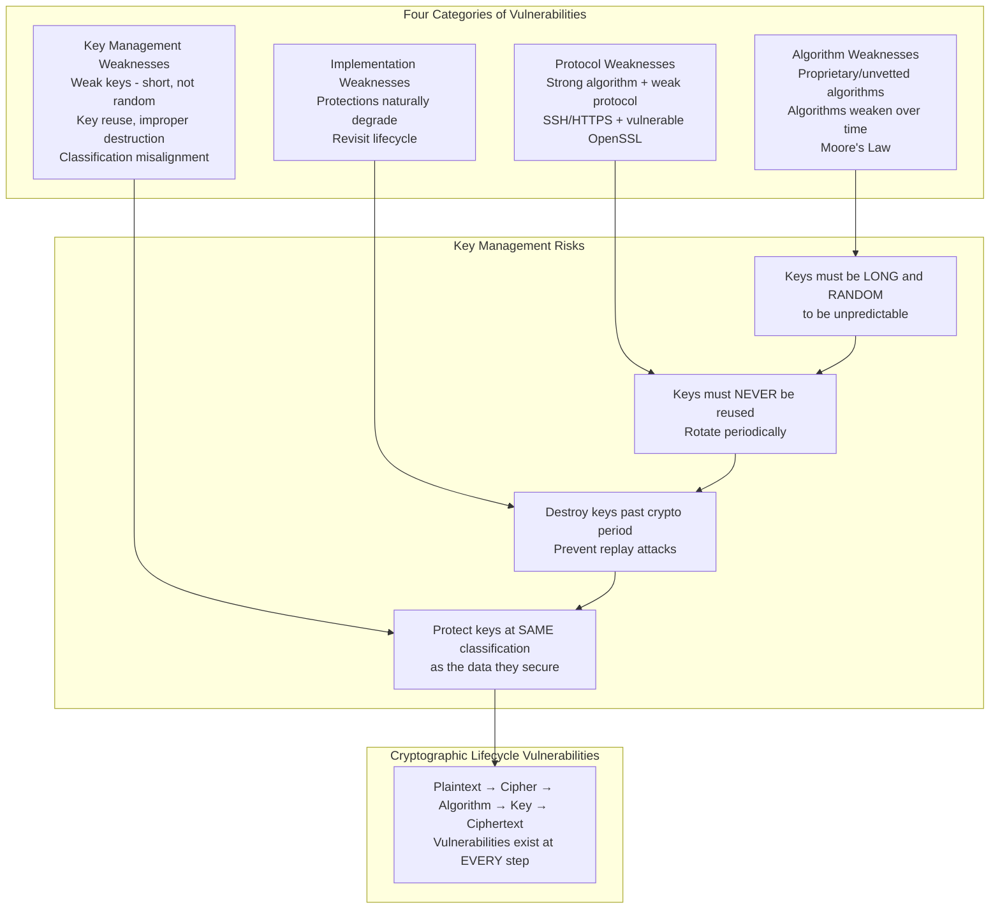
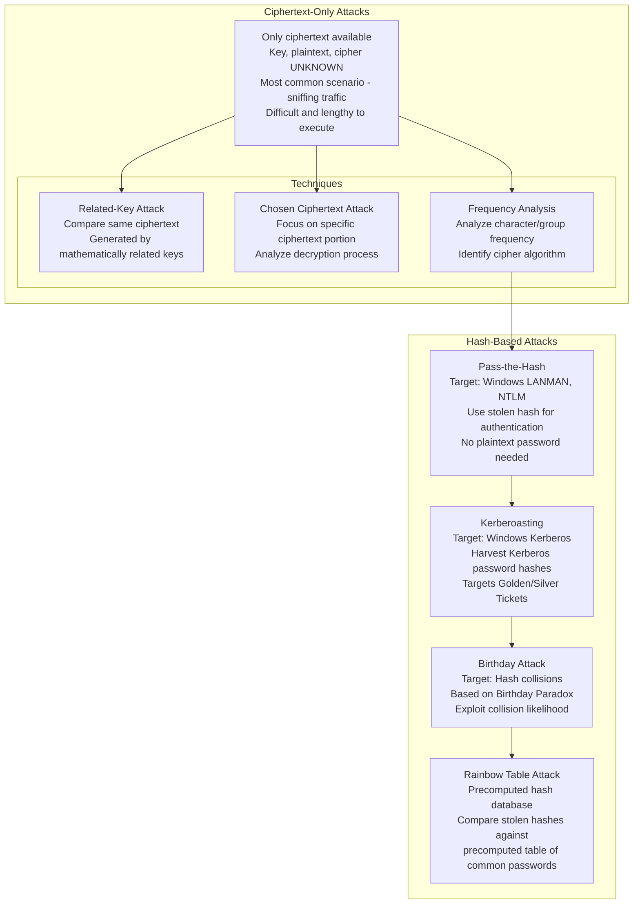
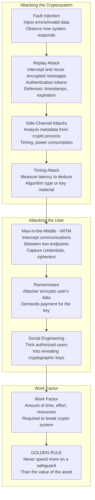
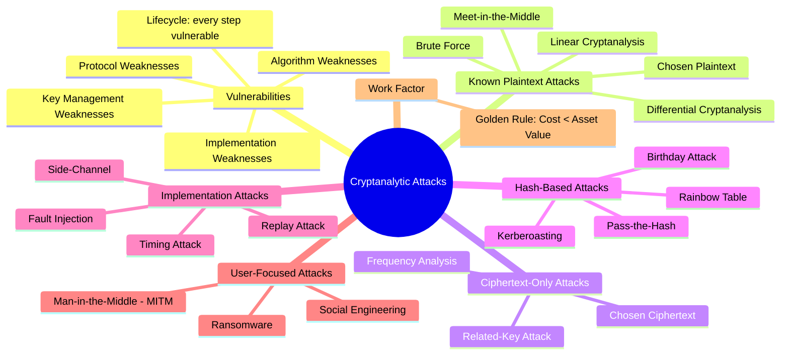

### Video V97: Vulnerabilities in Cryptographic Systems



---

### Video V98: Cryptanalytic Attacks Part I (Known Plaintext, Brute Force)

```mermaid
graph TD
    subgraph Goal
        Goal[Compromise cryptographic system<br/>Discover the encryption KEY]
    end

    subgraph Attack Vectors
        Vectors[Plaintext | Ciphertext | KEY 🎯 | Algorithm/Cipher]
    end

    subgraph Known Plaintext Attacks
        BF[Brute Force Attack<br/>Try every possible combination<br/>Eventually successful with time/resources]
        LC[Linear Cryptanalysis<br/>Linear math equations<br/>Statistical analysis of cipher]
        MITM[Meet-in-the-Middle Attack<br/>Targets ciphers with multiple rounds<br/>Encrypt/decrypt with every key to find match]
    end

    subgraph Chosen Plaintext Attacks
        CPA[Select specific portion of plaintext<br/>to encrypt and analyze<br/>Reduces analysis time]
    end

    subgraph Differential Cryptanalysis
        DC[Analyze differences in ciphertext outputs<br/>Based on changes in input<br/>Bits of key or plaintext<br/>Best used with Chosen Plaintext]
    end

    Goal --> Vectors
    Vectors --> BF
    BF --> LC
    LC --> MITM
    MITM --> CPA
    CPA --> DC
```

---

### Video V99: Cryptanalytic Attacks Part II (Ciphertext-Only, Hash Attacks)



---

### Video V100: Cryptanalytic Attacks Part III (Implementation Attacks)



---

### Bonus: Session 13 Complete Attack Map

