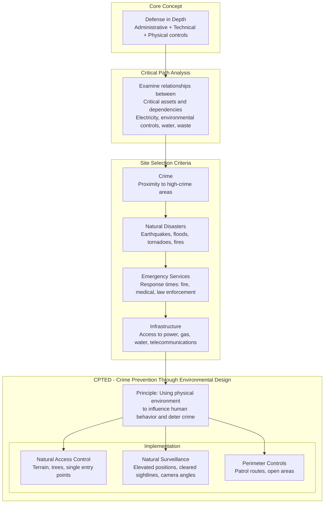
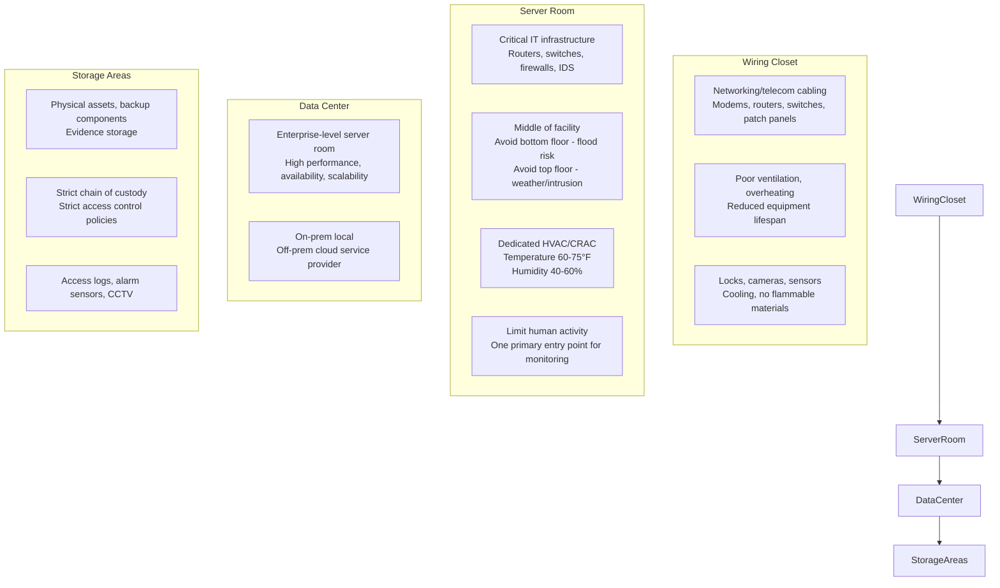
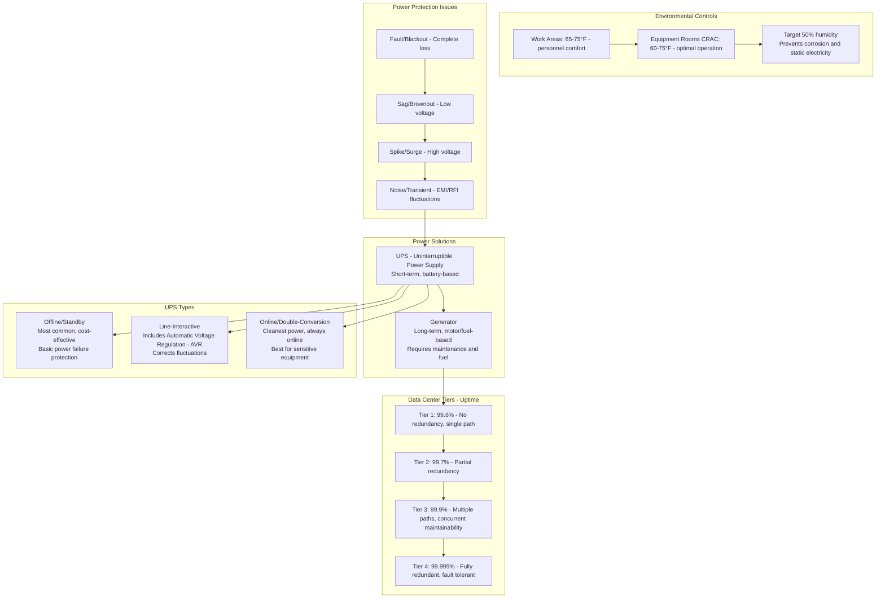
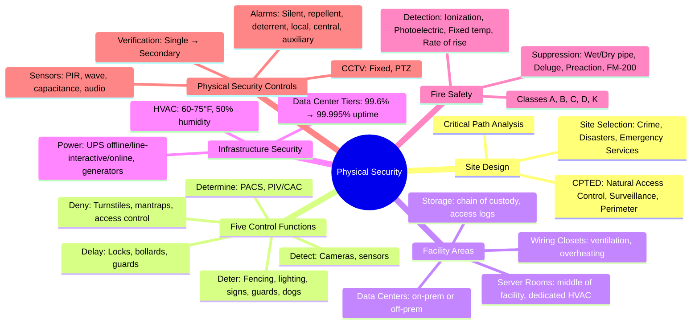

### Video V102: Site Design Principles (CPTED, Critical Path Analysis)



---

### Video V103: Facility Design Principles (Deter, Deny, Detect, Delay)

```mermaid
graph TD
    subgraph Five Control Functions
        Deter[Deter - Discourage violations<br/>Fencing 3-4ft casual, 6-7ft most, 8+ft barbed wire<br/>Lighting 2 foot candles, signs, guards, dogs]
        
        Deny[Deny - Prevent access<br/>Turnstiles, mantraps, access control systems]
        
        Detect[Detect - Identify violations<br/>Cameras: fixed, PTZ<br/>Sensors: infrared, wave pattern, heat<br/>Photoelectric, audio, capacitance, PIR]
        
        Delay[Delay - Slow down violations<br/>Barbed wire, locks, bollards, guards]
        
        Determine[Determine & Decide - Analyze & respond<br/>PACS - Physical Access Control System<br/>PIV/CAC cards]
    end

    subgraph Key Mechanisms
        Turnstile[Turnstile<br/>One person at a time after authentication]
        Mantrap[Mantrap - Two interlocking doors<br/>Prevents piggybacking (with knowledge)<br/>Prevents tailgating (without knowledge)]
        Bollards[Bollards<br/>Prevent vehicle ramming]
    end

    subgraph Access Control Software
        ACS[Aggregates monitor points<br/>Card readers, cameras, locks, sensors<br/>GUI with audit trails]
    end

    Deter --> Deny --> Detect --> Delay --> Determine
    Deny --> Turnstile
    Deny --> Mantrap
    Delay --> Bollards
    Determine --> ACS
```

---

### Video V104: Facility Security Controls (Wiring Closets → Data Centers)



---

### Video V105: Facility Infrastructure Security (HVAC, Power, UPS Types)



---

### Video V106: Fire Prevention, Detection, and Suppression

```mermaid
graph TD
    subgraph Priorities
        P1[Primary: Protect HUMAN LIFE<br/>Health, safety, safe exit]
        P2[Secondary: Protect system assets]
    end

    subgraph Fire Triangle
        Triangle[To stop a fire, eliminate one of:<br/>OXYGEN 🔥 HEAT 🔥 FUEL]
    end

    subgraph Fire Classes
        A[Class A: Common combustibles<br/>Wood, paper, cloth<br/>Agent: Water, Soda Acid]
        B[Class B: Flammable liquids<br/>Gasoline, oil<br/>Agent: CO₂, Halon substitute]
        C[Class C: Electrical fires<br/>Motors, appliances<br/>Agent: CO₂, Halon substitute - inert gas]
        D[Class D: Combustible metals<br/>Magnesium, titanium<br/>Agent: Dry Powder - ONLY option]
        K[Class K: Commercial kitchens<br/>Fats, greases]
    end

    subgraph Detection Methods
        Ion[Ionization Smoke Detector<br/>Radioisotopes, charged plates disruption]
        Photo[Photoelectric Smoke Detector<br/>Light source, trips when smoke interferes<br/>MOST COMMON]
        Fixed[Fixed Temperature Detector<br/>Activates at specific temperature]
        Rate[Rate of Rise Detector<br/>Activates on rapid temperature increase]
    end

    subgraph Suppression Systems
        Wet[Wet Pipe - Water always in pipes<br/>Immediate discharge]
        Dry[Dry Pipe - Compressed air holds water back<br/>Fills upon activation - for freezing areas]
        Deluge[Deluge - Large water volume rapidly<br/>Industrial/work areas - NOT for electronics]
        Preaction[Preaction - Dry/wet hybrid<br/>Two triggers required<br/>BEST FOR Data centers, server rooms]
        
        Halon[Halon - Legacy, effective<br/>Banned - ozone depletion]
        FM200[FM-200 HFC-227ea<br/>Most common Halon replacement]
    end

    subgraph Prevention
        Prev[Non-combustible, fire-resistant materials<br/>Solid-core, fire-rated doors<br/>Personnel training: evacuation, extinguishers]
    end

    P1 --> P2 --> Triangle
    Triangle --> A --> B --> C --> D --> K
    K --> Ion --> Photo --> Fixed --> Rate
    Rate --> Wet
    Wet --> Dry
    Dry --> Deluge
    Deluge --> Preaction
    Preaction --> Halon
    Halon --> FM200
    FM200 --> Prev
```



---

### Video V107: Physical Security Controls (Intrusion Detection, Alarms, CCTV)

```mermaid
graph TD
    subgraph Detection Sensors
        ActiveIR[Active Infrared<br/>Changes in infrared light patterns]
        PIR[Passive Infrared - PIR<br/>Changes in ambient temperature/heat<br/>MOST COMMON]
        Wave[Wave Pattern<br/>Ultrasonic low or microwave high wave changes]
        Capacitance[Capacitance/Proximity<br/>Changes in electric or magnetic fields]
        PhotoElec[Photoelectric<br/>Changes in visible light]
        Audio[Passive Audio<br/>Sound changes - glass break detectors]
    end

    subgraph Alarm Systems
        Silent[Notification - Silent<br/>Sends alert without notifying intruder<br/>Bank panic button]
        Repellent[Repellent<br/>Activates loud sirens, bells, or lights]
        Deterrent[Deterrent<br/>Activates barriers - gates, locks<br/>Traps intruder]
        Local[Local Alarm<br/>Loud audible alarm at facility only<br/>~400 ft range]
        Central[Central Station<br/>Remotely monitored<br/>Station contacts law enforcement]
        Auxiliary[Auxiliary<br/>Directly notifies emergency services]
    end

    subgraph CCTV Systems
        Fixed[Fixed Camera<br/>Constant view of specific area]
        PTZ[PTZ - Pan, Tilt, Zoom<br/>360-degree view<br/>Zoom on specific targets]
    end

    subgraph Verification Process
        Single[Single Verification<br/>Alert from monitor point<br/>Sensor or failed badge]
        Secondary[Secondary Verification<br/>Use another mechanism - PTZ camera<br/>Confirm alert is real violation<br/>Reduces false positives]
    end

    PIR --> ActiveIR
    ActiveIR --> Wave
    Wave --> Capacitance
    Capacitance --> PhotoElec
    PhotoElec --> Audio
    Audio --> Silent
    Silent --> Repellent
    Repellent --> Deterrent
    Deterrent --> Local
    Local --> Central
    Central --> Auxiliary
    Auxiliary --> Fixed
    Fixed --> PTZ
    PTZ --> Single
    Single --> Secondary
```



---

### Bonus: Session 14 Complete Concept Map

