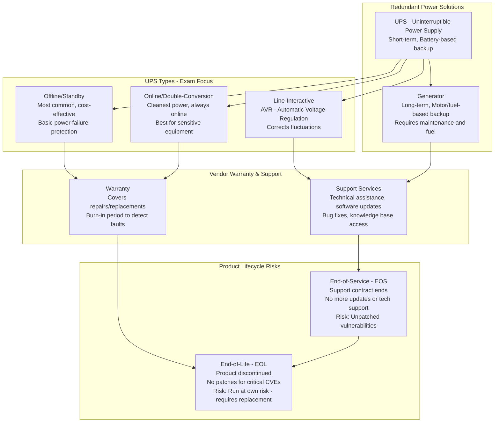
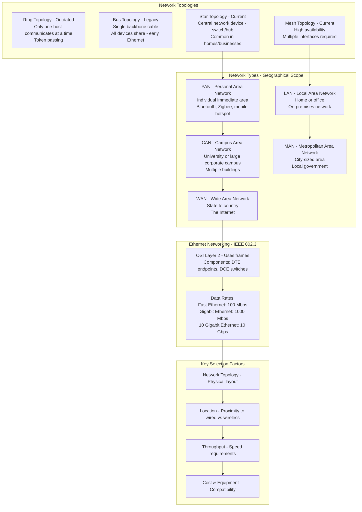
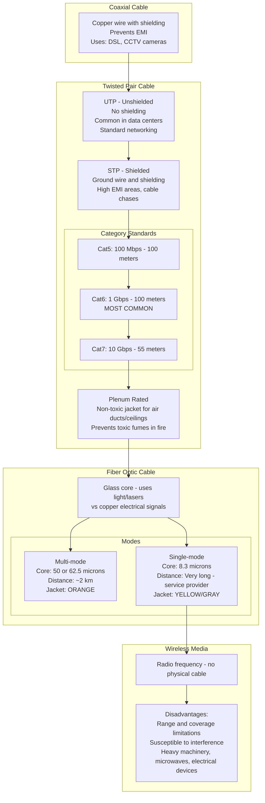
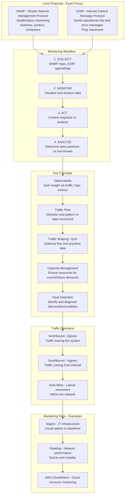
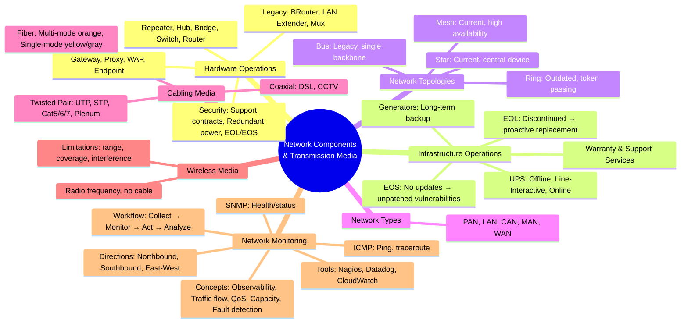

### Video V109: Hardware Operations (Routers, Switches, Gateways, etc.)

```mermaid
graph TD
    subgraph Core Hardware Components by OSI Layer
        Repeater[Repeater - Layer 1<br/>Re-energizes signals to extend distance]
        Hub[Hub - Layer 1<br/>Multi-port repeater<br/>Floods traffic to all ports]
        Bridge[Bridge - Layer 2<br/>Connects two network segments<br/>Same protocol - store and forward]
        Switch[Switch - Layer 2<br/>Intelligent hub<br/>Forwards traffic by MAC address]
        Router[Router - Layer 3<br/>Manages between networks<br/>IP addresses, route tables]
        Gateway[Gateway - Layers 6-7<br/>Protocol translator<br/>Connects different protocols]
        Proxy[Proxy - Mediates requests<br/>Verifies and forwards without translation<br/>NAT]
        WAP[WAP - Layer 2/3<br/>Connects devices to wireless network]
        Endpoint[Endpoint<br/>Originates or terminates communications<br/>Computers, servers, printers, IoT]
    end

    subgraph Legacy Devices - Exam Focus
        BRouter[BRouter - Bridge + Router<br/>Attempts routing first, then bridging]
        LANExt[LAN Extender<br/>Connects remote segments over WAN]
        Mux[Multiplexer - Mux<br/>Combines signals for transmission<br/>Over single medium]
    end

    subgraph Hardware Security Considerations
        Support[Support Contracts<br/>Priority support, engineering expertise<br/>Fast parts replacement]
        Redundant[Redundant Power<br/>UPS short-term, Generator long-term]
        EOL[End-of-Life - EOL<br/>Product no longer licensed/functional]
        EOS[End-of-Service - EOS<br/>No updates, patches, or vendor support]
    end

    Repeater --> Hub
    Hub --> Bridge
    Bridge --> Switch
    Switch --> Router
    Router --> Gateway
    Gateway --> Proxy
    Proxy --> WAP
    WAP --> Endpoint
    
    Endpoint --> BRouter
    BRouter --> LANExt
    LANExt --> Mux
    Mux --> Support --> Redundant --> EOL --> EOS
```

---

### Video V110: Network Infrastructure Operations (Redundant Power, Warranty, EOL/EOS)

---

### Video V111: Transmission Media Part I (Topologies, Network Types)

---

### Video V112: Transmission Media Part II (Cabling: Coax, Twisted Pair, Fiber)

---

### Video V113: Network Monitoring (SNMP, ICMP, QoS)

---

### Bonus: Session 15 Complete Concept Map

