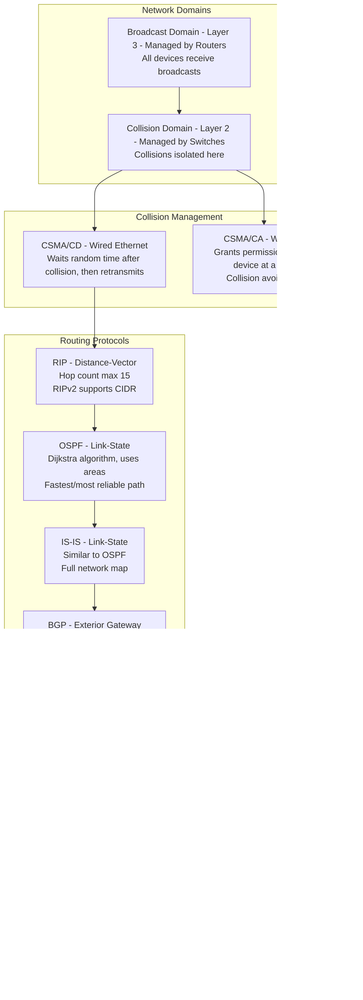
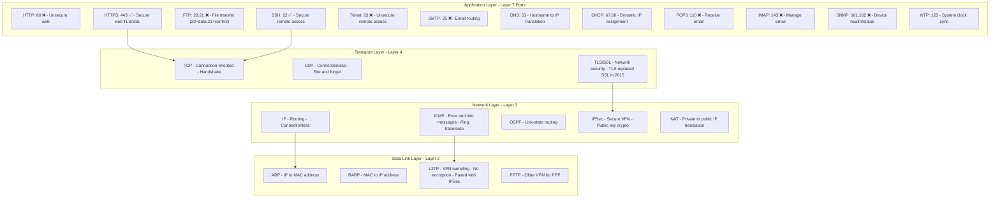
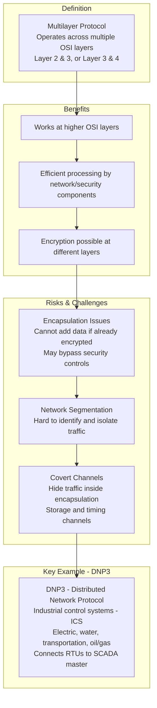
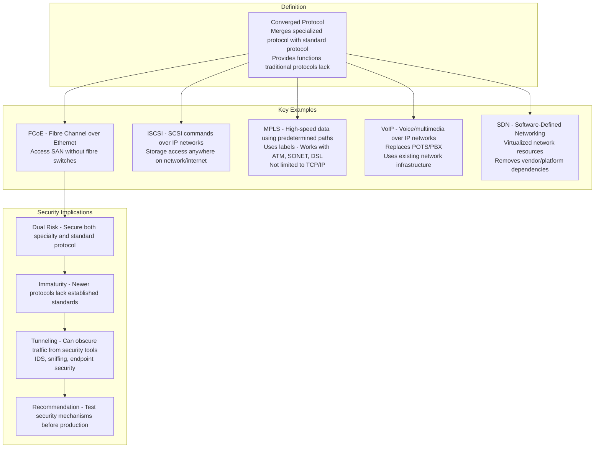
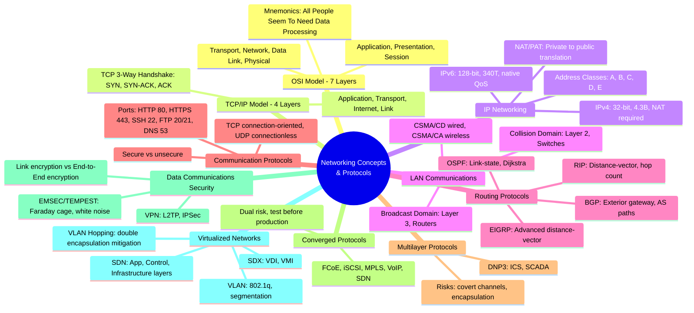

### Video V115: TCP/IP & OSI Models

```mermaid
graph TD
    subgraph OSI Model - 7 Layers
        L7[Layer 7: Application<br/>PDU: Data<br/>HTTP, FTP, SMTP, SNMP]
        L6[Layer 6: Presentation<br/>PDU: Data<br/>MPEG, JPEG, PNG]
        L5[Layer 5: Session<br/>PDU: Data<br/>SQL, NFS, RPC]
        L4[Layer 4: Transport<br/>PDU: Segments<br/>TCP, UDP, TLS/SSL]
        L3[Layer 3: Network<br/>PDU: Packets<br/>IP, IPSec, OSPF]
        L2[Layer 2: Data Link<br/>PDU: Frames<br/>Ethernet, ARP, Wi-Fi]
        L1[Layer 1: Physical<br/>PDU: Bits<br/>RS-232, SONET]
    end

    subgraph TCP/IP Model - 4 Layers
        App[Application Layer<br/>Maps to OSI 5,6,7<br/>Application services]
        Trans[Transport Layer<br/>Maps to OSI 4<br/>TCP/UDP]
        Internet[Internet Layer<br/>Maps to OSI 3<br/>Routing & addressing - IP]
        Link[Link Layer<br/>Maps to OSI 1,2<br/>Physical & data link]
    end

    subgraph TCP 3-Way Handshake
        SYN[1. SYN - Sender requests]
        SYNACK[2. SYN-ACK - Receiver acknowledges]
        ACK[3. ACK - Sender confirms, session established]
        Flags[Other Flags: URG priority, RST reset, FIN terminate]
    end

    subgraph Encapsulation
        Encap[Sender adds headers: Segments→Packets→Frames→Bits]
        Decap[Receiver de-encapsulates: Removes headers to reveal data]
    end

    L7 --> L6 --> L5 --> L4 --> L3 --> L2 --> L1
    App --> Trans --> Internet --> Link
    SYN --> SYNACK --> ACK --> Flags
    Encap --> Decap

    subgraph Mnemonics
        Down[Layer 7 to 1: All People Seem To Need Data Processing]
        Up[Layer 1 to 7: Please Do Not Throw Sausage Pizza Away]
    end
```



---

### Video V116: IP Networking (IPv4, IPv6, NAT, PAT)

```mermaid
graph TD
    subgraph Addressing Types
        MAC[MAC Address - Layer 2<br/>Physical address burned into NIC - Permanent]
        IP[IP Address - Layer 3<br/>Logical address - Dynamic]
        DNS[Domain Name - Human-readable version of IP]
    end

    subgraph IPv4 vs IPv6
        IPv4[IPv4<br/>32-bit decimal<br/>4.3 billion addresses<br/>Needs DHCP - No auto-config<br/>NAT required]
        IPv6[IPv6<br/>128-bit hexadecimal<br/>340 trillion addresses<br/>Built-in auto-config<br/>No NAT needed - Native QoS]
    end

    subgraph IPv4 Address Classes
        A[Class A: 1-126, /8<br/>Private: 10.0.0.0/8]
        B[Class B: 128-191, /16<br/>Private: 172.16.0.0/12]
        C[Class C: 192-223, /24<br/>Private: 192.168.0.0/16]
        D[Class D: 224-239 - Multicasting]
        E[Class E: 240-255 - Research/Private]
        Loopback[127.x.x.x - Loopback - 127.0.0.1]
    end

    subgraph Communication Methods
        Simplex[Simplex - One direction only]
        Half[Half-Duplex - Send OR receive, not both]
        Full[Full-Duplex - Bidirectional simultaneous - CURRENT]
    end

    subgraph NAT
        NAT[Network Address Translation - Converts private IPs to public]
        Dynamic[Dynamic NAT - Pool of private IPs to smaller pool of public]
        PAT[PAT - Port Address Translation<br/>Multiple private IPs to single public IP<br/>Supports 65,000+ connections]
    end

    MAC --> IP --> DNS
    IPv4 --> A --> B --> C --> D --> E --> Loopback
    IPv6 --> Simplex --> Half --> Full
    Full --> NAT --> Dynamic --> PAT
```

---

### Video V117: LAN Communications (Domains, Routing Protocols)



---

### Video V118: Communication Protocols (Ports, Secure vs. Unsecure)



---

### Video V119: Multilayer Protocols (DNP3, Covert Channels)



---

### Video V120: Converged Protocols (FCoE, iSCSI, VoIP, MPLS)



---

### Video V121: Data Communications (EMSEC/TEMPEST, Link/End-to-End Encryption)

```mermaid
graph TD
    subgraph Communication Controls
        Trans[Transparency - Security runs in background<br/>Users not impacted]
        Integrity[Integrity - Hashes and checksums<br/>Verify authenticity]
        Logging[Logging & Error Correction<br/>Accountability, HA, redundancy]
    end

    subgraph EMSEC/TEMPEST
        Problem[Problem: Electrical signals from copper media<br/>Emit emanations that can be captured/reconstructed]
        
        subgraph Countermeasures
            Faraday[Faraday Cage<br/>Enclosed area copper/metal mesh<br/>Blocks electromagnetic signals]
            Noise[White Noise/Pink Noise<br/>Broadcast alternate emanations<br/>Mask sensitive signals]
            ControlZones[Control Zones<br/>Specific areas protected by<br/>Faraday cage or white noise]
        end
        
        Mitigation[Mitigation: Use shielded cables or fiber optics]
    end

    subgraph Port Security
        MACFilter[MAC Filtering<br/>Whitelist specific MAC addresses<br/>Restrict device access]
    end

    subgraph Circuit Encryption
        Link[Link Encryption - Tunnel Mode<br/>Encrypts entire channel - headers + data<br/>Risk: Traffic may be cleartext after gateway]
        E2E[End-to-End Encryption - Transport Mode<br/>Encrypts payload only<br/>IP headers remain clear for routing<br/>Risk: Headers exposed]
    end

    subgraph VPN Summary
        VPN[Creates secure tunnel over untrusted network - internet<br/>Uses concentrator/gateway<br/>L2TP: Layer 2 frames protection<br/>IPSec: Layer 3 packets protection]
    end

    Trans --> Integrity --> Logging
    Logging --> Problem --> Faraday --> Noise --> ControlZones --> Mitigation
    Mitigation --> MACFilter --> Link --> E2E --> VPN
```



---

### Video V122: Virtualized Networks (VLANs, VLAN Hopping, SDN)

```mermaid
graph TD
    subgraph VLANs
        VLAN[VLAN - Virtual LAN<br/>Software-created LAN segments<br/>Segmentation and isolation<br/>Mechanism: 802.1q tagging - Q-tagging on Ethernet frames]
    end

    subgraph VLAN Hopping Attack & Mitigation
        Attack[Double Encapsulation Attack<br/>Attacker adds two tags<br/>First switch strips outer tag, exposes inner tag<br/>Traffic jumps authorized VLAN → target VLAN]
        
        subgraph Mitigation
            M1[1. Set endpoint ports to ACCESS MODE]
            M2[2. Change Native VLAN from default VLAN 1<br/>to non-default e.g., 999]
            M3[3. Enforce Native VLANs on trunk ports]
        end
    end

    subgraph Types of VLANs
        PVLAN[PVLAN - Private VLAN<br/>Port isolation - hotels, shared offices<br/>Layer 2 technology]
        VXLAN[VXLAN - Virtual Extensible LAN<br/>Tunnels Layer 2 frames over Layer 3<br/>Cloud networks]
    end

    subgraph SDN - Software-Defined Networking
        AppLayer[Application Layer<br/>Provides services and applications<br/>Handles requests]
        ControlLayer[Control Layer<br/>Determines data flow between app and infra<br/>Coordinates resources]
        InfraLayer[Infrastructure Layer<br/>Physical devices: routers, switches, storage<br/>Handles data forwarding]
    end

    subgraph SDX - Software-Defined Everything
        SDX[Virtualizing components to replace hardware<br/>Virtualization, containerization, IaaS]
        VDI[VDI - Virtual Desktop Infrastructure<br/>Centrally hosted VMs - VMware Horizon]
        VMI[VMI - Virtual Mobile Infrastructure<br/>Centrally hosted mobile OS for BYOD<br/>Parallels RAS]
    end

    VLAN --> Attack --> M1 --> M2 --> M3
    M3 --> PVLAN
    PVLAN --> VXLAN
    VXLAN --> AppLayer --> ControlLayer --> InfraLayer
    InfraLayer --> SDX --> VDI --> VMI
```



---

### Bonus: Session 16 Complete Concept Map

