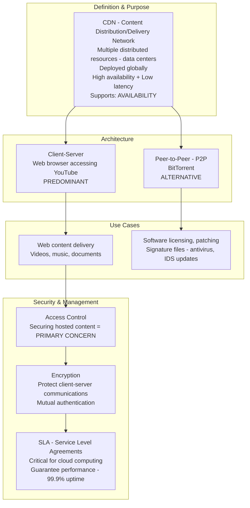
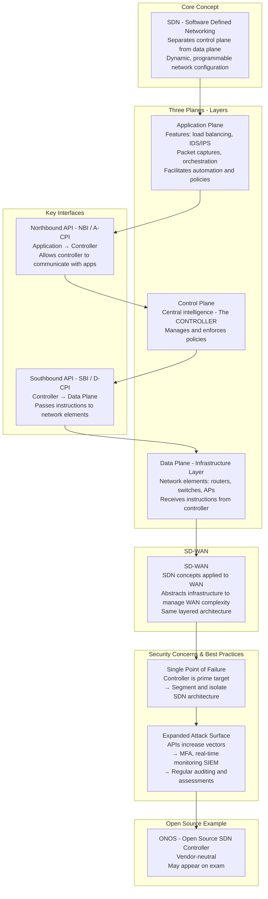
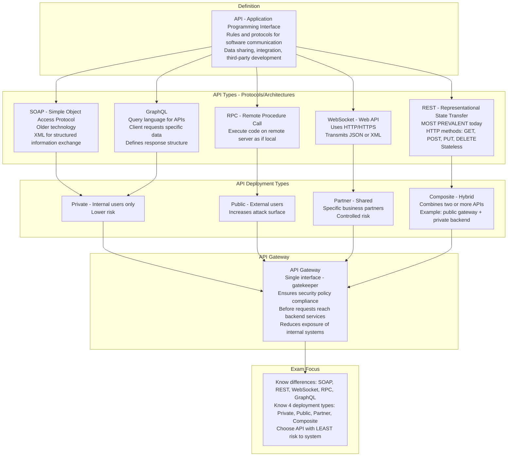
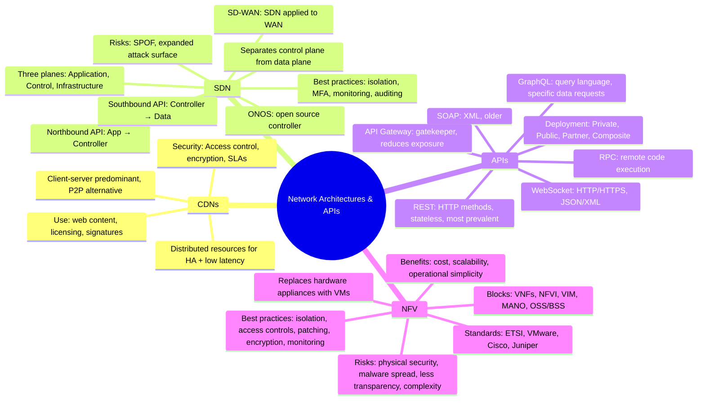

### Video V124: Content Distribution Networks (CDNs)

---

### Video V125: Software Defined Networks (SDN, SD-WAN)

---

### Video V126: Application Programming Interfaces (APIs)

---

### Video V127: Network Functions Virtualization (NFV)

```mermaid
graph TD
    subgraph Definition
        NFV[NFV - Network Functions Virtualization<br/>Replaces dedicated hardware appliances<br/>Routers, firewalls, switches<br/>Software running on VMs on standard servers<br/>Part of SDN]
    end

    subgraph Key Benefits
        Cost[Cost Savings<br/>Commodity servers cheaper than proprietary hardware]
        Scale[Scalability & Flexibility<br/>VMs powered on/off, scaled, automated]
        Ops[Operational Simplification<br/>Single pane of glass management]
    end

    subgraph NFV Architecture Blocks
        VNFs[VNFs - Virtualized Network Functions<br/>Software instances of network functions<br/>Firewalls, routers, load balancers, proxies, gateways]
        NFVI[NFVI - NFV Infrastructure<br/>Physical + virtual resources: compute, storage, network<br/>Includes virtualization layer hypervisors + VIM]
        VIM[VIM - Virtualized Infrastructure Manager<br/>Manages virtualized resources<br/>OpenStack, vCenter]
        MANO[MANO - Management and Orchestration<br/>Orchestrates deployment, scaling, lifecycle<br/>Works with VIM]
        OSSBSS[OSS/BSS - Operations/Business Support Systems<br/>Rely on NFV]
    end

    subgraph Security Risks
        PhysSec[Physical Security<br/>Underlying hardware must be secured]
        Malware[Malware Spread<br/>Difficult to contain in virtual environments<br/>Needs EDR/XDR]
        Transparency[Less Traffic Transparency<br/>East-west traffic on hypervisors harder to monitor]
        Complexity[Complexity<br/>Many moving parts increase security difficulty]
    end

    subgraph Security Best Practices
        Isolate[Isolate & Segment<br/>Separate hypervisors, VLANs, VXLANs<br/>Limit lateral movement]
        Access[Strict Access Controls<br/>Least privilege to hypervisors, management, VNFs]
        Patch[Patch Management<br/>Regularly update VNFs, hypervisors, hardware]
        Encrypt[Encrypt Traffic<br/>Especially between VNFs, virtualization, external nets]
        Monitor[Logging & Monitoring<br/>Centralize logs SIEM<br/>Monitor for unusual behavior]
    end

    subgraph Industry Standards
        ETSI[ETSI - European Telecommunications Standards Institute<br/>Leads NFV specifications]
        Vendors[Key Vendors: VMware, Cisco, Juniper]
    end

    NFV --> Cost --> Scale --> Ops
    Ops --> VNFs
    VNFs --> NFVI
    NFVI --> VIM
    VIM --> MANO
    MANO --> OSSBSS
    
    OSSBSS --> PhysSec
    PhysSec --> Malware
    Malware --> Transparency
    Transparency --> Complexity
    
    Complexity --> Isolate
    Isolate --> Access
    Access --> Patch
    Patch --> Encrypt
    Encrypt --> Monitor
    
    Monitor --> ETSI
    ETSI --> Vendors
```

---

### Bonus: Session 17 Complete Concept Map

