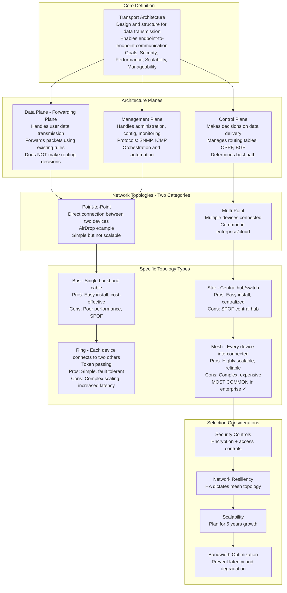
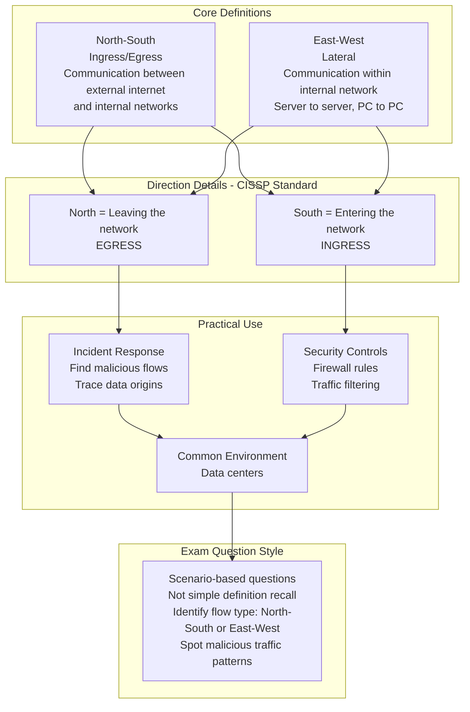
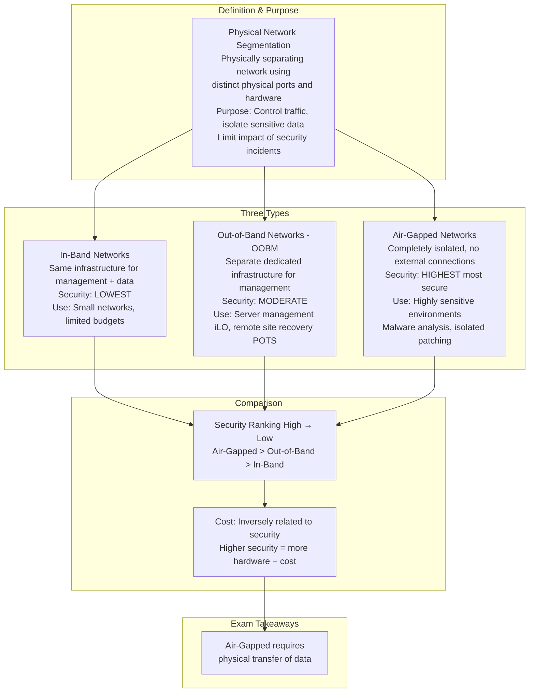
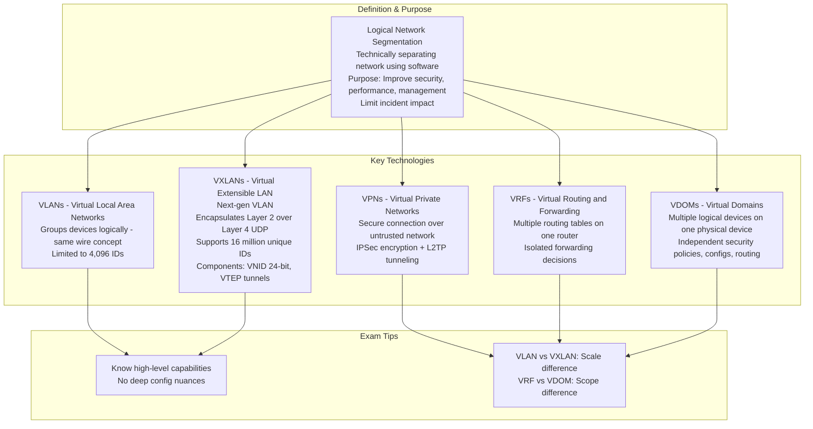
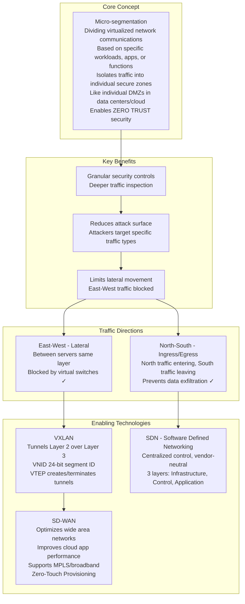
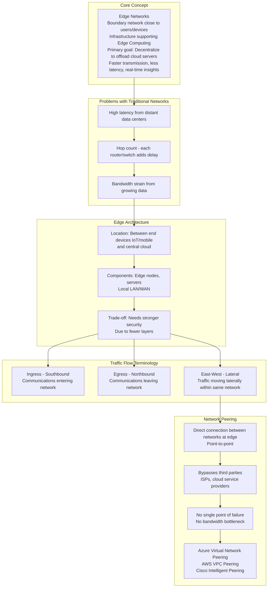
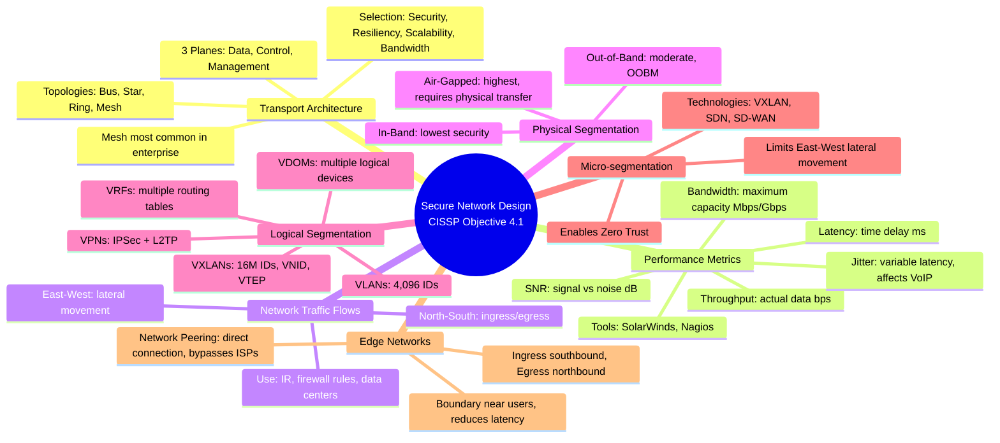

### Video V129: Transport Architecture

---

### Video V130: Performance Metrics

```mermaid
graph TD
    subgraph Purpose of Metrics
        Purpose[Establish baseline of normal behavior<br/>Detect Indicators of Compromise - IOCs<br/>Support User Entity Behavior Analytics - UEBA<br/>Ensure network availability]
    end

    subgraph Key Performance Metrics
        Throughput[Throughput<br/>Actual data transmitted/received over time<br/>Measured in bps<br/>Affected by bandwidth, latency, packet loss]
        
        Bandwidth[Bandwidth<br/>Maximum capacity of data transmission<br/>Measured in Mbps/Gbps<br/>Capacity vs actual usage]
        
        Latency[Latency<br/>Time delay between transmission and arrival<br/>Measured in milliseconds ms<br/>Low latency crucial for real-time apps]
        
        Jitter[Jitter<br/>Variation in packet delay - variable latency<br/>Caused by congestion or route changes<br/>Severely affects VoIP and video streaming]
        
        SNR[Signal-to-Noise Ratio - SNR<br/>Strength of desired signal vs background noise<br/>Measured in decibels dB<br/>Relevant to wireless networking<br/>Higher dB is better]
    end

    subgraph Monitoring Tools
        SolarWinds[SolarWinds<br/>Network monitoring, SNMP<br/>Packet captures pcaps, diagnostics]
        Nagios[Nagios<br/>IT infrastructure monitoring<br/>Dashboard and capacity planning]
    end

    subgraph Security Impact
        Impact[Insufficient throughput prevents<br/>Security tools SIEM from receiving data<br/>Baseline metrics identify anomalies<br/>Ensure availability]
    end

    Purpose --> Throughput
    Throughput --> Bandwidth
    Bandwidth --> Latency
    Latency --> Jitter
    Jitter --> SNR
    
    SNR --> SolarWinds
    SolarWinds --> Nagios
    Nagios --> Impact
```

---

### Video V131: Network Traffic Flows

---

### Video V132: Physical Network Segmentation

---

### Video V133: Logical Network Segmentation

---

### Video V134: Micro-segmentation

---

### Video V135: Edge Networks

---

### Bonus: Session 18 Complete Concept Map

