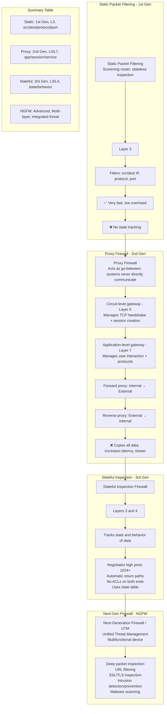
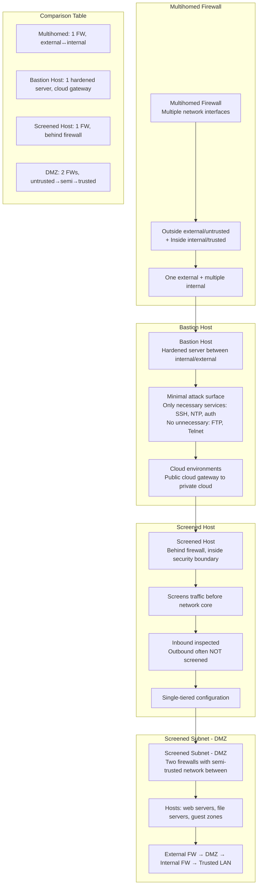
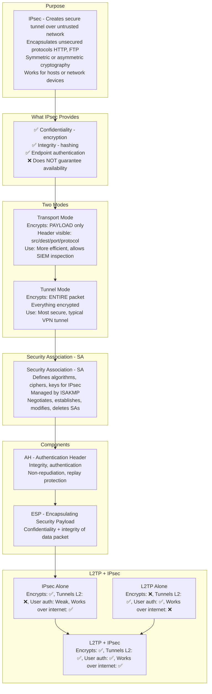
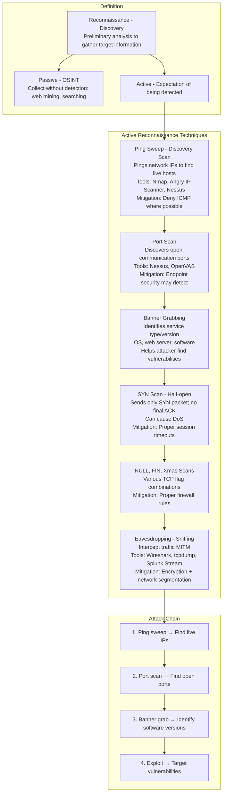
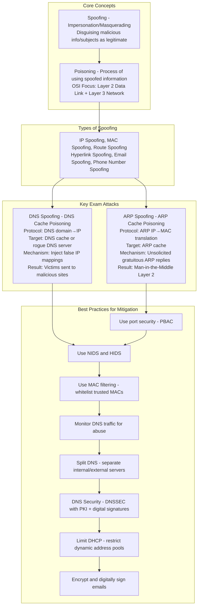
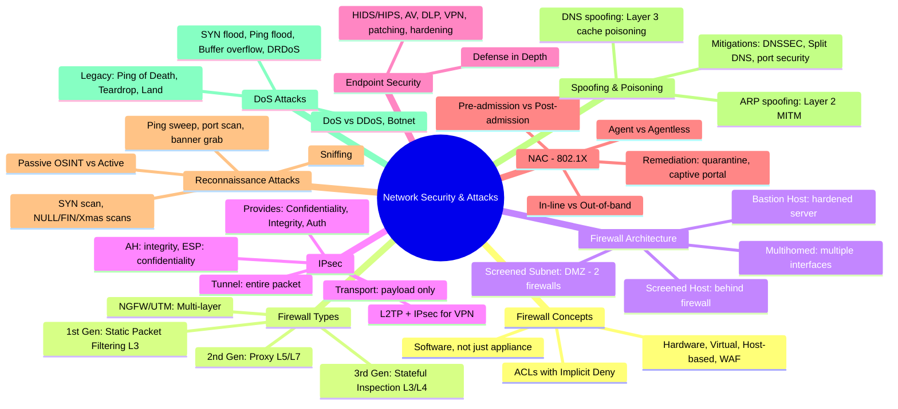

### Video V137: Firewall Concepts

```mermaid
graph TD
    subgraph Core Definition
        FW[Firewall - Software preventing unauthorized<br/>communications between networks<br/>Named after physical fire barriers]
    end

    subgraph Primary Functions
        F1[Creates security boundary<br/>Filters/controls inbound/outbound traffic]
        F2[Performs packet inspections]
        F3[Compares traffic to Access Control Lists - ACLs]
        F4[Permit or deny by source/destination<br/>protocol, port, or packet contents]
    end

    subgraph What Firewalls Can & Cannot Do
        Can[✅ Filter by src/dest IP, protocol, port<br/>✅ Perform packet inspections]
        Cannot[❌ Prevent data sharing<br/>❌ Stop viruses/worms - needs additional software]
    end

    subgraph ACLs
        ACL[Access Control Lists<br/>Primary method for firewall policies]
        ImplicitDeny[IMPLICIT DENY<br/>At end of every ACL<br/>All unlisted traffic automatically denied]
    end

    subgraph Firewall Deployment Types
        Hardware[Hardware/Appliance<br/>Dedicated hardware<br/>Cisco, Palo Alto, Juniper, Fortinet]
        Virtual[Virtual<br/>Software on VM - cloud/on-prem<br/>Same vendors + pfSense]
        HostBased[Host-based<br/>Installed on individual computers<br/>iptables, firewalld, hosts file]
        WAF[WAF - Web Application Firewall<br/>Protects web-based systems<br/>Cloudflare, Nginx, Azure, AWS]
    end

    subgraph Key Comparison
        NB[Network-based firewalls<br/>Monitor ALL traffic on network]
        HB[Host-based & WAFs<br/>Monitor traffic to/from SPECIFIC host]
    end

    FW --> F1 --> F2 --> F3 --> F4
    F4 --> Can
    Can --> Cannot
    Cannot --> ACL --> ImplicitDeny
    ImplicitDeny --> Hardware
    Hardware --> Virtual
    Virtual --> HostBased
    HostBased --> WAF
    WAF --> NB
    NB --> HB
```



---

### Video V138: Types of Firewalls



---

### Video V139: Firewall Architecture



---

### Video V140: IP Security (IPsec)



---

### Video V141: Endpoint Security

```mermaid
graph TD
    subgraph Definition
        Endpoint[Endpoints: Source and destination of communication<br/>Computers, servers, mobile devices<br/>Goal: Remove SPOF from network-based defenses]
    end

    subgraph Problem with Network-Only Defenses
        Problem[NIDS/NIPS on network<br/>Fail if endpoints talk directly without traversing device<br/>Routing all traffic through them = high latency]
    end

    subgraph Solution - Defense in Depth
        DiD[Install HIDS/HIPS on EVERY endpoint<br/>Always protected even if network defense fails<br/>Limits spread of infection<br/>Prevents lateral movement]
    end

    subgraph Key Endpoint Security Mechanisms
        FW_H[Host-based Firewall - Active<br/>Minimum baseline, prevents unauthorized comms]
        AV[Antivirus/Anti-malware - Active<br/>Detects/removes viruses, prevents spread]
        HIDS[HIDS - Passive<br/>Detects violations, sends alerts only]
        HIPS[HIPS - Active<br/>Detects and responds, can reconfigure system]
        DLP[DLP - Active<br/>Blocks unauthorized data transfers based on labeling]
        VPN[VPN Client - Active<br/>Secure connection over public networks]
        Patching[Patching - Proactive<br/>Keep endpoints up to date]
        Hardening[Hardening - Proactive<br/>Minimize attack surface]
    end

    subgraph Layered Defense Example
        L1[Layer 1: Host-based firewall]
        L2[Layer 2: HIDS and HIPS]
        L3[Layer 3: Antivirus and anti-malware]
        L4[Layer 4: Hardened configuration]
    end

    Endpoint --> Problem --> DiD
    DiD --> FW_H --> AV --> HIDS --> HIPS --> DLP --> VPN --> Patching --> Hardening
    Hardening --> L1 --> L2 --> L3 --> L4
```



---

### Video V142: Network Access Control (NAC)

```mermaid
graph TD
    subgraph Definition & Goal
        NAC[NAC - Network Access Control<br/>Combination of technologies controlling network access<br/>Goal: Enforce strict policies via AAA<br/>Identify subjects + devices not just IP<br/>Block/isolate non-compliant hosts]
    end

    subgraph Key Protocol - IEEE 802.1X
        Dot1X[IEEE 802.1X - Port-Based Network Access Control - PNAC<br/>Implemented at network interface<br/>Requires MUTUAL authentication device ↔ network<br/>Use cases: BYOD, IoT, guest network access]
    end

    subgraph Admission Types
        Pre[Pre-admission: Endpoint compliant BEFORE access<br/>Typical use: Employees]
        Post[Post-admission: Access granted first<br/>Then behavior monitored for violations<br/>Typical use: Guest networks]
    end

    subgraph Implementation Methods
        Agent[Agent-based: Software on endpoint monitors activity]
        Agentless[Agentless: Remote scanning via network connection]
    end

    subgraph Deployment Architectures
        OOB[Out-of-band: NAC components don't interfere<br/>Scanning without operational impact]
        Inline[In-line: NAC sits between device and network<br/>Real-time traffic inspection and decisions]
    end

    subgraph Remediation
        Quarantine[Quarantine - Isolate from network]
        Captive[Captive portal - Limited access login screen<br/>Until compliant]
        Remedial[Remedial network - Contains patch server<br/>Vulnerability scanner, captive portal server]
    end

    NAC --> Dot1X
    Dot1X --> Pre --> Post
    Post --> Agent --> Agentless
    Agentless --> OOB --> Inline
    Inline --> Quarantine --> Captive --> Remedial
```



---

### Video V143: Reconnaissance Attacks



---

### Video V144: Spoofing and Poisoning Attacks



---

### Video V145: Denial of Service (DoS) Attacks

```mermaid
graph TD
    subgraph Definition
        DoS[DoS - Denial of Service<br/>Prevents authorized access to resource/object<br/>Primary Focus: Denying AVAILABILITY]
    end

    subgraph DDoS
        DDoS[DDoS - Distributed Denial of Service<br/>Multiple bots/zombies attack single target]
        Botnet[Botnet: Network of bots<br/>Controlled via C2 - Command & Control server]
        BotMaster[Bot Master: Attacker controlling botnet]
    end

    subgraph Common DoS/DDoS Attacks
        SYN[SYN Flood<br/>Overwhelming SYN packets<br/>TCP handshake initiation to target]
        Ping[Ping Flood<br/>Massive ICMP ping requests<br/>Forcing server responses]
        Buffer[Buffer Overflow<br/>Sending more input than<br/>memory buffer can process → crash]
        DRDoS[DRDoS - Distributed Reflective DoS<br/>Trick machine into replying to itself<br/>Smurf: ICMP echo, Fraggle: UDP echo]
    end

    subgraph Legacy Attacks - Less Effective Today
        Pinger[Ping of Death<br/>Oversized ping packet 65,536 bytes<br/>Exceeds MTU → crash]
        Teardrop[Teardrop Attack<br/>Malformed packets cannot be reassembled<br/>Dropped packets → DoS]
        Land[Land Attack<br/>SYN packet to victim's own IP<br/>Self-reply loop → crash]
    end

    subgraph Defenses
        Modern[Modern OS Windows, macOS, Linux<br/>Built-in defenses against many attacks]
        Policy[Security professionals must enforce policy compliance]
    end

    DoS --> DDoS
    DDoS --> Botnet --> BotMaster
    BotMaster --> SYN --> Ping --> Buffer --> DRDoS
    DRDoS --> Pinger --> Teardrop --> Land
    Land --> Modern --> Policy
```

---

### Bonus: Session 19 Complete Concept Map

