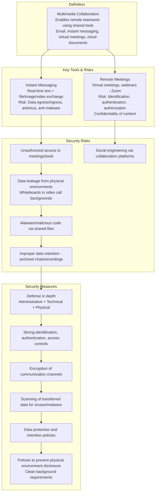
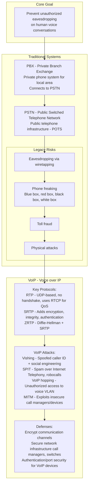
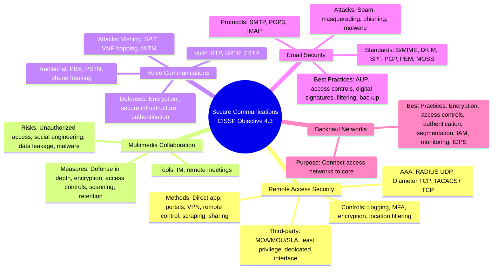

### Video V147: Remote Access Security

```mermaid
graph TD
    subgraph Definition & Context
        RA[Remote Access<br/>Accessing organizational resources<br/>Outside facility and organizational control<br/>Teleworkers, customers, contractors, third-party maintenance]
    end

    subgraph Security Challenges
        C1[No control over remote devices or internet]
        C2[BYOD devices may be less secure]
        C3[Unprotected connections expose data]
    end

    subgraph Remote Access Methods
        M1[Specific service - direct application<br/>Single app access - SaaS]
        M2[Application portals<br/>Centralized interface - captive portal]
        M3[Tunneling - VPN<br/>Cryptography for confidentiality/integrity]
        M4[Remote control<br/>Full system control: Remote Desktop, VDI<br/>Direct or via bastion/jump host]
        M5[Screen scraping<br/>Extracts displayed data, presents remotely]
        M6[Screen sharing<br/>Remote viewing of user's screen]
    end

    subgraph AAA Protocols
        RADIUS[RADIUS - UDP<br/>Most common, used by ISPs<br/>Encrypts password only]
        Diameter[Diameter - TCP/SCTP<br/>Centralized AAA, more reliable]
        TACACS[TACACS/TACACS+ - TCP<br/>Supports two-factor authentication<br/>Encrypts entire session]
    end

    subgraph Security Controls & Best Practices
        BC1[Log and audit all connections]
        BC2[Limit access locations - IP/geolocation filtering]
        BC3[Enforce BYOD policies - harden devices]
        BC4[Strong authentication - MFA]
        BC5[Encrypt storage on remote devices]
        BC6[Encrypt remote sessions - VPN]
    end

    subgraph Third-Party Considerations
        T1[Signed agreements: MOA, MOU, SLA before access]
        T2[Least privilege - minimize privileges]
        T3[Dedicated interface - separate network/VPN/captive portal<br/>Flow control, auditing, security]
    end

    RA --> C1 --> C2 --> C3
    C3 --> M1 --> M2 --> M3 --> M4 --> M5 --> M6
    M6 --> RADIUS --> Diameter --> TACACS
    TACACS --> BC1 --> BC2 --> BC3 --> BC4 --> BC5 --> BC6
    BC6 --> T1 --> T2 --> T3
```

---

### Video V148: Multimedia Collaboration

---

### Video V149: Voice Communications

---

### Video V150: Email Security

```mermaid
graph TD
    subgraph Importance
        Email[Email is primary organizational communication<br/>Can serve as legal evidence<br/>SLAs, contracts, civil/criminal trials]
    end

    subgraph Protocols
        SMTP[SMTP - Sends/routes emails<br/>Unsecure by nature port 25<br/>Can use TLS]
        POP3[POP3 - Retrieves emails from server<br/>Unsecure, can use Kerberos]
        IMAP[IMAP - Manages emails on server<br/>Unsecure, can use TLS on port 993]
    end

    subgraph Common Attacks
        A1[Spamming - unsolicited/unwanted messages]
        A2[Masquerading - attacker pretends to be someone else]
        A3[Phishing - fraudulent communication with malicious links]
        A4[Malware delivery - viruses, worms, logic bombs, ransomware]
    end

    subgraph Security Techniques & Standards
        MOSS[MOSS - Encrypts with MD2/MD5 integrity<br/>+ DES/RSA confidentiality]
        PEM[PEM - RSA/DES + digital certificates<br/>Provides auth, integrity, confidentiality, non-repudiation<br/>Uses X.509]
        PGP[PGP - Uses IDEA algorithm originally RSA<br/>Encrypts emails/files]
        DKIM[DKIM - DomainKeys Identified Mail<br/>Validates email via domain verification]
        SPF[SPF - Sender Policy Framework<br/>Verifies sender authorized for SMTP domain]
        S_MIME[S/MIME - Encrypts/authenticates with PKCS #7<br/>X.509 for identity<br/>Stored as TXT records in DNS]
    end

    subgraph Best Practices
        BP1[AUP - Acceptable Use Policy<br/>Rules, goals, consequences]
        BP2[Strong access controls on email inboxes]
        BP3[Digital signatures - prevent masquerading, non-repudiation]
        BP4[Email filtering - reduce spam, unauthorized file formats]
        BP5[Endpoint security - protect from attachments]
        BP6[Backup & retention - governance, regulations, laws]
    end

    Email --> SMTP --> POP3 --> IMAP
    IMAP --> A1 --> A2 --> A3 --> A4
    A4 --> MOSS --> PEM --> PGP --> DKIM --> SPF --> S_MIME
    S_MIME --> BP1 --> BP2 --> BP3 --> BP4 --> BP5 --> BP6
```

---

### Video V151: Backhaul Networks

```mermaid
graph TD
    subgraph Definition & Purpose
        Backhaul[Backhaul Network<br/>Backbone connecting access networks to core networks<br/>Backhaul Link: Connects smaller access networks/devices<br/>to larger core network<br/>Primary: Bandwidth + connectivity between<br/>remote locations and central infrastructure]
    end

    subgraph Architecture Example
        Core[Core Network<br/>MPLS core, segment routing]
        Access[Access Layers<br/>Connected to core via backhaul links]
        Related[Related terms - not exam critical<br/>CRAN - cloud radio access network<br/>Ethernet VPN, fronthaul links 4G/5G]
    end

    subgraph Security Best Practices
        Encrypt[Encryption<br/>Strong encryption for data in transit<br/>IPsec, TLS]
        AccessCtrl[Access controls<br/>Strict restrictions for backhaul components<br/>and critical infrastructure]
        Auth[Authentication<br/>MFA where possible<br/>Strong single-factor where necessary]
        Segment[Segmentation<br/>VLANs, secure zones to isolate traffic<br/>Limit breach impact, prevent lateral movement]
        IAM[Identity & Access Management<br/>Authenticate identities before<br/>granting access to backhaul equipment]
        Monitor[Monitoring<br/>Logging and real-time monitoring<br/>Detect unusual behavior, unauthorized access, IOCs]
        IDPS[Intrusion Detection/Prevention - IDPS<br/>Deeper threat analysis]
    end

    subgraph For the Exam
        Focus[Understand purpose of backhaul links/networks<br/>Know security best practices<br/>Detailed telco/5G concepts NOT required]
    end

    Backhaul --> Core
    Core --> Access
    Access --> Related
    Related --> Encrypt
    Encrypt --> AccessCtrl --> Auth --> Segment --> IAM --> Monitor --> IDPS
    IDPS --> Focus
```

---

### Bonus: Session 20 Complete Concept Map

