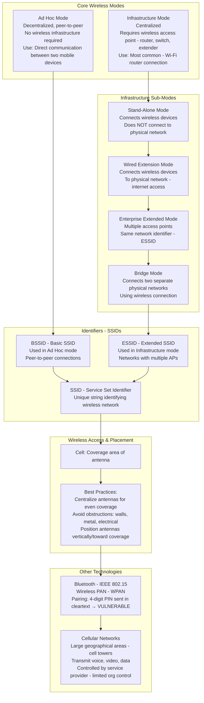
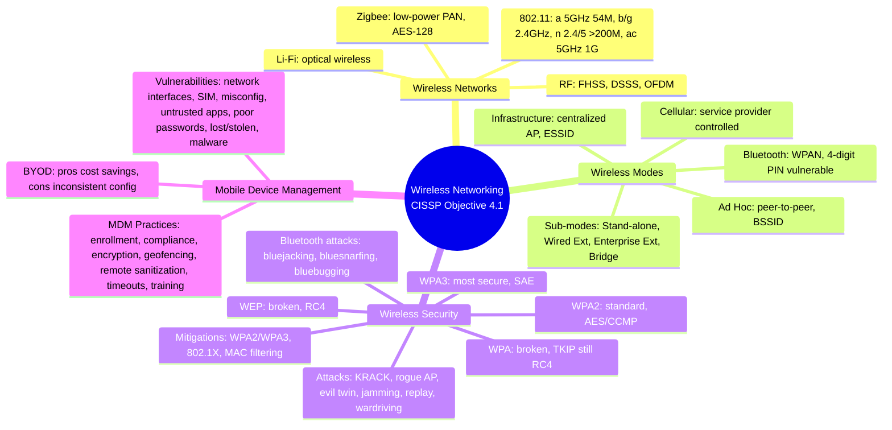

### Video V153: Wireless Networks

```mermaid
graph TD
    subgraph Core Concept
        WN[Wireless Networks<br/>Communication without physical cable media<br/>Using Radio Frequency RF signals<br/>RF Spectrum: 3 Hz to 300 GHz<br/>Key exam freqs: 900 MHz, 2.4 GHz, 5 GHz]
    end

    subgraph Key RF Techniques
        Modulation[Modulation<br/>Changing information on RF signal<br/>Varying amplitude, frequency, phase, pulse]
        FHSS[FHSS - Frequency Hopping Spread Spectrum<br/>Sender/receiver randomly change frequencies<br/>Minimizes interference, harder to track/monitor]
        DSSS[DSSS - Direct Sequence Spread Spectrum<br/>Data divided and transmitted in parallel<br/>Faster than FHSS, uses chipping code]
        OFDM[OFDM - Orthogonal Frequency-Division Multiplexing<br/>Divides data into sub-streams<br/>Transmits over separate frequency bands<br/>Reduces bandwidth, increases throughput]
    end

    subgraph IEEE 802.11 Standards
        A[802.11a: 54 Mbps, 5 GHz]
        B[802.11b: 11 Mbps, 2.4 GHz]
        G[802.11g: 54 Mbps, 2.4 GHz]
        N[802.11n: >200 Mbps, 2.4 or 5 GHz]
        AC[802.11ac: 1 Gbps, 5 GHz]
    end

    subgraph Other Technologies
        LiFi[Li-Fi - Light Fidelity<br/>Optical wireless: visible, infrared, UV light<br/>Eliminates RF interference, higher data rates]
        Zigbee[Zigbee - IEEE 802.15.4<br/>Low-power PAN for IoT, mobile, BYOD<br/>Supports 128-bit AES encryption<br/>Vulnerable: physical, key, replay/injection]
    end

    subgraph Broadcast Channels
        BC[Function: Divide RF signal into sub-frequencies<br/>Public: shared → interference, eavesdropping<br/>Private: exclusive to organization<br/>Regional: US 11, Europe ~13, Japan 14-17]
    end

    WN --> Modulation --> FHSS --> DSSS --> OFDM
    OFDM --> A --> B --> G --> N --> AC
    AC --> LiFi
    LiFi --> Zigbee
    Zigbee --> BC
```

---

### Video V154: Wireless Network Modes

---

### Video V155: Wireless Network Security

```mermaid
graph TD
    subgraph Authentication Setup
        WPS[WPS - Wi-Fi Protected Setup<br/>Simplifies access using two 4-digit PINs<br/>Should be DISABLED unless absolutely required]
    end

    subgraph Encryption Standards - Security Order
        WEP[WEP - 64/128-bit encryption, RC4 cipher<br/>Status: BROKEN - RC4 has known weaknesses]
        WPA[WPA - LEAP Cisco proprietary, TKIP<br/>Status: BROKEN - TKIP still uses RC4]
        WPA2[WPA2 - CCMP based on AES, 128-bit key<br/>Status: STANDARD to know<br/>No known compromise of AES/CCMP]
        WPA3[WPA3 - 192-bit AES<br/>Enterprise: AES-256 GCM<br/>Personal: AES-128 CCM<br/>SAE for secure key exchange<br/>Status: MOST SECURE]
    end

    subgraph Wireless Attacks
        KRACK[KRACK - Key Reinstallation Attack<br/>Compromises WPA2 4-way handshake<br/>Reuses encryption keys]
        Jamming[Signal Jamming - DoS against access point]
        Rogue[Rogue Access Points<br/>Unauthorized AP on open network port<br/>Mitigation: walkarounds, DHCP monitoring]
        Evil[Evil Twin - Fake wireless network<br/>Clone of legitimate AP<br/>Steals credentials via captive portal]
        Replay[Replay Attack<br/>Reuses previously authenticated communications]
        Wardriving[Wardriving - Searching for open networks<br/>While moving car/walking]
        Warchalking[Warchalking - Chalk markings<br/>Indicating wireless hotspots - historical]
    end

    subgraph Bluetooth Attacks
        Bluejacking[Bluejacking<br/>Sends unsolicited messages to collect data<br/>MiTM/spam/phishing-like]
        Bluesnarfing[Bluesnarfing<br/>Forces Bluetooth connection<br/>Access stored data: calls, messages]
        Bluebugging[Bluebugging<br/>Executes device commands<br/>Without user's knowledge]
    end

    subgraph General Security Measures
        M1[Change default passwords and SSIDs]
        M2[Decide broadcast or hide SSID - hiding deters casual only]
        M3[Enable MAC address filtering]
        M4[Use WPA2 or WPA3 encryption]
        M5[Manage physical access with 802.1X - NAC]
        M6[Apply defense in depth - multiple mechanisms]
    end

    WPS --> WEP --> WPA --> WPA2 --> WPA3
    WPA3 --> KRACK --> Jamming --> Rogue --> Evil --> Replay --> Wardriving --> Warchalking
    Warchalking --> Bluejacking --> Bluesnarfing --> Bluebugging
    Bluebugging --> M1 --> M2 --> M3 --> M4 --> M5 --> M6
```

---

### Video V156: Mobile Device Management (MDM)

```mermaid
graph TD
    subgraph Definition
        MDM_Def[Mobile Device Management - MDM<br/>Mobile devices: portable/handheld network-capable<br/>Smartphones, tablets, wearables, laptops, IoT<br/>Key characteristic: Mobility → complicates tracking/auditing]
    end

    subgraph BYOD - Bring Your Own Device
        BYOD[BYOD Policy<br/>Employees use personal devices<br/>to access organizational assets]
        BYOD_Pro[PRO: Saves organization money<br/>User purchases/maintains device]
        BYOD_Con[CON: Inconsistent configurations<br/>Unknown threats/vulnerabilities]
    end

    subgraph Mobile Device Vulnerabilities
        V1[Network interfaces: Wi-Fi, cellular, Bluetooth]
        V2[SIM cards: High-value targets due to stored data]
        V3[Misconfiguration: Lack of hardening]
        V4[Untrusted applications: No supply chain verification]
        V5[Poor password hygiene: Weak, reused passwords]
        V6[Lost/stolen devices: Data exposure risk]
        V7[Malware infections: Viruses, worms]
    end

    subgraph MDM Security Practices
        P1[Enrollment & authentication<br/>For corporate/BYOD devices]
        P2[Compliance with regulations<br/>GDPR, FISMA, PCI DSS]
        P3[Include mobile devices in<br/>vulnerability/patch/change/config management]
        P4[Encrypt storage - protect data at rest]
        P5[Geofencing - grant access/privileges<br/>based on device location]
        P6[Endpoint protection - anti-virus, firewalls where possible]
        P7[Inactivity & session timeouts<br/>Lock after period of inactivity]
        P8[Remote sanitization - wipe data if lost/stolen]
        P9[Screen locks for inactive devices]
        P10[Security awareness training for BYOD users]
    end

    subgraph Key Goal
        Goal[If device leaves organizational control<br/>Reduce risk of CIA compromise]
    end

    MDM_Def --> BYOD
    BYOD --> BYOD_Pro
    BYOD --> BYOD_Con
    BYOD_Con --> V1 --> V2 --> V3 --> V4 --> V5 --> V6 --> V7
    V7 --> P1 --> P2 --> P3 --> P4 --> P5 --> P6 --> P7 --> P8 --> P9 --> P10
    P10 --> Goal
```

---

### Bonus: Session 21 Complete Concept Map

