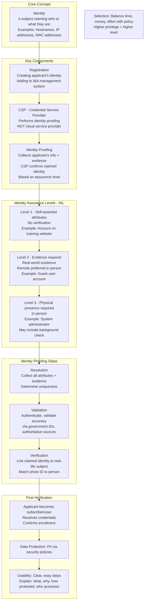
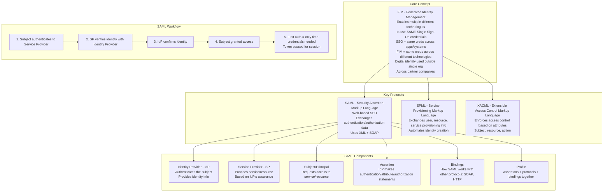
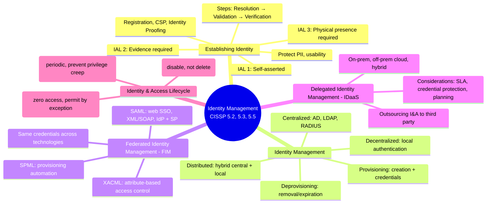

### Video V158: Establishing Identity

---

### Video V159: Identity Management

```mermaid
graph TD
    subgraph Core Definitions
        Identity[Identity: Subject's claim of who/what they are<br/>Users, computers, hosts]
        Auth[Authentication: Verification of identity's correctness]
        Authz[Authorization: Permission to access an object]
        Access[Access Controls: Management of subject privileges<br/>to access objects]
        Provisioning[Provisioning: Creation of identity + credentials]
        Deprovisioning[Deprovisioning: Removal or expiration of credentials/identity]
    end

    subgraph Identity Management Methods
        Centralized[Centralized Access Control<br/>Single entity handles I&A + authorization<br/>Examples: Active Directory, LDAP, RADIUS]
        
        Decentralized[Decentralized Access Control<br/>Multiple entities perform I&A + authorization<br/>Each host has local identity management<br/>Local authentication]
        
        Distributed[Distributed Access Control - Hybrid<br/>Primary: centralized authentication<br/>Backup: decentralized local for high-level accounts<br/>Normal users → central, root/admin → local]
    end

    subgraph Example - Website Access
        ExIdentity[Identity: Username - BSpencer]
        ExAuth[Authentication: Password - only known to user]
        ExAccess[Access Control: Group-based privileges<br/>Limited interaction, no modification rights]
    end

    Identity --> Auth --> Authz --> Access
    Access --> Provisioning
    Provisioning --> Deprovisioning
    Deprovisioning --> Centralized
    Centralized --> Decentralized
    Decentralized --> Distributed
    Distributed --> ExIdentity --> ExAuth --> ExAccess
```

---

### Video V160: Federated Identity Management (FIM)

---

### Video V161: Delegated Identity Management (IDaaS)

```mermaid
graph TD
    subgraph Definition
        Delegated[Delegated Identity Management<br/>Outsourcing identity management responsibilities<br/>Authentication services to third party<br/>Part of Federated Identity Management<br/>Also known as: IDaaS - Identity as a Service]
    end

    subgraph Benefits & Use Cases
        B1[Lack of infrastructure<br/>No Active Directory, LDAP, or skilled admins]
        B2[Cost & time savings<br/>Reduces overhead, maintenance, infrastructure costs]
        B3[Consistency<br/>Dependable I&A process]
        B4[Business continuity/DR<br/>Same credentials for primary/recovery sites]
        B5[Real-world example<br/>Login to training platform using<br/>LinkedIn, Facebook, Google credentials]
    end

    subgraph Implementation Models
        OnPrem[On-Premise<br/>Local I&A mechanisms installed in facility]
        OffPrem[Off-Premise - Cloud-based<br/>I&A mechanisms hosted offsite<br/>Most common with third parties]
        Hybrid[Hybrid<br/>Combination of on-prem + off-prem<br/>Syncing local directory with cloud IdP for redundancy]
    end

    subgraph Security & Operational Considerations
        HA[SLA - High Availability<br/>Avoid single point of failure<br/>Uptime guarantees]
        Cred[Credential Protection<br/>Provider protection ≥ org policies<br/>Responsibility remains with organization]
        Planning[Planning Account Requirements<br/>Roles, privileges, changes in advance<br/>Avoid delays with third party schedule]
    end

    Delegated --> B1 --> B2 --> B3 --> B4 --> B5
    B5 --> OnPrem --> OffPrem --> Hybrid
    Hybrid --> HA --> Cred --> Planning
```

---

### Video V162: Identity and Access Lifecycle

```mermaid
graph TD
    subgraph Core Definition
        Lifecycle[Lifecycle: Creation, management, revocation of identity<br/>Provisioning: Creating identity + credentials<br/>Deprovisioning: Removing credentials]
    end

    subgraph Phase 1 - Provisioning Creation
        P1[Enrollment/registration<br/>Establish need & requirements]
        P2[Controlled process with justification<br/>Who, what, when, why, how]
        P3[Required evidence per policy<br/>Photo ID, passport, background check, references]
        P4[Complete security awareness training<br/>BEFORE access]
        P5[Standardized, unique username - no duplicates]
        P6[Create authentication credentials<br/>Passwords, keys, biometrics]
        P7[Start with ZERO access<br/>Allocate based on approved roles/groups]
        P8[Permit by exception, deny by default<br/>Least privilege & need-to-know]
    end

    subgraph Phase 2 - Review Ongoing Management
        R1[Accounts reviewed PERIODICALLY<br/>Per law, regulation, or requirement]
        R2[Part of audits, assessments, or personnel changes]
        R3[Adjust privileges based on current needs<br/>Add/remove groups or individual rights]
        R4[Prevents privilege/authorization creep]
        R5[Identify and correct incorrect privilege levels]
    end

    subgraph Phase 3 - Revocation Deprovisioning
        V1[Disabling account when no longer needed<br/>or privileges change]
        V2[Triggers: Termination, job change<br/>Stale account, security policy violation]
        V3[Goal: Minimize risk and attack surface<br/>Stale accounts = attack vectors]
        V4[IMPORTANT: Do NOT delete accounts<br/>Just disable them]
        V5[Reasons to keep: Decrypt data later<br/>Investigations, possible return of user]
        V6[Keep accounts as long as policy requires]
    end

    Lifecycle --> P1 --> P2 --> P3 --> P4 --> P5 --> P6 --> P7 --> P8
    P8 --> R1 --> R2 --> R3 --> R4 --> R5
    R5 --> V1 --> V2 --> V3 --> V4 --> V5 --> V6
```

---

### Bonus: Session 22 Complete Concept Map

