### Video V164: Authentication Systems (LDAP, RADIUS, TACACS+, Diameter)

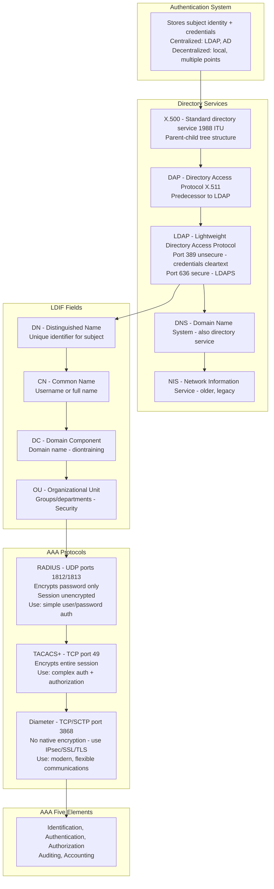

---

### Video V165: Authentication Factors (SFA, 2FA, MFA)

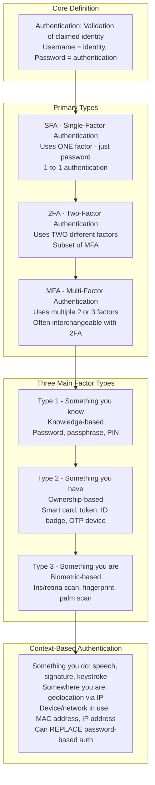

---

### Video V166: Biometric Authentication

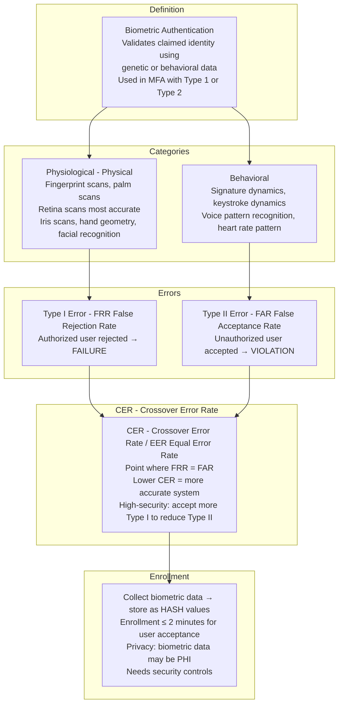

---

### Video V167: Single Sign-On (SSO)

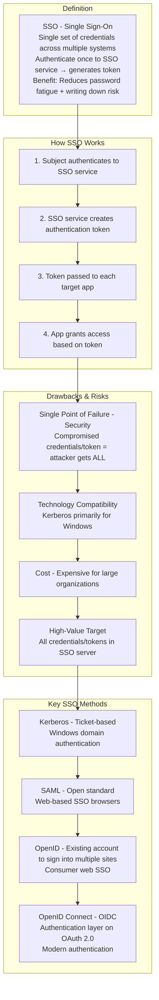

---

### Video V168: OAuth and OpenID Connect (OIDC)

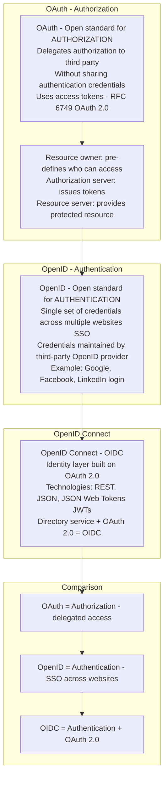

---

### Video V169: Kerberos

```mermaid
graph TD
    subgraph Overview
        Kerb[Kerberos - Ticket-based SSO system<br/>Developed by MIT Project Athena 1983-1991<br/>Version 5 current<br/>Widely used with Windows / Active Directory]
    end

    subgraph Core Components
        KDC[KDC - Key Distribution Center<br/>Trusted 3rd party - issues & stores secret session keys]
        AS[AS - Authentication Server<br/>Authenticates subject's account - issues TGT]
        TGS[TGS - Ticket Granting Service<br/>Verifies TGT - issues service tickets & session keys]
        DS[Directory Service - Active Directory<br/>Maintains account info - Kerberos references it]
    end

    subgraph Ticket Types
        TGT[TGT - Golden Ticket<br/>Evidence of authentication with KDC]
        ServiceTicket[Service Ticket - Silver Ticket<br/>Encrypted evidence of authorization to object]
    end

    subgraph Authorization Flow
        F1[1. User authenticates to AS]
        F2[2. AS verifies identity against directory service]
        F3[3. AS issues TGT Golden Ticket]
        F4[4. Client presents TGT to TGS]
        F5[5. TGS issues service ticket Silver Ticket + session keys]
        F6[6. Client presents service ticket to Kerberos-enabled service]
        F7[7. Service checks with KDC → if valid, session opens - SSO achieved]
    end

    subgraph Risks
        Risk1[Dictionary/brute force on passwords]
        Risk2[KDC compromise → system fails secure - all access denied]
        Risk3[Kerberoasting - extracting password hashes from AD<br/>Crack passwords and spoof identity]
    end

    subgraph Security
        Sec[Uses AES for encryption<br/>Requires synchronized time source - timestamps critical]
    end

    Kerb --> KDC
    KDC --> AS
    AS --> TGS
    TGS --> DS
    DS --> TGT
    TGT --> ServiceTicket
    ServiceTicket --> F1 --> F2 --> F3 --> F4 --> F5 --> F6 --> F7
    F7 --> Risk1 --> Risk2 --> Risk3
    Risk3 --> Sec
```

---

### Video V170: Credential Management Systems

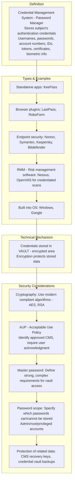

---

### Video V171: Just-In-Time (JIT) Access

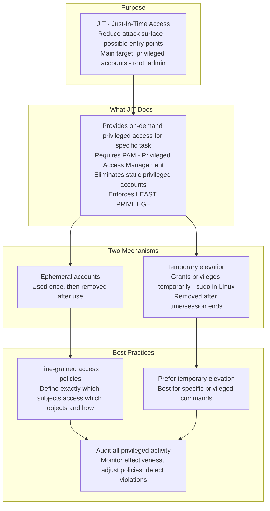

---

### Video V172: Access Control Models – Part 1 (DAC, MAC, Rule-Based)

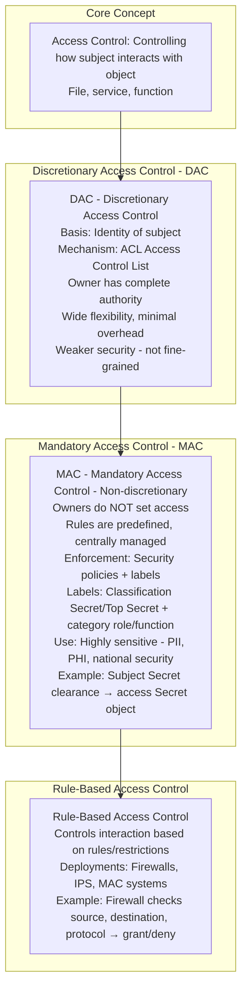

---

### Video V173: Access Control Models – Part 2 (RBAC, ABAC, Risk-Based)

```mermaid
graph TD
    subgraph Role-Based Access Control - RBAC
        RBAC[RBAC - Role-Based Access Control<br/>Controls subject-object interaction based on group membership/role<br/>Subjects grouped by function: admin, engineer<br/>Privileges assigned to group/role<br/>Benefits: Enforces need-to-know + least privilege, reduces privilege creep<br/>Key Rule: If label/category not defined → deny by default - fail safe/secure]
    end

    subgraph Attribute-Based Access Control - ABAC
        ABAC[ABAC - Attribute-Based Access Control / PBAC Policy-Based<br/>Controls access based on attributes<br/>Focus: Object attributes - more flexible than RBAC<br/>Standard: XACML eXtensible Access Control Markup Language]
        ABAC_Attrs[Attributes:<br/>Subject: Role, clearance, organization<br/>Action: Read, write, execute<br/>Object: Sensitivity, owner, type<br/>Environment: Date, time, IP, MAC]
    end

    subgraph Risk-Based Access Control
        Risk[Risk-Based Access Control / Risk-Adaptable<br/>Controls access based on dynamic risk decision]
        Risk_Factors[Risk Factors:<br/>Device, network, geolocation, object sensitivity<br/>Behavior analytics, authentication method]
        Risk_Logic[Logic Example:<br/>High risk → require MFA<br/>Medium risk + single-factor + privileged → deny<br/>Untrusted IP/subnet → deny]
    end

    subgraph Comparison Table
        Comp1[DAC: Identity ACL - Object owner]
        Comp2[MAC: Labels/clearance - Security policy]
        Comp3[RBAC: Group membership - Subject focus]
        Comp4[ABAC: Attributes - Object focus, XACML]
        Comp5[Rule-Based: Rules/restrictions - Firewalls, IPS]
        Comp6[Risk-Based: Dynamic risk - Device, location, behavior]
    end

    RBAC --> ABAC
    ABAC --> ABAC_Attrs
    ABAC_Attrs --> Risk
    Risk --> Risk_Factors --> Risk_Logic
    Risk_Logic --> Comp1 --> Comp2 --> Comp3 --> Comp4 --> Comp5 --> Comp6
```

---

### Bonus: Session 23 Complete Concept Map

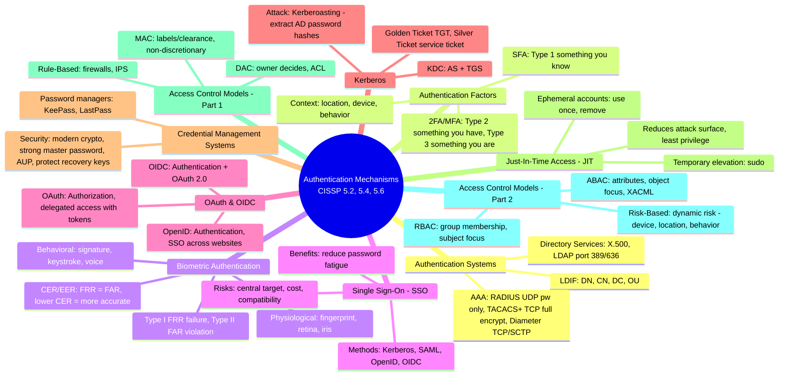