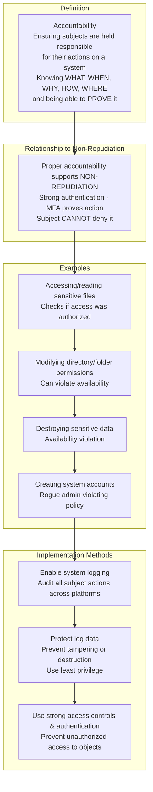
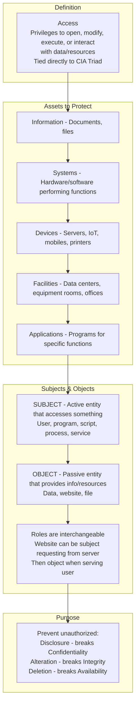
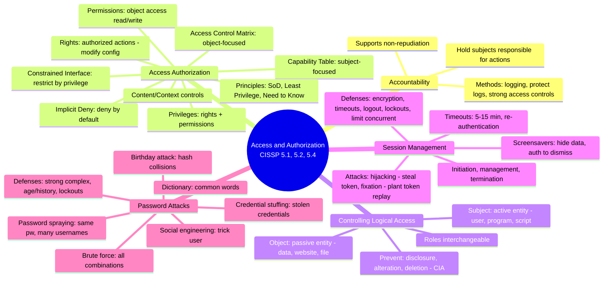

### Video V175: Accountability

---

### Video V176: Access Authorization

```mermaid
graph TD
    subgraph Definition
        Authz[Authorization<br/>Granting an authorized subject access to an object<br/>System decides if subject allowed to access resource<br/>File, VM, network interface]
    end

    subgraph Key Terms
        Permissions[Permissions<br/>Subject's ability to access an object - read/write<br/>Applies to objects]
        Rights[Rights<br/>Subject's ability to conduct authorized actions<br/>Modify user account, change config]
        Privileges[Privileges<br/>Combination of rights + permissions]
    end

    subgraph Core Concepts
        ImplicitDeny[Implicit Deny<br/>Deny by default<br/>Access only if explicitly authorized]
        AccessMatrix[Access Control Matrix<br/>Lists subjects, objects, and access privileges<br/>Focused on the OBJECT]
        CapTable[Capability Table<br/>Lists subject, objects, and privileges<br/>Focused on subject's CAPABILITIES]
        Constrained[Constrained Interface<br/>Restricts actions based on privilege level<br/>Non-admin users see fewer options]
        Content[Content-Dependent Controls<br/>Limit access based on type/content of object]
        Context[Context-Dependent Controls<br/>Require a preceding action before granting access]
    end

    subgraph Security Perspective
        Sensitive[Sensitive data → focus on OBJECT<br/>Use Access Control Matrix]
        Public[Public/non-sensitive data → focus on SUBJECT<br/>Use Capability Table]
    end

    subgraph Three Key Principles
        SoD[Separation of Duties<br/>Divide critical tasks among multiple people<br/>Prevent excessive power]
        Least[Least Privilege<br/>Give only privileges necessary to perform job]
        NeedToKnow[Need to Know<br/>Grant access only to information required for duties<br/>Data owner decides - related to DAC]
    end

    Authz --> Permissions
    Permissions --> Rights
    Rights --> Privileges
    Privileges --> ImplicitDeny
    ImplicitDeny --> AccessMatrix
    AccessMatrix --> CapTable
    CapTable --> Constrained
    Constrained --> Content
    Content --> Context
    Context --> Sensitive
    Sensitive --> Public
    Public --> SoD
    SoD --> Least
    Least --> NeedToKnow
```

---

### Video V177: Controlling Logical Access

---

### Video V178: Session Management

```mermaid
graph TD
    subgraph Session Definition
        Session[Session<br/>Connection and exchange between two entities<br/>User-computer, computer-application<br/>Sessions have IDs binding credentials to active session]
    end

    subgraph Session Management Scope
        Scope[Initiation, Management, Proper Termination<br/>Risk: Closing browser or stepping away<br/>Does NOT always terminate session<br/>Possible session hijacking]
    end

    subgraph Timeouts
        Timeout[Session Timeout<br/>Closes session after period of inactivity<br/>Requires re-authentication to resume<br/>Typical: 5-15 minutes<br/>Depends on org policy or industry regs<br/>Applied to endpoints and network devices]
        Screensaver[Screensaver<br/>Activates after inactivity - 5 min<br/>Hides on-screen sensitive data<br/>Requires authentication to dismiss/resume]
    end

    subgraph Session Attacks
        Hijack[Session Hijacking - Sidejacking<br/>Attacker steals session token/cookie<br/>Over unsecured wireless<br/>Man-in-the-Middle attack]
        Fixation[Session Fixation<br/>Attacker plants unsecure token on victim's browser<br/>Later uses it for REPLAY attack]
    end

    subgraph Defenses
        D1[Encrypt session traffic<br/>Prevent sniffing/eavesdropping]
        D2[Configure timeouts<br/>For all access types: console, remote, web]
        D3[Include logout features<br/>Visible and easy to use<br/>Invalidates tokens/credentials]
        D4[Enforce account lockouts<br/>After 3-5 failed attempts<br/>Blocks brute force]
        D5[Limit simultaneous/concurrent sessions<br/>Typically 1-3<br/>Prevents replay and DoS/DDoS]
    end

    Session --> Scope
    Scope --> Timeout
    Timeout --> Screensaver
    Screensaver --> Hijack
    Hijack --> Fixation
    Fixation --> D1 --> D2 --> D3 --> D4 --> D5
```

---

### Video V179: Password Attacks

```mermaid
graph TD
    subgraph Introduction
        PW[Password - secret credential - something you know<br/>Authenticates identity - username<br/>Cognitive password: security questions<br/>Pet's name, birthplace - self-service reset]
    end

    subgraph Attack Types
        Brute[Brute-force attack<br/>Attempt every possible character combination<br/>Umbrella category]
        Dict[Dictionary attack<br/>Uses file of common words<br/>Known passwords or decrypted passwords]
        Spray[Password spraying<br/>Single password tried against many usernames<br/>Avoids account lockout]
        Stuff[Credential stuffing<br/>Automated injection of stolen username/password pairs<br/>Into login forms]
        Birthday[Birthday attack<br/>Exploits hash collisions - birthday paradox<br/>Find matching hashes from different inputs]
        SE[Social engineering<br/>Trick user into revealing password<br/>Impersonating admin/manager]
    end

    subgraph Cracking Tools
        Tools[Tools:<br/>Cain & Abel - Windows<br/>John the Ripper - Windows, Unix, Linux<br/>Mimikatz - Windows<br/>Hashcat - multi-platform<br/>Aircrack - wireless WEP/WPA<br/>Hydra - HTTP, HTTPS, FTP<br/>RainbowCrack/L0phtCrack/OphCrack - Windows]
    end

    subgraph Defenses
        Strong[Strong, complex passwords<br/>Minimum: 1 upper, 1 lower, 1 number, 1 special<br/>Longer = harder to crack]
        Age[Minimum & maximum password age<br/>Prevents reuse, forces regular changes]
        History[Password history<br/>Prevents reuse of old/compromised passwords]
        Lockout[Account lockouts<br/>After failed attempts - 3-5]
        Reg[Regulatory awareness<br/>FISMA, HIPAA, PCI DSS requirements]
    end

    PW --> Brute
    Brute --> Dict
    Dict --> Spray
    Spray --> Stuff
    Stuff --> Birthday
    Birthday --> SE
    SE --> Tools
    Tools --> Strong --> Age --> History --> Lockout --> Reg
```

---

### Bonus: Session 24 Complete Concept Map

