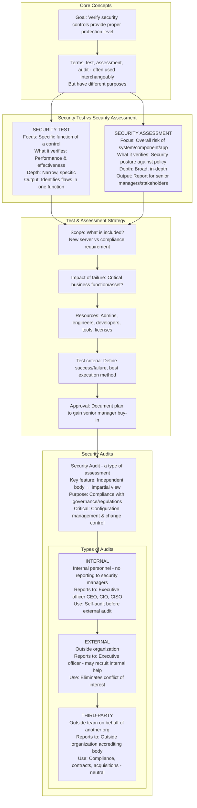
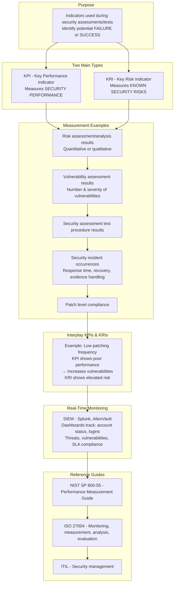
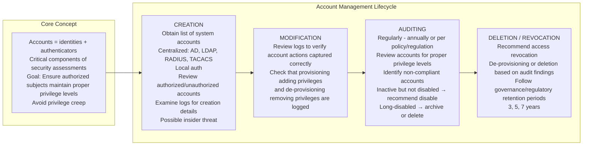
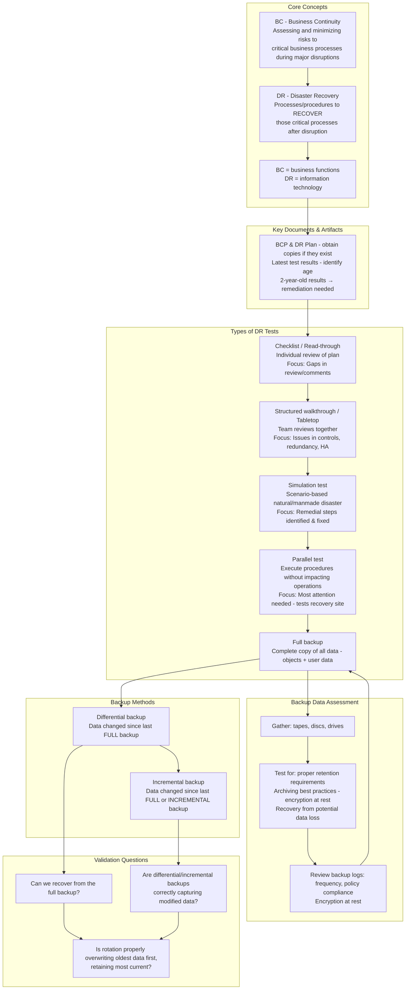
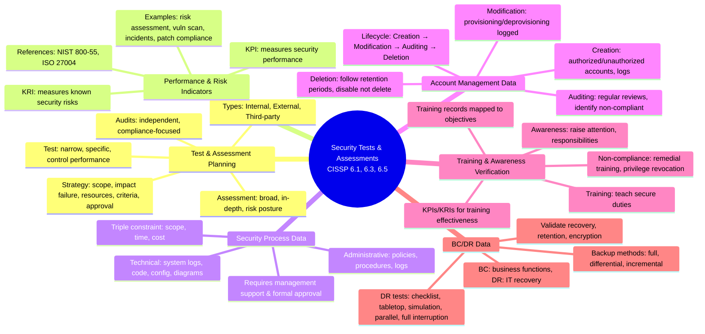

### Video V181: Security Test and Assessment Planning



---

### Video V182: Performance and Risk Indicators (KPIs, KRIs)



---

### Video V183: Collecting Security Process Data

```mermaid
graph TD
    subgraph Purpose
        Purpose[Support security tests, assessments, or audits<br/>Provide evidence for management approval<br/>Quality depends on proper inputs]
    end

    subgraph Triple Constraint - Quality Determinants
        Scope[Scope - what is being tested]
        Time[Time - duration available for testing]
        Cost[Cost - resources/funding required]
    end

    subgraph Types of Data to Collect
        Admin[ADMINISTRATIVE DATA<br/>Policies, processes, procedures, records<br/>Logs, archive data<br/>Data from other departments: Finance, HR]
        
        Tech[TECHNICAL DATA<br/>System logs, software code<br/>Configuration files<br/>Change management records<br/>System diagrams, data flow diagrams]
    end

    subgraph Role of Management
        Mgmt1[Resource allocation<br/>Admins, engineers, architects]
        Mgmt2[Understanding<br/>Clear communication of purpose and scope]
        Mgmt3[Formal approval<br/>Documented in policy, procedure, or change control]
    end

    subgraph Documentation Requirements
        Docs[Expected outcomes<br/>Schedule start/end dates and times<br/>Risk exceptions<br/>Out-of-scope items]
    end

    Purpose --> Scope
    Scope --> Time
    Time --> Cost
    Cost --> Admin
    Admin --> Tech
    Tech --> Mgmt1 --> Mgmt2 --> Mgmt3
    Mgmt3 --> Docs
```

---

### Video V184: Account Management Data



---

### Video V185: Verifying Training and Awareness

```mermaid
graph TD
    subgraph Purpose & Context
        Context[Part of Security Assessment / Security Test data collection<br/>Focuses on ADMINISTRATIVE CONTROLS<br/>Training & Awareness]
    end

    subgraph Key Definitions
        Awareness[Awareness: Raising attention to foundational security<br/>Employee responsibilities]
        Training[Training: Teaching personnel how to perform duties SECURELY]
    end

    subgraph Data Collection Focus - Training Records
        DR1[Map training records to specific training objectives<br/>Anti-phishing]
        DR2[Review KPIs & KRIs for training]
        DR3[Understand compliance requirements per objective]
        DR4[Handle sensitive data carefully - remove employee IDs]
    end

    subgraph Assessment Goals
        G1[Determine if security is being met via current training]
        G2[Identify emerging threats, new vulnerabilities, missing risks<br/>Due diligence]
        G3[Check attendance and completion rates]
    end

    subgraph Handling Non-Compliance
        NC1[Identify non-compliant personnel and frequent offenders]
        NC2[Apply remedial training - makeup sessions, on-demand]
        NC3[Consider revoking privileges/access until training complete]
    end

    subgraph Exam Takeaways
        TA[Auditing training & awareness provides situational awareness<br/>of program effectiveness<br/>Reflects DUE CARE creating training<br/>and DUE DILIGENCE updating training]
    end

    Context --> Awareness
    Awareness --> Training
    Training --> DR1 --> DR2 --> DR3 --> DR4
    DR4 --> G1 --> G2 --> G3
    G3 --> NC1 --> NC2 --> NC3
    NC3 --> TA
```



---

### Video V186: Disaster Recovery and Business Continuity Data



---

### Bonus: Session 25 Complete Concept Map

