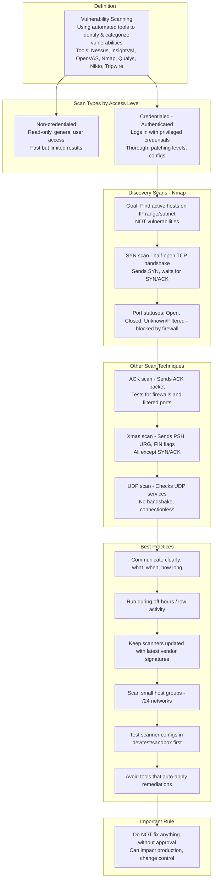
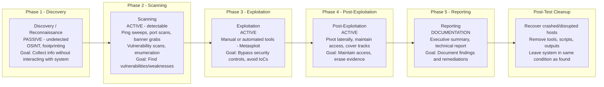
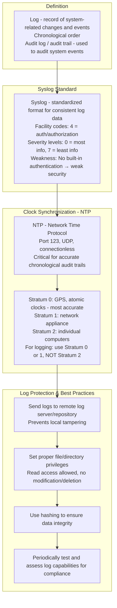
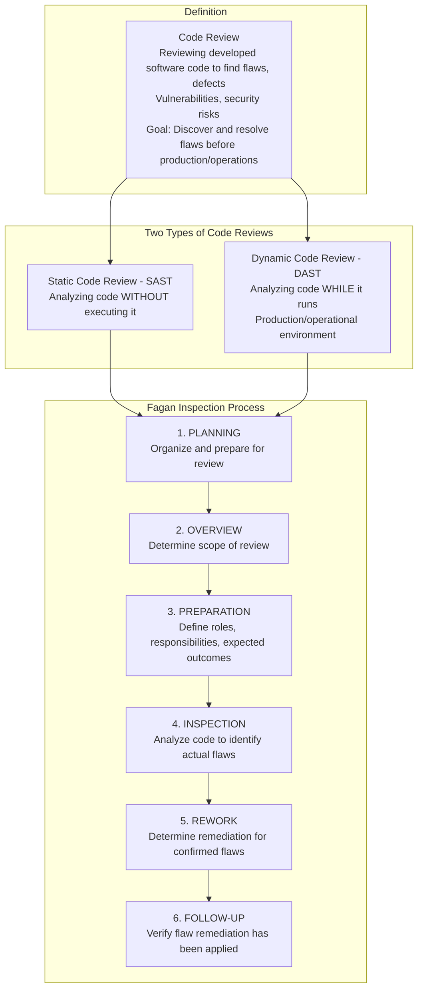
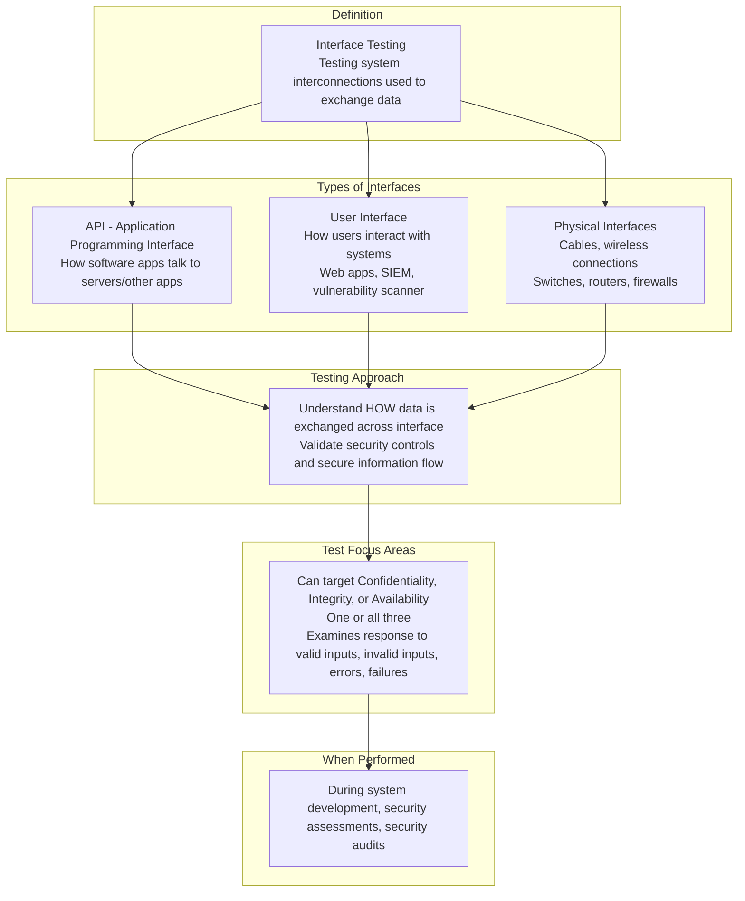
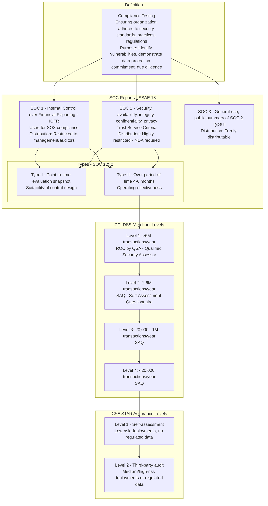
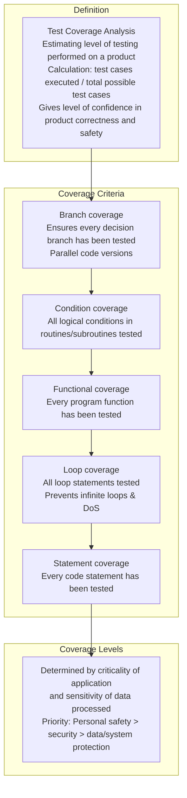
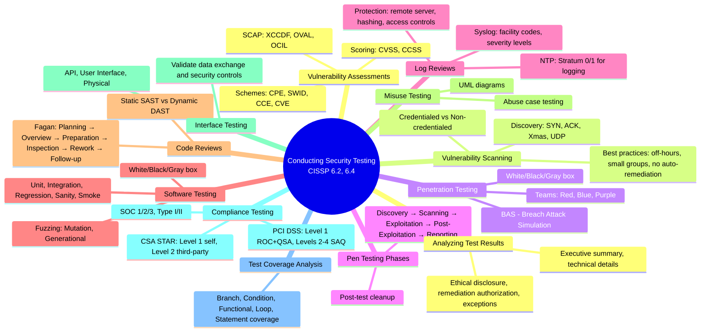

### Video V188: Vulnerability Assessments (SCAP, CVSS, CVE, CPE)

```mermaid
graph TD
    subgraph Purpose
        VA[Vulnerability Assessment<br/>Goal: Identify and categorize security flaws/weaknesses<br/>Benefits: Understand risks, prioritize response]
    end

    subgraph Prerequisite
        Inventory[Accurate System Inventory<br/>Hardware, software, firmware<br/>Manufacturer, product name, version]
    end

    subgraph Vulnerability Management Process
        V1[1. DETECT potential vulnerabilities]
        V2[2. VALIDATE impact using inventory]
        V3[3. REMEDIATE fix/reduce vulnerability]
    end

    subgraph SCAP - Security Content Automation Protocol
        SCAP_Dev[Developer: NIST - SP 800-126<br/>Purpose: Standardized reporting for vulnerabilities & config]
        
        subgraph Languages
            XCCDF[XCCDF - Extensible Configuration Checklist Description Format<br/>Security checklist/benchmark results - MOST COMMON]
            OVAL[OVAL - Open Vulnerability and Assessment Language<br/>Configuration info, machine states, assessment results]
            OCIL[OCIL - Open Checklist Interactive Language<br/>Info from people or existing data stores - less common]
        end
        
        subgraph Identification Schemes
            CPE[CPE - Common Platform Enumeration<br/>Defines: Hardware, OS, applications]
            SWID[SWID - Software Identification<br/>Defines: Software identifier + metadata]
            CCE[CCE - Common Configuration Enumeration<br/>Defines: Dictionary of software security configs]
            CVE[CVE - Common Vulnerabilities and Exposures<br/>Defines: Security-related software flaws]
        end
        
        subgraph Scoring Systems
            CVSS[CVSS - Common Vulnerability Scoring System<br/>Severity score for a flaw - MOST COMMON]
            CCSS[CCSS - Common Configuration Scoring System<br/>Severity for a configuration issue]
        end
    end

    subgraph Sources
        Sources[NIST NVD, Mitre CVE, US-CERT, Vendor bulletins]
    end

    subgraph Tools
        Tools[OpenSCAP Unix/Linux, Tripwire, Nessus, InsightVM]
    end

    VA --> Inventory --> V1 --> V2 --> V3
    V3 --> SCAP_Dev
    SCAP_Dev --> XCCDF --> OVAL --> OCIL
    OCIL --> CPE --> SWID --> CCE --> CVE
    CVE --> CVSS --> CCSS
    CCSS --> Sources --> Tools
```

---

### Video V189: Vulnerability Scanning



---

### Video V190: Penetration Testing (Concepts, Teams, BAS)

```mermaid
graph TD
    subgraph Definition
        PT[Penetration Testing<br/>Simulates system attack by exploiting vulnerabilities<br/>Scope: Physical locks/doors/guards OR logical software/network<br/>Perspective: Attacker's point of view]
    end

    subgraph Rules of Engagement - ROE
        ROE[Agreement defining how and why test is conducted<br/>Elements: Scope, test objectives, permitted techniques<br/>Reporting requirements<br/>Purpose: Legal protection for testers and organization]
    end

    subgraph Types of Penetration Tests
        White[White box - Full-knowledge<br/>All details known to testers<br/>Cheapest]
        Black[Black box - No/zero knowledge<br/>No test details shared<br/>Most expensive]
        Gray[Gray box - Partial knowledge<br/>Some info provided, some withheld<br/>Middle ground]
    end

    subgraph Teams
        Red[Red Team - Simulates the attacker]
        Blue[Blue Team - Defends against attack<br/>SOC, security analysts]
        Purple[Purple Team - Collaboration between red and blue<br/>Strengthen security posture]
    end

    subgraph BAS - Breach and Attack Simulation
        BAS[Automated testing to determine if<br/>security controls can detect and respond to threats<br/>Method: Synthetic transactions, attack simulations<br/>SYN scans, brute force<br/>Deployment: Agent-based or agent-less<br/>Example: FireEye Mandiant]
    end

    subgraph Popular Distributions
        Distros[Kali Linux - most popular<br/>Parrot OS, BlackArch, Core Impact, BAC BOX]
    end

    PT --> ROE
    ROE --> White
    White --> Black
    Black --> Gray
    Gray --> Red
    Red --> Blue
    Blue --> Purple
    Purple --> BAS
    BAS --> Distros
```



---

### Video V191: Penetration Testing Phases



---

### Video V192: Log Reviews



---

### Video V193: Software Testing Methods

```mermaid
graph TD
    subgraph Purpose
        Purpose[Software Testing<br/>Verify functionality & configuration<br/>Find flaws, defects, vulnerabilities, security risks]
    end

    subgraph Three Main Testing Methods - Knowledge Based
        White[White Box<br/>Full working knowledge - source code known<br/>Context: Internal testing team]
        Black[Black Box<br/>No working knowledge - user perspective<br/>Context: External auditors / assessments]
        Gray[Gray Box<br/>Combination - some known, some unknown<br/>Context: Mixed internal/external testing]
    end

    subgraph Specific Test Types - Outcome Focused
        System[System / Acceptance<br/>Verifies functional & security requirements, customer needs]
        Unit[Unit<br/>Specific component - script, module]
        Integration[Integration<br/>How ≥2 technologies work together]
        Regression[Regression<br/>Ensures new changes don't break existing functionality]
        Sanity[Sanity<br/>Quick check if feature works as expected - early R&D]
        Smoke[Smoke<br/>Quick assessment of basic functionality after build]
        Fuzz[Fuzz - Fuzzing<br/>Dynamic test with invalid inputs to find crashes, overflows, flaws]
    end

    subgraph Fuzz Testing Details
        Mutation[Mutation Fuzzing - dumb fuzzing<br/>Modifies valid operational data - seed data<br/>Creates invalid inputs]
        Generational[Generational Fuzzing - smart/intelligent<br/>Creates data from an input model<br/>Generates invalid inputs]
    end

    Purpose --> White
    White --> Black
    Black --> Gray
    Gray --> System --> Unit --> Integration --> Regression --> Sanity --> Smoke --> Fuzz
    Fuzz --> Mutation
    Fuzz --> Generational
```

---

### Video V194: Software Code Reviews (Static, Dynamic, Fagan)



---

### Video V195: Misuse Testing (Abuse Case Testing)

```mermaid
graph TD
    subgraph Definition
        Misuse[Misuse Testing - Abuse Case Testing<br/>Simulating system misuse from attacker/user perspective<br/>Goal: Determine how user/attacker could misuse/abuse system]
    end

    subgraph Steps
        S1[1. IDENTIFY critical assets<br/>Business functions, apps, services]
        S2[2. CATEGORIZE & PRIORITIZE what to test]
        S3[3. DEFINE security goals<br/>Expected outcomes, what needs protection]
        S4[4. IDENTIFY threats that pose risk to critical assets]
        S5[5. ANALYZE risks from threat modeling/risk analysis]
        S6[6. DEFINE security requirements<br/>Prioritize what to defend]
    end

    subgraph UML
        UML[Unified Modeling Language diagrams<br/>Maps interactions of legitimate users vs attackers]
    end

    Misuse --> S1 --> S2 --> S3 --> S4 --> S5 --> S6
    S6 --> UML
```

---

### Video V196: Interface Testing (API, UI, Physical)



---

### Video V197: Compliance Testing (SOC, PCI DSS, CSA STAR)



---

### Video V198: Test Coverage Analysis



---

### Video V199: Analyzing Test Results

```mermaid
graph TD
    subgraph Purpose
        Analyze[Analyzing Test Results<br/>After security assessment/test, output/report generated<br/>Goal: Analyze tool outputs, test procedures, errors, lessons learned]
    end

    subgraph Types of Reports
        AR[Assessment report - approach & findings<br/>Control tests, privacy impact assessments]
        AuditR[Audit report - compliance-related tests<br/>Self-assessments, third-party audits]
        Both serve ETHICAL DISCLOSURE - responsibility to report vulnerabilities]
    end

    subgraph Core Report Contents
        ExecSum[Executive summary - for senior management<br/>Business impacts, critical findings, recommendations]
        Threats[Threats & vulnerabilities - all findings<br/>Reference CVEs, NVD, vendor patches]
        Criticality[Criticality/importance - severity critical/high<br/>+ likelihood of occurrence]
        Impact[Exposure factor / potential impact<br/>Percentage of asset loss if exploited]
        Remediation[Remediations / fix actions - specific recommendations<br/>Patching, config changes]
        Exceptions[Exceptions - known non-compliant items<br/>Excluded from testing]
    end

    subgraph Remediation Guidelines
        RG1[Recommend how to correct or apply compensating controls]
        RG2[NEVER fix without authorization - violates change control]
        RG3[Present recommendations to owners/management<br/>Then execute per organizational policy]
    end

    subgraph Exception Handling
        EH[Exclusions for known findings that won't be fixed<br/>Within required timeframe<br/>Reduces time, energy, cost in analysis]
    end

    Analyze --> AR
    Analyze --> AuditR
    AR --> ExecSum --> Threats --> Criticality --> Impact --> Remediation --> Exceptions
    AuditR --> ExecSum
    Remediation --> RG1 --> RG2 --> RG3
    Exceptions --> EH
```

---

### Bonus: Session 26 Complete Concept Map

