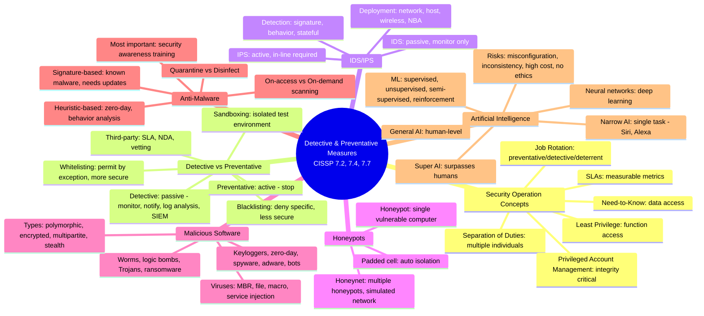

### Video V201: Security Operation Concepts

```mermaid
graph TD
    subgraph Purpose
        SecOps[Security Operations<br/>Purpose: Operating and maintaining secure system operations<br/>Key Activities: Allow systems to function, maintain secure baseline<br/>Ensure controls remain effective throughout system lifecycle]
    end

    subgraph Key Security Concepts
        NTK[Need-to-Know<br/>Focus: Access to INFORMATION/DATA needed for job<br/>Implementation: Data owner discretion DAC, groups, RBAC, clearance levels MAC]
        
        LP[Least Privilege<br/>Focus: Access to FUNCTIONS/PRIVILEGES needed for job<br/>Implementation: Enforces need-to-know & separation of duties<br/>Often via RBAC]
        
        SoD[Separation/Segregation of Duties<br/>Requires MULTIPLE individuals to perform sensitive task<br/>Prevents excessive power, requires COLLUSION to subvert]
        
        PAM[Privileged Account Management<br/>Control over elevated accounts: admin, root, domain, security<br/>Provides access to sensitive functions/configs/logs<br/>Critical for INTEGRITY]
        
        JR[Job Rotation<br/>Rotating individuals through roles to prevent excessive control<br/>Functions as PREVENTATIVE, DETECTIVE, and DETERRENT control]
        
        SLA[Service-Level Agreements - SLAs<br/>Formal agreement with EXTERNAL provider defining service terms<br/>Must be MEASURABLE e.g., 99% uptime<br/>Includes consequences for violations]
    end

    subgraph Relationships
        Rel1[Least Privilege is broader principle - privileges for job]
        Rel2[Need-to-Know is subset/focus - data access for job]
        Rel3[Separation of Duties enforced by least privilege]
        Rel4[Job Rotation complements separation of duties]
    end

    SecOps --> NTK
    NTK --> LP
    LP --> SoD
    SoD --> PAM
    PAM --> JR
    JR --> SLA
    SLA --> Rel1 --> Rel2 --> Rel3 --> Rel4
```



---

### Video V202: Detective and Preventative Concepts

```mermaid
graph TD
    subgraph Focus
        Focus[Detective vs Preventative measures in security operations<br/>Scope: Technical/logical controls - not physical<br/>Goal: Discover or prevent violations BEFORE incidents]
    end

    subgraph Detective Measures - Passive
        Detective[Function: Monitor, discover current/previous violations, notify<br/>Methods: Log analysis, network monitoring, vulnerability scanning]
        SIEM[SIEM - Alert aggregation, displays alerts on dashboard<br/>Real-time monitoring]
    end

    subgraph Preventative Measures - Active
        Whitelist[Whitelisting<br/>Permit by exception, deny by default<br/>More stringent & secure]
        
        Blacklist[Blacklisting<br/>Deny specific actions, allow everything else by default<br/>Less secure, looser control]
        
        ACL[Access Control Lists - ACLs<br/>Can act as either whitelist or blacklist<br/>Depends on configuration]
        
        Sandbox[Sandboxing<br/>Confined test environment with logical boundary - confinement<br/>Isolates failures from production<br/>Use Cases: Testing apps, malware analysis, config changes<br/>Analogy: Type 2 virtualization - VirtualBox, VMware]
        
        ThirdParty[Third-Party Security Services<br/>Leasing services due to lack of internal tools/skills<br/>Requires: Thorough vetting, SLA, NDA<br/>Include in incident response plan]
    end

    Focus --> Detective
    Detective --> SIEM
    Focus --> Whitelist
    Whitelist --> Blacklist
    Blacklist --> ACL
    ACL --> Sandbox
    Sandbox --> ThirdParty
```

---

### Video V203: IDS/IPS Systems

```mermaid
graph TD
    subgraph Core Definitions
        Intrusion[Intrusion: Unauthorized access attempt<br/>Circumventing security/privacy controls]
        IDS[IDS - Intrusion Detection System<br/>PASSIVE: Listens, monitors, reports only]
        IPS[IPS - Intrusion Prevention System<br/>ACTIVE aka active IDS: Listens, detects, AND responds]
    end

    subgraph Key Deployment Difference
        Deploy[IDS: Can be deployed anywhere, traffic can bypass it<br/>IPS: Must be IN-LINE - traffic goes through it<br/>To truly prevent attacks]
    end

    subgraph Important Standards
        NIST[NIST SP 800-94 - Guide to IDPS]
        ISO[ISO/IEC 27039 - Selection, deployment, operations of IDPS]
    end

    subgraph Detection Methods
        Knowledge[Knowledge-Based - Signature-Based<br/>Compares events to known attack signatures<br/>Limitation: Requires up-to-date signatures, cannot detect emerging threats]
        
        Behavior[Behavior-Based - Anomaly-Based / Heuristic<br/>Compares current activity to normal behavior profile<br/>Limitation: Prone to false positives]
        
        Stateful[Stateful Protocol Analysis<br/>Compares monitored events to expected protocol states<br/>Limitation: Uses vendor-developed profiles]
    end

    subgraph Deployment Types
        NIDS[NIDS / NIPS - Network-wide<br/>Monitors all network traffic]
        HIDS[HIDS / HIPS - Single host<br/>Host-specific only - cannot see network]
        WIDS[WIDS / WIPS - Wireless network<br/>Monitors unusual protocol activity]
        NBA[NBA - Network Behavior Analysis<br/>Detects unusual communications]
        Best[Best practice: Deploy both network-based and host-based<br/>Defense in depth]
    end

    subgraph Drawbacks
        D1[Inline IPS → Throughput/latency risk<br/>Bad for availability-focused environments]
        D2[HIDS/HIPS → Cannot detect misconfigurations, missing patches<br/>Requires host firewall as minimum]
        D3[Network IDS → Attack traffic still reaches network<br/>Detection only, no prevention]
    end

    Intrusion --> IDS
    Intrusion --> IPS
    IDS --> Deploy
    IPS --> Deploy
    Deploy --> NIST --> ISO
    ISO --> Knowledge --> Behavior --> Stateful
    Stateful --> NIDS --> HIDS --> WIDS --> NBA --> Best
    Best --> D1 --> D2 --> D3
```



---

### Video V204: Honeypots and Honeynets

```mermaid
graph TD
    subgraph Honeypot
        Honeypot[Honeypot<br/>Intentionally vulnerable computer - physical or virtual<br/>Contains no tangible/valuable data<br/>Intentionally misconfigured<br/>Uses PSEUDO FLAWS to lure attackers<br/>Effectiveness: Can trigger intrusion detection alerts<br/>Should be believable - threat modeling, MITRE ATT&CK]
    end

    subgraph Honeynet
        Honeynet[Honeynet<br/>Multiple honeypots creating simulated or pseudo network<br/>More believable than single honeypot<br/>Encourages more attacker interaction<br/>Contains attackers within pseudo network<br/>Enhancement: Use unused IP space for footprinting discovery]
    end

    subgraph Padded Cell
        Padded[Padded Cell<br/>Similar to honeypot but automatically moves attackers to isolated area<br/>Features: Built with more realistic data<br/>Keeps attackers busy in pseudo-flawed network<br/>Deployment: Rare in smaller systems - resource-intensive<br/>Occasionally in enterprise systems, monitored by SOC]
    end

    Honeypot --> Honeynet
    Honeynet --> Padded
```

---

### Video V205: Malicious Software

```mermaid
graph TD
    subgraph Malware Definition
        Malware[Malware - Software purposely designed to harm computer system<br/>Goals: Cause damage, steal/exfiltrate data, extort money<br/>Nature: Typically passive attack<br/>Good malware avoids detection until activated or propagated]
    end

    subgraph Key Types of Malware
        Worms[Worms - Self-contained, spread/modify without human interaction]
        LogicBomb[Logic Bombs - Activated by trigger: timer, system action, criteria]
        Trojan[Trojan Horses - Disguised as harmless/trusted software<br/>RAT creates backdoor]
        Ransomware[Ransomware - Encrypts victim's data, holds decryption key for ransom]
        Keylogger[Keyloggers - Records every keystroke<br/>Usernames, passwords, credit card numbers]
        ZeroDay[Zero-day Malware - Targets unknown/unpatched vulnerabilities<br/>Indefensible]
        Spyware[Spyware - Collects info via keylogging, screen scraping]
        Adware[Adware - Collects info on consumer interests<br/>Less nefarious but can be exploited]
        Bots[Bots - Zombies - Infected computers remotely controlled<br/>Bot master via C&C server<br/>Botnet = network of bots - used in DDoS]
    end

    subgraph Viruses
        Virus[Virus - Small malicious code attached to legitimate programs<br/>Goal: Infect and spread to as many system areas as possible]
        
        subgraph Propagation Methods
            MBR[Master Boot Record - Infects first boot sector<br/>Processed early, may defeat anti-malware]
            File[File Infector - Deployed with files, activates when executed<br/>Common in phishing]
            Macro[Macro Virus - Spreads via VBA code in MS Office]
            Service[Service Injection Virus - Infects trusted system processes/services<br/>Avoids detection]
        end
        
        subgraph Specific Virus Types
            Poly[Polymorphic Virus - Copies and changes itself to alter signature<br/>Evades detection]
            Encrypted[Encrypted Virus - Uses encryption to hide<br/>Requires decryption before scanning]
            Multi[Multipartite Virus - Uses multiple infection methods simultaneously<br/>Spreads quickly]
            Stealth[Stealth Virus - Modifies OS processes, changes signatures<br/>Encrypts data, erases evidence]
        end
    end

    Malware --> Worms --> LogicBomb --> Trojan --> Ransomware --> Keylogger --> ZeroDay --> Spyware --> Adware --> Bots
    Bots --> Virus
    Virus --> MBR --> File --> Macro --> Service
    Service --> Poly --> Encrypted --> Multi --> Stealth
```



---

### Video V206: Anti-Malware

```mermaid
graph TD
    subgraph Risks
        Risks[Any software can be vulnerable<br/>Especially if unpatched, unprotected, or unknown vulnerabilities zero-day<br/>Encrypted data - files, emails - makes malware detection difficult]
    end

    subgraph Defense Mechanisms - Layered / Defense-in-Depth
        NGFW[Next-gen firewalls / UTM - inspect data at firewall level]
        NIDS[NIDS/NIPS - detects known signatures]
        ServerAV[Server anti-malware - inline protection]
        EDR[Endpoint security / EDR - detects and responds<br/>Quarantine/eradicate]
    end

    subgraph Anti-Malware Functions
        OnAccess[On-access scanning - scans files when downloaded/executed<br/>Recommended for untrusted sources]
        OnDemand[On-demand scanning - manually activated scans<br/>For trusted sources]
        Actions[Actions: scan, detect, isolate quarantine, remove/disinfect]
    end

    subgraph Detection Methods
        Signature[Signature-Based - knowledge-based/pattern-matching<br/>Compares file to known malware signatures from vendor<br/>Requires up-to-date signatures]
        
        Heuristic[Heuristic-Based<br/>Static: analyzes without execution<br/>Dynamic: executes in sandbox to observe behavior<br/>Best for zero-day malware]
    end

    subgraph Quarantine & Disinfection
        Quarantine[Quarantine - isolate malware in sandbox for further analysis]
        Disinfect[Disinfect - remove malware from infected file<br/>Note: Some malware cannot be disinfected<br/>Must delete or sanitize system]
    end

    subgraph Most Important Control
        Training[Security Awareness Training<br/>People are the weakest link<br/>Train users to detect and prevent social engineering/phishing<br/>Goal: change user behavior toward safer practices]
    end

    Risks --> NGFW --> NIDS --> ServerAV --> EDR
    EDR --> OnAccess
    OnAccess --> OnDemand
    OnDemand --> Actions
    Actions --> Signature
    Signature --> Heuristic
    Heuristic --> Quarantine --> Disinfect
    Disinfect --> Training
```

---

### Video V207: Artificial Intelligence Tools

```mermaid
graph TD
    subgraph AI Definition
        AI[AI - Artificial Intelligence<br/>Software capability to analyze environment and make independent decisions<br/>Goal: Reduce human workload and minimize errors - stress, fatigue]
    end

    subgraph Three Levels of AI
        Narrow[Narrow AI - Weak AI<br/>Artificial Narrow Intelligence<br/>Single task, no transfer learning<br/>Examples: Siri, Alexa, help bots]
        
        General[General AI - AGI<br/>Artificial General Intelligence<br/>Mimics human behavior, complex tasks<br/>Equal to human intelligence]
        
        Super[Super AI - ASI<br/>Artificial Super Intelligence<br/>Surpasses human intelligence<br/>Future goal]
    end

    subgraph AI in Cybersecurity
        App[Mostly Narrow AI used today<br/>Applications: Expert systems, NLP, virtual assistants<br/>Chatbots, email spam protection]
    end

    subgraph Machine Learning Types
        Supervised[Supervised - Labeled data<br/>Train with labels + feedback<br/>Example: Google/YouTube recommendations]
        
        Unsupervised[Unsupervised - Unlabeled data<br/>Finds hidden patterns via clustering<br/>Example: Big data, APT detection]
        
        Semi[Semi-supervised - Mixed data<br/>Combines both approaches<br/>Sensitive data = supervised, rest = unsupervised]
        
        Reinforcement[Reinforcement - Positive/negative feedback<br/>Agents reward/punish themselves<br/>Example: Tesla self-driving cars]
    end

    subgraph Neural Networks
        ANN[ANN / SNN - Artificial Neural Networks<br/>Use DEEP LEARNING to make independent decisions<br/>Process: Multiple inputs → hidden layers → limited outputs<br/>→ informed decision<br/>Examples: Spam detection, NLP, business intelligence<br/>Limitation: Cannot make human-based ethical decisions]
    end

    subgraph Risks of AI
        R1[Misconfiguration / poor implementation → high errors]
        R2[Inconsistent outputs - AI changes rapidly with new inputs]
        R3[High investment - time, money, infrastructure]
        R4[No regard for ethics, privacy, sensitivity<br/>Human oversight required]
    end

    AI --> Narrow --> General --> Super
    Super --> App
    App --> Supervised --> Unsupervised --> Semi --> Reinforcement
    Reinforcement --> ANN
    ANN --> R1 --> R2 --> R3 --> R4
```



---

### Bonus: Session 27 Complete Concept Map

