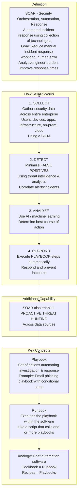
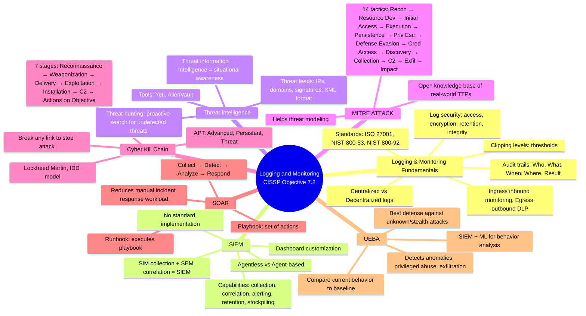

### Video V209: Logging and Monitoring

```mermaid
graph TD
    subgraph Core Concepts
        Logging[Logging - Digital<br/>System-generated record/journal of system-related events]
        Audit[Audit Logging - Examination of log files to investigate events<br/>and assess organizational compliance<br/>Auditing = process, Logging = capture]
        Events[Events - System or network-related activities that can be recorded<br/>Most computer/network/application actions can be logged]
    end

    subgraph Key Events to Log
        E1[Successful & unsuccessful logon attempts]
        E2[Successful & unsuccessful access attempts to objects<br/>Files, directories, code execution]
        E3[Start/end date & time of user sessions]
        E4[Account creation, modification, or revocation]
        E5[Privilege-level system access - sudo, root, admin]
        E6[Program/application initiations and terminations]
    end

    subgraph Log Deployment Models
        Centralized[Centralized - All logs sent to one central log server<br/>SIEM, backups<br/>Best practice: real-time central collection + local copies for integrity]
        Decentralized[Decentralized - Each device maintains its own logs<br/>Firewall, switch, server]
    end

    subgraph Critical Log Attributes
        Attr1[Who: User or system account]
        Attr2[What: Action taken]
        Attr3[When: Date/time - must sync to Stratum 0/1 or NTP]
        Attr4[Where: Hostname, IP address]
        Attr5[Result: Success or failure]
    end

    subgraph Monitoring Types
        Ingress[Ingress - North-South, inbound<br/>External → internal networks<br/>Early threat/attack/intrusion detection]
        Egress[Egress - Southbound, outbound<br/>Internal → external networks<br/>Protects against sensitive data exfiltration using DLP]
    end

    subgraph Clipping Levels
        Clip[Clipping Levels - Thresholds to avoid excessive log data<br/>Example: Don't log single failed login<br/>Log only after 3 consecutive failures<br/>Policy/industry driven]
    end

    subgraph Log Security & Protection
        Sec1[Limit access to logs]
        Sec2[Encrypt logs at rest/in archive]
        Sec3[Retain logs per regulations - 1,3,5+ years by industry]
        Sec4[Protect integrity in transit - secure protocols, segmentation]
        Sec5[Secure log-generating components - critical for legal admissibility]
    end

    subgraph Standards
        Std1[ISO 27001 - Log management controls]
        Std2[NIST SP 800-53 - Log collection controls]
        Std3[NIST SP 800-92 - Guide to computer security log management]
    end

    Logging --> Audit --> Events
    Events --> E1 --> E2 --> E3 --> E4 --> E5 --> E6
    E6 --> Centralized
    Centralized --> Decentralized
    Decentralized --> Attr1 --> Attr2 --> Attr3 --> Attr4 --> Attr5
    Attr5 --> Ingress
    Ingress --> Egress
    Egress --> Clip
    Clip --> Sec1 --> Sec2 --> Sec3 --> Sec4 --> Sec5
    Sec5 --> Std1 --> Std2 --> Std3
```

---

### Video V210: Security Information and Event Management (SIEM)

```mermaid
graph TD
    subgraph Definition
        SIEM[SIEM - Security Information and Event Management<br/>Primary Use: Real-time analysis of security-related events<br/>Advanced threat detection<br/>Key Function: Collects log data from multiple components to central point<br/>Analyzes and formats for detection]
    end

    subgraph Historical Evolution
        SIM[SIM - Security Information Manager<br/>Gathered logs into central repository/log server]
        SEM[SEM - Security Event Manager<br/>Correlated and analyzed logs for security events]
        Current[SIM + SEM merged = SIEM product]
    end

    subgraph Deployment Context
        Context[Commonly found in Security Operations Centers - SOCs<br/>Large enterprise networks<br/>Uses ML and AI to filter noise<br/>Presents relevant data for real-time decisions]
    end

    subgraph Deployment Methods
        Agentless[Agentless - Receives log data from hosts<br/>No additional software]
        AgentBased[Agent-based - Requires specialized software on each host<br/>To transmit logs]
    end

    subgraph Core Capabilities
        C1[Collection & Aggregation - inherited from SIM]
        C2[Correlation Engine - inherited from SEM<br/>Creates audit trails]
        C3[Alerting & Reporting - email/console alerts<br/>Generates daily reports for management]
        C4[Retention & Archive - stores logs per industry standards/regulations]
        C5[Data Stockpiling - large volumes enable ML/AI<br/>Search and surface relevant data]
    end

    subgraph Dashboard Customization
        Dashboard[Users can filter what data appears<br/>Logon attempts, specific OS vulnerabilities<br/>Based on organizational needs<br/>Allows analysts to view real-time alerts and act]
    end

    subgraph Key Note
        Note[SIEM is an INDUSTRY PRODUCT<br/>NO standard implementation or configuration<br/>Configuration depends on industry regulations and preferences]
    end

    SIEM --> SIM --> SEM --> Current
    Current --> Context
    Context --> Agentless
    Agentless --> AgentBased
    AgentBased --> C1 --> C2 --> C3 --> C4 --> C5
    C5 --> Dashboard
    Dashboard --> Note
```

---

### Video V211: Threat Intelligence

```mermaid
graph TD
    subgraph Core Definition
        TI[Threat Intelligence<br/>Analyzed information used to make threat-based decisions<br/>Conclusions drawn from raw data]
    end

    subgraph Key Concepts
        Threat[Threat - Potential for unwanted harm to personnel or assets]
        Vuln[Vulnerability - Flaw or weakness a threat acts against]
        AttackSurface[Attack Surface - All possible entry points for compromise<br/>People, technology, physical access]
    end

    subgraph Relationship
        Relation[Threat Information → Threat Intelligence = SITUATIONAL AWARENESS<br/>Uses risk indicators, performance indicators<br/>to understand security posture<br/>TTPs - Tactics, Techniques, Procedures<br/>Proven methods for better defense]
    end

    subgraph Threat Feeds
        Feeds[Threat Feeds - Data sources<br/>Collections of data from known threats/attacks<br/>Shared with security community<br/>Contents: suspicious/known IPs, ports/protocols, domain names, signatures<br/>Format: Often raw XML<br/>Tools to ingest/interpret: Yeti, AlienVault]
    end

    subgraph Threat Hunting
        Hunting[Threat Hunting - Proactive Search<br/>Searching for PREVIOUSLY UNDETECTED threats or attacks<br/>Goes beyond known alerts]
        
        Process[Process:<br/>1. Detect a known threat - from threat feed<br/>2. Proactively search systems for impact<br/>3. Identify presence → take remedial action<br/>Value: Enables proactive defense, not just reactive alerts]
    end

    TI --> Threat
    Threat --> Vuln
    Vuln --> AttackSurface
    AttackSurface --> Relation
    Relation --> Feeds
    Feeds --> Hunting
    Hunting --> Process
```

---

### Video V212: MITRE ATT&CK Framework

```mermaid
graph TD
    subgraph Overview
        MITRE[MITRE ATT&CK Framework<br/>Open knowledge base of real-world attacker TTPs<br/>Tactics, Techniques, Procedures<br/>Large, fluid, frequently updated by MITRE<br/>Purpose: Helps THREAT MODELING]
    end

    subgraph The 14 ATT&CK Categories - Tactics
        T1[1. Reconnaissance - Passive scanning, OSINT, phishing]
        T2[2. Resource Development - Discovering attack vectors and assets]
        T3[3. Initial Access - First entry - compromised account]
        T4[4. Execution - Running malware, scripts, code]
        T5[5. Persistence - Maintaining access - manipulating accounts/processes]
        T6[6. Privilege Escalation - Gaining admin/root]
        T7[7. Defense Evasion - Avoiding IDS, endpoint security]
        T8[8. Credential Access - Stealing account info/passwords]
        T9[9. Discovery - Searching for more assets to exploit]
        T10[10. Collection - Gathering target data]
        T11[11. Command & Control - Controlling compromised machines]
        T12[12. Exfiltration - Stealing target data]
        T13[13. Impact - Disrupting CIA]
    end

    subgraph Application to Threat Modeling
        Q1[Reconnaissance: What public info is available?]
        Q2[Resource Development: What are attack vectors?]
        Q3[Initial Access: Where will access be gained?]
        Q4[Execution: Where could malware be installed?]
        Q5[Persistence: How many accounts exist on servers?]
        Q6[Privilege Escalation: Are there privileged accounts?]
        Q7[Defense Evasion: What endpoint security/firewalls exist?]
        Q8[Credential Access: Account management, policies]
        Q9[Discovery/Lateral Movement: Can attacker move between servers?]
        Q10[Collection: Is data encrypted at rest?]
        Q11[Exfiltration/Impact: How is data protected during theft?]
    end

    MITRE --> T1 --> T2 --> T3 --> T4 --> T5 --> T6 --> T7 --> T8 --> T9 --> T10 --> T11 --> T12 --> T13
    T13 --> Q1 --> Q2 --> Q3 --> Q4 --> Q5 --> Q6 --> Q7 --> Q8 --> Q9 --> Q10 --> Q11
```

---

### Video V213: Cyber Kill Chain

```mermaid
graph TD
    subgraph Context
        KillChain[Cyber Kill Chain<br/>Developed by Lockheed Martin<br/>Part of Intelligence Driven Defense - IDD model<br/>Purpose: Proactively detect persistent threats - APTs]
    end

    subgraph APT Definition
        APT1[Advanced - Sophisticated skill/expertise - not script kiddies]
        APT2[Persistent - Continues attacking target over time]
        APT3[Threat - Potential for unwanted harm to personnel/assets]
    end

    subgraph The 7 Stages
        S1[1. RECONNAISSANCE<br/>Passive info gathering - names, emails, OSINT]
        S2[2. WEAPONIZATION<br/>Creating exploit based on gathered intel]
        S3[3. DELIVERY<br/>Deploying exploit - phishing, malicious website, USB drop]
        S4[4. EXPLOITATION<br/>Activating exploit to take advantage of vulnerability]
        S5[5. INSTALLATION<br/>Installing malware - backdoors, viruses, worms]
        S6[6. COMMAND & CONTROL - C2<br/>Maintaining access to owned system]
        S7[7. ACTIONS ON OBJECTIVE<br/>Achieving attacker's final goal]
    end

    subgraph Proactive Defense
        Defense[Goal: Identify/prevent cyber intrusions<br/>Stop adversaries at any stage of the chain<br/>Break ONE link → defend against/minimize attack impact]
        
        Strategy[Detection at delivery → focus on stopping installation/exploitation<br/>Malware already deployed → break link #6 C2<br/>Caught during weaponization → block deployment]
    end

    KillChain --> APT1 --> APT2 --> APT3
    APT3 --> S1 --> S2 --> S3 --> S4 --> S5 --> S6 --> S7
    S7 --> Defense
    Defense --> Strategy
```

---

### Video V214: Security Orchestration, Automation and Response (SOAR)

---

### Video V215: User/Entity Behavior Analytics (UEBA)

```mermaid
graph TD
    subgraph Definition
        UEBA[UEBA - User/Entity Behavior Analytics<br/>Also called: UBA - User Behavior Analytics<br/>Behavior analytics = analysis of subject activity to detect threats<br/>Focus: How subjects behave on systems, device usage<br/>Security-related events from that activity]
    end

    subgraph Core Mechanism
        Mechanism[Compare current user/device behavior to PAST BEHAVIOR<br/>Detect ANOMALIES<br/>Example: A workstation running a vulnerability scan]
    end

    subgraph What It Detects
        D1[Privileged account abuse]
        D2[Privilege escalation abuse]
        D3[Data exfiltration - including misses by DLP]
    end

    subgraph How It Works in Practice
        Flow[Logs from endpoints, servers, IoT, mobile devices<br/>→ sent to a SIEM<br/>SIEM performs behavior analytics]
        Tools[Example SIEM tools: Elastic Stack, AlienVault, RSA<br/>Splunk - uses machine learning for unknown threats]
    end

    subgraph Key Benefits
        B1[Best defense against UNKNOWN/STEALTH attacks]
        B2[Catches what IDS/IPS/DLP/endpoint security might miss]
        B3[Enables advanced threat detection by correlating anomalies into threat profile]
        B4[Accelerates threat hunting via deep investigation]
    end

    subgraph Key Takeaway - Vendor Neutral
        Takeaway[Understand purpose and benefits of behavior analytics<br/>Focus on concepts: anomaly detection<br/>Behavior comparison, log analysis across multiple sources]
    end

    UEBA --> Mechanism
    Mechanism --> D1 --> D2 --> D3
    D3 --> Flow
    Flow --> Tools
    Tools --> B1 --> B2 --> B3 --> B4
    B4 --> Takeaway
```

---

### Bonus: Session 28 Complete Concept Map

