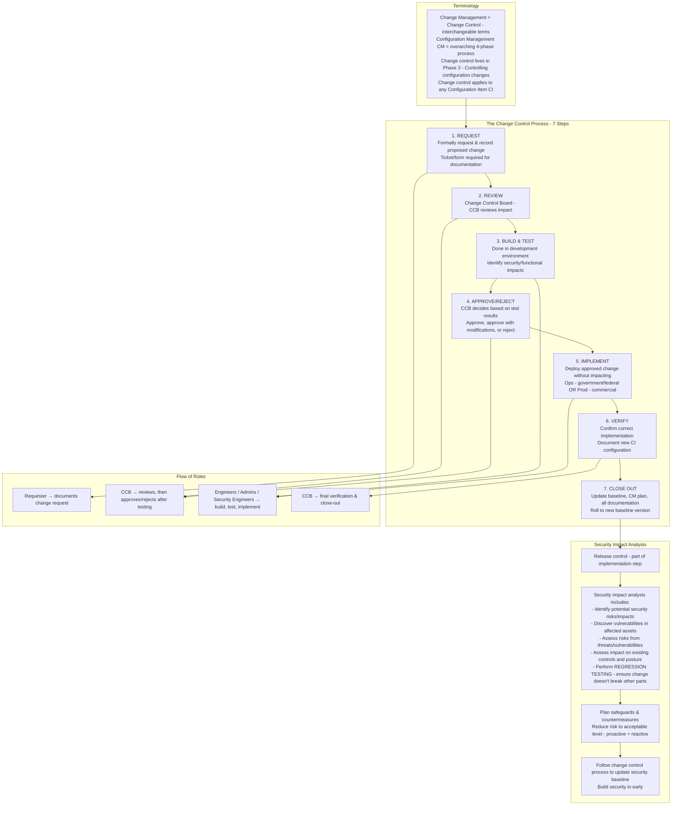
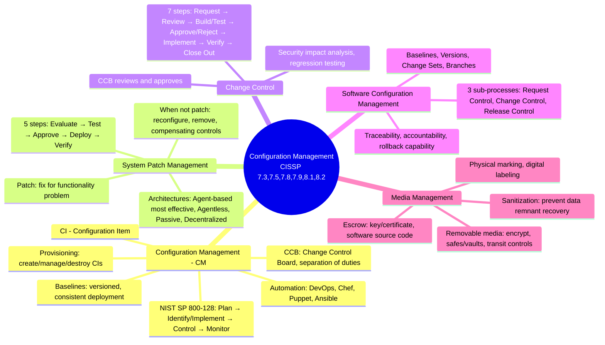

### Video V217: Configuration Management

```mermaid
graph TD
    subgraph Core Definition
        CM[Configuration Management - CM<br/>Activities ensuring system components maintain a known configuration state<br/>Primary Goal: Prevent unauthorized changes to systems<br/>Configuration: Specifications/settings of an asset - server, firewall, etc.<br/>Includes architecture design]
    end

    subgraph Key Terminology
        CI[Configuration Item - CI<br/>The asset that requires configuration control]
        CMP[CM Plan - Defines HOW organization manages/configures changes to assets]
        Policy[CM Policy vs Plan: Policy = intention, Plan = execution<br/>Purpose, scope, roles, processes]
    end

    subgraph NIST SP 800-128 - 4 Phases
        Phase1[1. PLANNING<br/>Identify CIs scope → Create CM policy/processes<br/>Establish Change Control Board - CCB<br/>Review/approve changes, ensures separation of duties]
        
        Phase2[2. IDENTIFYING and IMPLEMENTING<br/>Define secure baseline configuration<br/>Specifications/version for consistent deployment<br/>PROVISIONING = create/manage/destroy CIs<br/>Can be automated: DevOps tools - Chef, Puppet, Ansible]
        
        Phase3[3. CONTROLLING<br/>Maintain secure baseline<br/>Conduct security impact assessments for changes<br/>Update CM plan and baseline documentation]
        
        Phase4[4. MONITORING<br/>Analyze compliance with approved baselines<br/>Integrity tools: AIDE, Tripwire, discovery/vulnerability scans<br/>Identify unauthorized changes and improve CM processes]
    end

    subgraph Important Concepts
        NotAll[Not everything is a CI - only assets requiring control]
        CCB_Comp[CCB composition: Designated members + guest SMEs<br/>Network engineer for network changes]
        BaselineVersions[Baseline versions enable recovery, consistent deployment, risk awareness]
        Automation[Automation DevOps/DevSecOps allows approved baselines<br/>Provisioned without repeated security analysis]
    end

    CM --> CI --> CMP --> Policy
    Policy --> Phase1 --> Phase2 --> Phase3 --> Phase4
    Phase4 --> NotAll --> CCB_Comp --> BaselineVersions --> Automation
```

---

### Video V218: System Patch Management

```mermaid
graph TD
    subgraph Definition
        Patch[Patch - Fix for known functionality problem in software/firmware<br/>Bug fixes, new features, security updates]
        PM[Patch Management - Consistent process to identify and install patches<br/>Avoiding operational impact<br/>Link to Vulnerability Management: Patches often fix vulnerabilities]
    end

    subgraph Key Policy Elements
        PolicyOut[Patch management policy must outline:<br/>Identification, acquisition, installation, responsibilities<br/>Avoiding production/operations impact]
        Challenges[Key challenges: timeliness, priority setting, testing before deployment]
    end

    subgraph When Patching Not Possible
        Options[Options if system/application cannot be patched:<br/>1. Reconfigure - disable vulnerable service<br/>2. Remove the application<br/>3. Apply COMPENSATING CONTROLS - whitelisting, TLS encryption]
    end

    subgraph Patch Management Architectures
        AgentBased[Agent-based - centralized<br/>Agents on hosts communicate with internal patch server<br/>MOST COMMON & EFFECTIVE]
        Agentless[Agentless - Server scans systems to detect missing patches]
        Passive[Passive network monitoring - Monitors local network traffic<br/>Limited to protocol-level visibility]
        Decentralized[Decentralized - Hosts manage own patches<br/>NOT recommended - loss of configuration control & baseline]
    end

    subgraph General Steps - 5 Steps
        Step1[1. EVALUATE<br/>Identify relevant patches from trusted sources<br/>NIST, vendors, determine risk to system]
        Step2[2. TEST<br/>Assess for negative impacts in sandbox/dev environment]
        Step3[3. APPROVE<br/>Submit to change control board - part of change/config management]
        Step4[4. DEPLOY<br/>Install in production ASAP to reduce risk exposure]
        Step5[5. VERIFY<br/>Confirm effectiveness and no operational issues<br/>Security tests, audits, regression testing]
    end

    subgraph Reference
        NISTRef[NIST SP 800-40r3 comparison highlights:<br/>Agent-based needs admin privileges, supports remote hosts<br/>Most effective overall]
    end

    Patch --> PM
    PM --> PolicyOut --> Challenges
    Challenges --> Options
    Options --> AgentBased
    AgentBased --> Agentless --> Passive --> Decentralized
    Decentralized --> Step1 --> Step2 --> Step3 --> Step4 --> Step5
    Step5 --> NISTRef
```

---

### Video V219: Change Control

---

### Video V220: Software Configuration Management

```mermaid
graph TD
    subgraph Core Definition
        SWCM[Software Configuration Management<br/>Ensures software maintains a known configuration<br/>Critical for large and enterprise-level environments<br/>Focuses on the software side - vs general CM]
    end

    subgraph Key Components
        CI_SW[Configuration Items - CIs<br/>System/software assets requiring control<br/>OS, hypervisor, identified in CM plan]
        
        Baselines[Baselines<br/>Pre-configured CIs as consistent starting point<br/>Tested, verified, then versioned<br/>e.g., 1.1.2 → 1.1.3]
        
        Versions[Versions<br/>Uniquely identify functionality or baseline configuration]
        
        ChangeSets[Change Sets<br/>Collective changes made to a baseline<br/>As part of a change request]
        
        Branches[Branches<br/>Configurations built alongside the baseline<br/>A build in progress<br/>Checkout baseline = create branch<br/>Check in after CCB approval = new official baseline]
    end

    subgraph Change Management Process - 3 Sub-processes
        ReqControl[Request Control<br/>Procedures for REQUESTING a change]
        ChangeControl[Change Control<br/>Procedures for IDENTIFYING the appropriate change<br/>What's in change set, which branch]
        ReleaseControl[Release Control<br/>Procedures for DEPLOYING the change to production/ops<br/>Pushing/rolling out]
    end

    subgraph Step-by-Step Change Workflow
        W1[1. Request - Submit change to CCB - Request Control]
        W2[2. Review - Assess relevance, risk, impact - Request Control]
        W3[3. Build & Test - Create proof of concept - Change Control]
        W4[4. Approve/Reject - CCB decides - Change Control]
        W5[5. Implement - Push/roll out to production/ops - Release Control]
        W6[6. Verify - Check for negative impacts - Release Control]
        W7[7. Close Out - Roll new baseline/version - Release Control]
    end

    subgraph Key Benefits
        Benefit1[Traceability & Accountability<br/>Multiple personnel involved at each step]
        Benefit2[Governance<br/>If something fails, documentation allows rollback to previous baseline]
    end

    SWCM --> CI_SW --> Baselines --> Versions --> ChangeSets --> Branches
    Branches --> ReqControl
    ReqControl --> ChangeControl
    ChangeControl --> ReleaseControl
    ReleaseControl --> W1 --> W2 --> W3 --> W4 --> W5 --> W6 --> W7
    W7 --> Benefit1 --> Benefit2
```

---

### Video V221: Media Management

```mermaid
graph TD
    subgraph Definition
        Media[Media - Any medium capable of storing data<br/>HDD, SSD, tape, CD, DVD, mobile device, thumb drive]
    end

    subgraph Core Security Goal
        CIA[Maintain CONFIDENTIALITY, INTEGRITY, AVAILABILITY<br/>of data on media at all times]
    end

    subgraph Media Lifecycle & Availability
        Life[Media has finite lifespan - mean time to failure<br/>Aging media can slow data retrieval → impacts AVAILABILITY<br/>Need good inventory & asset tracking to replace media before failure]
    end

    subgraph Relationship to Data Lifecycle
        Relation[Media management focuses on STORAGE phase of data lifecycle<br/>Data is created → labeled → stored on media → accessed → transferred to other media]
    end

    subgraph Marking & Labeling Assets
        Physical[Physical marking - e.g., Secret sticker on hard drive<br/>Identifies sensitivity/classification of data media may contain]
        Digital[Digital labeling - metadata, hard-coded<br/>Ensures proper handling across systems]
    end

    subgraph Removable Media & Physical Controls
        RC1[Use stickers, tags, markers]
        RC2[Encrypt wherever possible]
        RC3[Backup tapes → store in safes, lockable containers, vaults]
        RC4[Media leaving facility → apply security controls for transit/transport protection]
    end

    subgraph Sanitization
        Sanitize[When media is no longer needed → properly SANITIZE<br/>Prevent data remnant recovery<br/>Critical before reusing media at lower classification level]
    end

    subgraph Proactive Replacement
        Replace[Replace media before mean time to failure is realized<br/>Part of continuous monitoring and asset security<br/>Avoid availability loss or single points of failure]
    end

    subgraph Escrow Arrangements
        KeyEscrow[Key/Certificate Escrow<br/>Third-party agent stores crypto keys<br/>Recovery agent accesses]
        SoftwareEscrow[Software Escrow<br/>Stores source code, licenses, documentation<br/>Protects if vendor fails]
    end

    Media --> CIA
    CIA --> Life --> Relation
    Relation --> Physical
    Physical --> Digital
    Digital --> RC1 --> RC2 --> RC3 --> RC4
    RC4 --> Sanitize --> Replace
    Replace --> KeyEscrow
    KeyEscrow --> SoftwareEscrow
```

---

### Bonus: Session 29 Complete Concept Map

