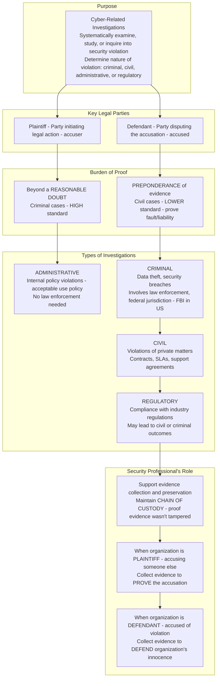
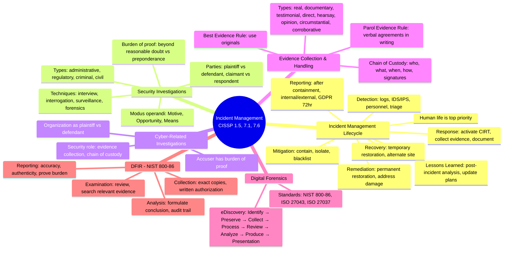

### Video V223: Incident Management

```mermaid
graph TD
    subgraph Core Definition
        Incident[Incident - An event intentional or unintentional<br/>that violates security policy<br/>Goal: Manage, respond to, and recover from events<br/>that negatively impact the system]
    end

    subgraph Key Frameworks
        Primary[NIST SP 800-61 Rev 2 - Computer Security Incident Handling Guide<br/>PRIMARY EXAM FOCUS]
        Secondary[ISO 27035, ISACA guides]
    end

    subgraph Incident Response Lifecycle - 7 Steps
        S1[1. DETECTION<br/>Sources: system logs, IDS/IPS, endpoint security, personnel reports<br/>Analyze events to verify if security incident<br/>Triage determines severity and prioritizes treatment]
        
        S2[2. RESPONSE<br/>Based on severity level in Incident Response Plan<br/>Activate CIRT or CSIRT<br/>Identify, collect, and handle evidence<br/>Thoroughly document everything]
        
        S3[3. MITIGATION<br/>Quickly contain incident to prevent further impact<br/>Example: shut down port, isolate network segment, blacklist IP<br/>Determine if DR/BC procedures needed]
        
        S4[4. REPORTING<br/>After containment - NOT before<br/>Internal: senior management - status, impact, recovery timeline<br/>External: required by regulations - GDPR 72-hour breach notification<br/>Exclude sensitive details from public reports]
        
        S5[5. RECOVERY<br/>Temporary restoration to operational state<br/>Examples: re-enable network connection, restore system account<br/>If recovery exceeds MTD, activate BCP/DRP]
        
        S6[6. REMEDIATION<br/>Permanent restoration to full operational status<br/>Address system damage, legal matters, financial impacts]
        
        S7[7. LESSONS LEARNED<br/>Post-incident analysis: What happened? Why? What could have prevented?<br/>What can stakeholders do differently?<br/>Update plans, controls, monitor changes for effectiveness]
    end

    subgraph Foundational Preparations - Pre-Detection
        Policy[Policy: Define objectives, scope, incident definition<br/>Priorities, KPIs/KRIs, reporting requirements]
        Resources[Resources: Deploy tools - DLP, firewalls, storage<br/>Establish recovery sites]
        Team[Team: Form cohesive CIRT with appropriate skills<br/>Sysadmins, network, security, management]
        Procedures[Procedures: Create step-by-step responses<br/>Get buy-in from system owners and senior management]
    end

    subgraph Key Principle
        HumanLife[Human life is ALWAYS the top priority]
        RecoveryRestore[Recovery = bringing systems back to normal at alternate site<br/>Restoration = returning to original state at primary location]
    end

    Incident --> Primary
    Primary --> Secondary
    Secondary --> S1 --> S2 --> S3 --> S4 --> S5 --> S6 --> S7
    S7 --> Policy --> Resources --> Team --> Procedures
    Procedures --> HumanLife --> RecoveryRestore
```

---

### Video V224: Security Investigations

```mermaid
graph TD
    subgraph Core Purpose
        Inv[Investigation<br/>Goal: Collect and analyze facts about an event to reach a conclusion<br/>Determine if something did or did not happen<br/>Your Role: Primarily SUPPORT role<br/>Collecting evidence, chain of custody, possibly testifying in court]
    end

    subgraph Burden of Proof
        Criminal[Criminal proceeding<br/>Proof BEYOND A REASONABLE DOUBT<br/>To a jury of peers]
        Civil[ Civil proceeding<br/>PREPONDERANCE OF EVIDENCE<br/>Majority/more likely than not]
    end

    subgraph Parties Involved
        CriminalParties[Criminal: Plaintiff accuser vs Defendant]
        CivilParties[Civil: Claimant vs Respondent]
    end

    subgraph Chain of Custody
        CoC[Chain of Custody<br/>Must protect evidence and maintain accurate record<br/>Who handled it and how]
    end

    subgraph Investigative Techniques
        Interview[Interviewing - Talking to personnel<br/>Admins, engineers - to gather information]
        Interrogation[Interrogation - Specific, focused interview<br/>To determine if subject committed violation]
        Surveillance[Surveillance - Monitoring a subject<br/>Real-time logs, CCTV - to gather evidence]
        Forensics[Digital Forensics - Identifying, collecting<br/>Analyzing, preserving electronic data]
    end

    subgraph Types of Investigations
        Admin[Administrative - Violation of ORGANIZATIONAL POLICY]
        Regulatory[Regulatory/Compliance - Violation of LAW OR REGULATION]
        CriminalType[Criminal - Violation of LAWS - country/state level]
        CivilType[Civil - Private or non-criminal matters<br/>Breach of contract, SLA]
    end

    subgraph Modus Operandi - Mode of Operations
        MO1[Motive - Why did they do it?]
        MO2[Opportunity - When and where could they do it?]
        MO3[Means - Did they have capability, tools, techniques?]
    end

    subgraph Key Principle
        Burden[The ACCUSER plaintiff/claimant<br/>ALWAYS has the burden of proof]
    end

    Inv --> Criminal
    Inv --> Civil
    Criminal --> CriminalParties
    Civil --> CivilParties
    CriminalParties --> CoC
    CivilParties --> CoC
    CoC --> Interview --> Interrogation --> Surveillance --> Forensics
    Forensics --> Admin --> Regulatory --> CriminalType --> CivilType
    CivilType --> MO1 --> MO2 --> MO3
    MO3 --> Burden
```

---

### Video V225: Cyber-Related Investigations

---

### Video V226: Evidence Collection and Handling

```mermaid
graph TD
    subgraph Purpose
        Evidence[Evidence - Facts/data proving an incident occurred<br/>Goal: Demonstrate security incident occurred<br/>Prove/disprove root cause<br/>Admissibility: Evidence must be directly relevant<br/>Judge decides admissibility based on laws/regulations]
    end

    subgraph Types of Evidence
        Real[Real - Tangible objects<br/>Fingerprints on keyboard, video recording, screen scrape]
        Documentary[Documentary - Written proof of facts/statements<br/>Audit logs, entry/exit logs - must be authenticated]
        Testimonial[Testimonial - Written/verbal witness statements<br/>Witness describing what they saw]
        Direct[Direct - Witness directly observed the offense<br/>Saw attacker typing commands]
        Hearsay[Hearsay - Secondhand knowledge - someone told me<br/>John told me he saw the attacker]
        Opinion[Opinion - Expert statement<br/>Forensic analyst explaining attack method]
        Circumstantial[Circumstantial - Facts combined to infer offense<br/>Multiple indirect clues pointing to guilt]
        Corroborative[Corroborative - Supports/validates a claim<br/>Video + logs matching hearsay statement]
    end

    subgraph Key Legal Rules
        BestEvidence[Best Evidence Rule<br/>Use ORIGINAL documentation whenever possible<br/>Copies are SECONDARY EVIDENCE<br/>Less admissible, harder to authenticate]
        Parol[Parol Evidence Rule<br/>Verbal agreements about evidence must be put IN WRITING<br/>To become documentary evidence]
    end

    subgraph Chain of Custody
        CoC[Chain of Custody - Proper handling, marking, tracking<br/>Every piece of evidence<br/>Breaks in chain introduce doubt → evidence thrown out]
        CoCDoc[Document for every transfer:<br/>WHAT was transferred - hard drive, logs<br/>WHO transferred to whom<br/>WHEN - date/time to seconds<br/>HOW - physical, digital, envelope<br/>SIGNATURES of BOTH parties for custody change]
    end

    subgraph Collection Best Practices
        BP1[Get a SECOND OPINION / second person present<br/>During witness interviews]
        BP2[Avoid INVESTIGATOR BIAS<br/>Don't try to prove preconceived narrative]
        BP3[Document EVERYTHING<br/>IP addresses, nodes, rooms, buildings<br/>Nothing is overkill]
    end

    Evidence --> Real --> Documentary --> Testimonial --> Direct --> Hearsay --> Opinion --> Circumstantial --> Corroborative
    Corroborative --> BestEvidence --> Parol
    Parol --> CoC --> CoCDoc
    CoCDoc --> BP1 --> BP2 --> BP3
```

---

### Video V227: Digital Forensics

```mermaid
graph TD
    subgraph Definition
        DF[Digital Forensics - Collection and analysis of digital evidence<br/>Computers, etc.<br/>Other Terms: eDiscovery, electronic data discovery, data forensics<br/>Applications: Investigations, security assessments, compliance<br/>Goals: Determine who, what, when, where, how of violation<br/>Identify modus operandi, motive, opportunity, method]
    end

    subgraph eDiscovery Reference Model
        Gov[Information Governance - Starting point<br/>Ensures information is well-organized<br/>Aligns policies/processes with governance, regulations, compliance]
        
        E1[1. IDENTIFY - Locate all potential sources of evidence]
        E2[2. PRESERVE - Protect information from alteration, deletion<br/>Ensures data integrity]
        E3[3. COLLECT - Gather all required information for forensic process]
        E4[4. PROCESS - Screen collected information for relevance]
        E5[5. REVIEW - Ensure information is relevant to investigation]
        E6[6. ANALYZE - Determine if information meets real/best evidence guidelines]
        E7[7. PRODUCE - Package information into consumable format<br/>For investigators, managers, courtroom]
        E8[8. PRESENTATION - Use information in court or by investigative parties]
    end

    subgraph Forensic Standards
        NIST86[NIST SP 800-86 - Guide to integrating forensic techniques into incident response]
        ISO43[ISO 27043 - Incident investigation principles and processes]
        ISO37[ISO 27037 - Guidelines for identification, collection, acquisition, preservation]
        NIST101[NIST SP 800-101 - Mobile device forensics]
        IOCE[IOCE - International Organization on Computer Evidence]
        SWGDE[SWGDE - Scientific Working Group on Digital Evidence]
    end

    subgraph High-Level Process
        Process[Collection → Examination → Analysis → Reporting]
    end

    DF --> Gov --> E1 --> E2 --> E3 --> E4 --> E5 --> E6 --> E7 --> E8
    E8 --> NIST86 --> ISO43 --> ISO37 --> NIST101 --> IOCE --> SWGDE
    SWGDE --> Process
```

---

### Video V228: Digital Forensic Incident Response (DFIR)

```mermaid
graph TD
    subgraph Core Context
        DFIR[DFIR - Digital Forensic Incident Response<br/>Focus: Deep dive into digital forensics for exam preparation<br/>Guiding Framework: NIST SP 800-86]
    end

    subgraph Phase 1 - Collection
        C1[Identify data sources: storage, external media, remote, personnel statements<br/>Set collection priorities<br/>Preserve data quickly due to volatility]
        C2[WRITTEN AUTHORIZATION is MANDATORY<br/>From management or via IR plan]
        C3[Create EXACT COPIES - full backup/bit-level<br/>NEVER work on original evidence<br/>Treat as digital crime scene]
        C4[Collect: logs, system files, accounts, code, hardware, media]
    end

    subgraph Phase 2 - Examination
        E1[Review & process collected data<br/>Search for relevant, admissible, best evidence<br/>Handle encryption, compression, technical issues]
        E2[Tools: EnCase, Forensic Toolkit, MacQuisition, The Sleuth Kit]
    end

    subgraph Phase 3 - Analysis
        A1[Formulate investigative conclusion<br/>Identify persons, places, devices, events - audit trail]
        A2[Ensure conclusion supported by evidence<br/>Beyond reasonable doubt / preponderance of evidence]
        A3[If conclusion lacks support → return to Examination or revise conclusion]
    end

    subgraph Phase 4 - Reporting
        R1[Document all forensic data and conclusion<br/>Explain HOW conclusion was reached]
        R2[Key attributes: ACCURACY & AUTHENTICITY<br/>Purpose: Prove beyond reasonable doubt / preponderance]
    end

    subgraph Key Considerations
        K1[Competence of Investigators<br/>Requires special mindset + skillset - not just running tools]
        K2[Consistency: Use consistent policy, process, procedure<br/>Admissible in court]
        K3[Chain of Custody: Anyone collecting, accessing, storing<br/>Or transferring evidence responsible for compliance]
        K4[Approach: Should be PROACTIVE]
    end

    DFIR --> C1 --> C2 --> C3 --> C4
    C4 --> E1 --> E2
    E2 --> A1 --> A2 --> A3
    A3 --> R1 --> R2
    R2 --> K1 --> K2 --> K3 --> K4
```

---

### Bonus: Session 30 Complete Concept Map

