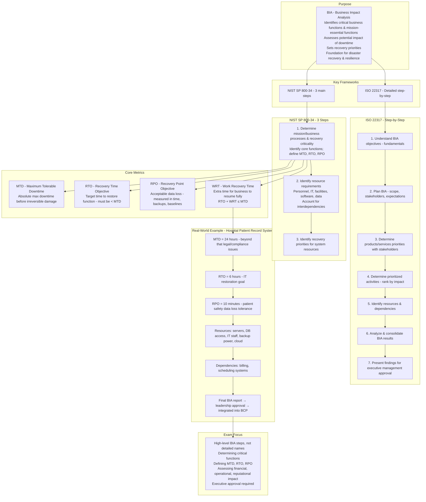
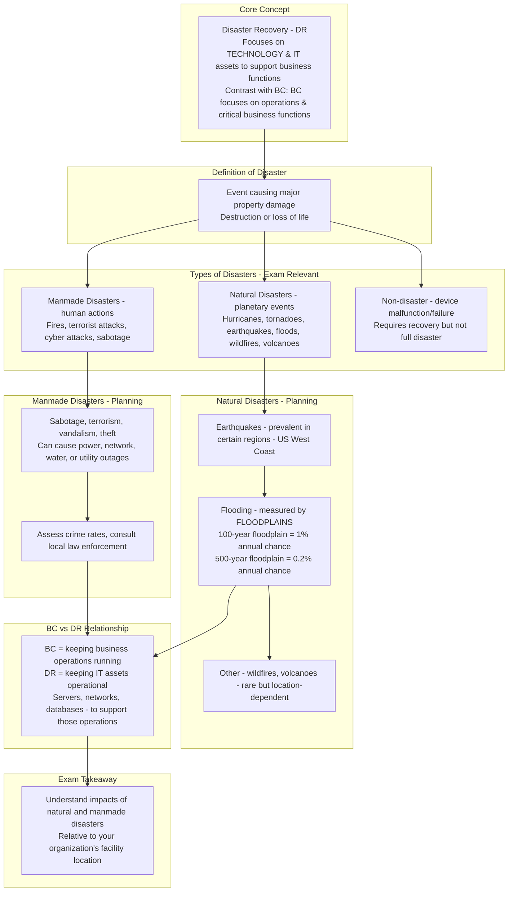
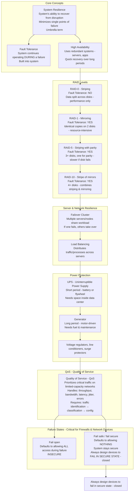
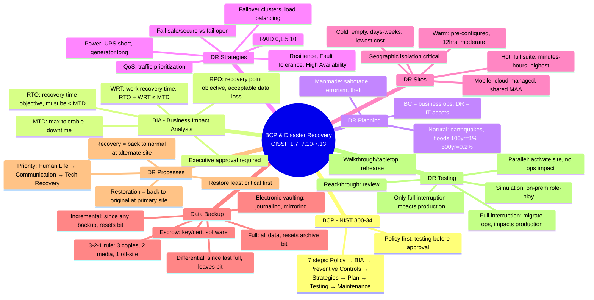

### Video V230: Business Continuity Planning (BCP)

```mermaid
graph TD
    subgraph Core Concept
        BCP[BCP - Business Continuity Planning<br/>Ensures organization can continue functioning during disruptions<br/>Cyber attacks, power outages, natural disasters<br/>Ties to: risk management, disaster recovery, security governance]
    end

    subgraph Key Frameworks
        Primary[NIST SP 800-34 - Contingency Planning Guide<br/>PRIMARY for exam]
        Secondary[ISO 22301, FFIEC Handbook, FINRA Rule 4370, COBIT]
    end

    subgraph NIST SP 800-34 - Seven Steps
        S1[1. Develop Contingency Planning Policy Statement<br/>Formal policy: direction, roles, responsibilities<br/>Executive support, scope, compliance alignment]
        S2[2. Conduct Business Impact Analysis - BIA<br/>Identify critical systems, assess disruption impact<br/>Determine RTO/RPO, dependencies]
        S3[3. Identify Preventive Controls<br/>Reduce failure risk: fire suppression, UPS<br/>Data replication, patching]
        S4[4. Develop Contingency Strategies<br/>Define recovery methods: hot site, cloud failover, remote work<br/>Based on BIA findings]
        S5[5. Develop Information System Contingency Plan<br/>Document actionable plan - DRP or COOP<br/>Step-by-step procedures, roles, contacts, escalation]
        S6[6. Ensure Plan Testing, Training & Exercises<br/>Validate plan via tabletop drills, simulations<br/>Train personnel, expose gaps before real incidents]
        S7[7. Ensure Plan Maintenance<br/>Regular reviews/updates quarterly/annually<br/>Due to technology, staffing, or business changes]
    end

    subgraph Exam-Ready Insights
        I1[Order of steps matters - sequence questions]
        I2[Policy first - without executive support, BCP fails]
        I3[Testing before approval - leadership approves after validation]
        I4[Policy vs strategy vs actual plan - key distinctions]
        I5[Outdated plan = no plan - maintenance critical]
    end

    BCP --> Primary
    Primary --> Secondary
    Secondary --> S1 --> S2 --> S3 --> S4 --> S5 --> S6 --> S7
    S7 --> I1 --> I2 --> I3 --> I4 --> I5
```

---

### Video V231: Business Impact Analysis (BIA)

---

### Video V232: Disaster Recovery Planning

---

### Video V233: Disaster Recovery Strategies

---

### Video V234: Disaster Recovery Sites

```mermaid
graph TD
    subgraph Purpose
        Site[Recovery Site - Alternate Processing Site<br/>Used temporarily after disaster or major disruption at primary site<br/>Focuses on IT assets: networks, servers, databases<br/>Not for permanent relocation - typical duration = days]
    end

    subgraph Selection Criteria
        Criteria[Based on BIA results - especially MTD<br/>Also considers RTO and budget]
    end

    subgraph Types of Recovery Sites
        Cold[Cold Site<br/>Empty room/warehouse - no computing equipment<br/>Data: None<br/>Cost: Lowest<br/>Activation: Days to weeks]
        
        Warm[Warm Site<br/>Pre-configured computing equipment<br/>Basic infrastructure: HVAC, electricity, patch/baseline servers<br/>Data: No operational data - only system data<br/>Cost: Moderate<br/>Activation: ~12 hours]
        
        Hot[Hot Site<br/>Full suite: computers, networks, near-real-time data<br/>Full infrastructure<br/>Data: Near real-time - copied daily/hourly<br/>Cost: Very high<br/>Activation: Minutes to few hours]
    end

    subgraph Other Recovery Options
        Mobile[Mobile Site<br/>Self-contained, transportable - shipping container, tractor-trailer<br/>Typically cold or warm]
        Cloud[Cloud-Managed Recovery Site<br/>Hosted on AWS, Azure, GCP<br/>Usually warm or hot<br/>SLA defines roles, availability, performance, costs - metered by VM uptime]
        Shared[Shared Site<br/>Shared with external organizations<br/>Governed by Mutual Assistance Agreement - MAA or reciprocal agreement<br/>Rare due to data sensitivity]
    end

    subgraph Critical Requirement
        Isolation[Geographic isolation from primary site<br/>Different city/region<br/>To avoid same disaster impacting both sites]
    end

    subgraph Exam Takeaways
        TA1[Know PURPOSE of recovery sites]
        TA2[Understand WHAT is present at cold, warm, hot, mobile, cloud, shared]
        TA3[Activation time and cost are inversely related to readiness]
    end

    Site --> Criteria
    Criteria --> Cold
    Cold --> Warm
    Warm --> Hot
    Hot --> Mobile
    Mobile --> Cloud
    Cloud --> Shared
    Shared --> Isolation
    Isolation --> TA1 --> TA2 --> TA3
```

---

### Video V235: Data Backup Strategies

```mermaid
graph TD
    subgraph Core Purpose
        Backup[Backup - Duplicate data to retrieve after data loss or system failure<br/>Critical for disaster recovery - DR]
    end

    subgraph Key Concepts
        Mirror[Mirroring - Identical copy on ≥2 storage media - RAID]
        Archive[Archive bit - backup bit<br/>0 = backed up - no change since last backup<br/>1 = needs backup - file changed]
    end

    subgraph Backup Types
        Full[FULL Backup<br/>Complete copy of ALL data<br/>After backup: Sets all archive bits to 0<br/>Large, infrequent - Sundays]
        
        Differential[DIFFERENTIAL Backup<br/>Changes since LAST FULL backup<br/>After backup: Does NOT reset - leaves 1<br/>Medium, captures everything since last full]
        
        Incremental[INCREMENTAL Backup<br/>Changes since ANY last backup<br/>Full/diff/inc<br/>After backup: Resets to 0<br/>Small, frequent - daily except full/diff days]
    end

    subgraph 3-2-1 Backup Rule
        Rule321[3 copies of data<br/>2 different devices/media on-premise<br/>1 copy off-premise]
    end

    subgraph Off-Premise Backup - Electronic Vaulting
        Journal[Remote journaling<br/>Logs + metadata off-site<br/>For audit/analysis]
        MirrorOff[Remote mirroring<br/>Real-time streaming of changes off-site]
        Need[Recovery needs both JOURNAL + backup data]
    end

    subgraph Storage Media
        Media[Disks, tapes, external drives<br/>No mandated method - organization chooses]
    end

    subgraph Snapshots
        Snap[Snapshots<br/>Virtual copies of files, dirs, volumes, VMs<br/>Via hypervisor]
    end

    subgraph Escrow Arrangements
        KeyEscrow[Key/Certificate Escrow<br/>Third-party agent stores crypto keys<br/>Recovery agent accesses]
        SoftwareEscrow[Software Escrow<br/>Stores source code, licenses, docs<br/>Protects if vendor fails]
    end

    subgraph Exam Takeaways
        TA1[Know backup types: full, diff, inc + archive bit behavior]
        TA2[Know electronic vaulting methods]
        TA3[Know escrow arrangements: key/cert, software]
    end

    Backup --> Mirror --> Archive
    Archive --> Full --> Differential --> Incremental
    Incremental --> Rule321
    Rule321 --> Journal
    Journal --> MirrorOff --> Need
    Need --> Media --> Snap
    Snap --> KeyEscrow --> SoftwareEscrow
    SoftwareEscrow --> TA1 --> TA2 --> TA3
```

---

### Video V236: Disaster Recovery Processes

```mermaid
graph TD
    subgraph Core Focus
        DRP[DR Processes - Goal: Ensure critical business assets and processes<br/>IT infrastructure remain operational after disruption<br/>Reference: NIST SP 800-34]
    end

    subgraph Priority Hierarchy
        P1[1. HUMAN LIFE - Top Priority<br/>Safety and security of personnel<br/>Overrides ALL technology concerns]
        P2[2. COMMUNICATION<br/>Essential for assessing safety and coordinating response]
        P3[3. TECHNOLOGY RECOVERY<br/>Only after human safety is addressed]
    end

    subgraph Key Processes within DRP
        Doc[DOCUMENTATION<br/>Assign a scribe/spokesperson as single point of contact<br/>Clear, consistent communication]
        
        Training[TRAINING & AWARENESS<br/>Ensure team knows roles, responsibilities<br/>First aid, fire suppression, crisis management]
        
        Response[RESPONSE<br/>Define procedures based on disaster type<br/>Activate BCP if RTO/RPO cannot be met]
        
        Personnel[PERSONNEL<br/>Define roles, responsibilities, response times<br/>PRIMARY and ALTERNATE backup personnel for each role]
        
        Comm[COMMUNICATIONS<br/>Single recognizable voice<br/>Maintain contact information table]
        
        Assessment[ASSESSMENT<br/>Investigate disruption extent<br/>Impact on tolerance levels RTO/RPO, sales, reputation<br/>Contracts, legal/regulatory compliance]
        
        Restoration[RESTORATION<br/>Move operations back to ORIGINAL PRIMARY location<br/>vs Recovery = bringing systems back to normal at ANY site<br/>Restore LEAST CRITICAL functions first]
        
        Lessons[LESSONS LEARNED<br/>Evaluate personnel performance, team speed<br/>Tolerance impacts, communication effectiveness<br/>Identify corrective actions]
    end

    subgraph Key Exam Takeaways
        BCPvsDRP[BCP identifies critical business functions<br/>DRP is subset focused on RECOVERING technology infrastructure]
        TopPriority[Always choose HUMAN LIFE first in any exam question]
        RecoveryVsRestoration[RECOVERY = bringing systems back to normal at alternate site<br/>RESTORATION = returning systems to original state at primary location]
    end

    DRP --> P1 --> P2 --> P3
    P3 --> Doc --> Training --> Response --> Personnel --> Comm --> Assessment --> Restoration --> Lessons
    Lessons --> BCPvsDRP --> TopPriority --> RecoveryVsRestoration
```

---

### Video V237: Disaster Recovery Testing

```mermaid
graph TD
    subgraph Context
        DR_Test[Disaster Recovery Testing<br/>DR = Ensures critical technological assets/processes stay operational<br/>BC = Focuses on critical business functions<br/>Key Reference: NIST SP 800-84]
    end

    subgraph Disaster Recovery Tests - In Order of Increasing Complexity/Impact
        ReadThrough[READ-THROUGH test - Checklist test<br/>Review DRP, redline updates<br/>Agree on roles/responsibilities<br/>Production Impact: NO]
        
        Walkthrough[WALKTHROUGH test - Tabletop<br/>Structured meeting, rehearse procedures<br/>Coordinate scenarios: fire, flood, cyber<br/>Production Impact: NO]
        
        Simulation[SIMULATION test - Preparedness test<br/>Role-play realistic conditions on-prem<br/>Evacuation drills, system activation<br/>No relocation<br/>Production Impact: NO]
        
        Parallel[PARALLEL test<br/>Activate recovery site using DRP<br/>Primary site runs normal ops<br/>Tests external services/SLAs<br/>Production Impact: NO]
        
        Full[FULL INTERRUPTION test<br/>Simulate disaster, migrate primary operations to recovery site<br/>Requires senior management approval<br/>Conducted off-peak hours<br/>Production Impact: YES]
    end

    subgraph Post-Testing Actions
        Action1[Redline and update BCP/DRP]
        Action2[Put through Configuration Management - CM process]
        Action3[Continuous monitoring: changes in processes, personnel, regulations<br/>Trigger plan review]
        Action4[Ensure DRP supports BCP - target correct servers, apps]
    end

    subgraph Exam Key Takeaway
        TA[Only the FULL INTERRUPTION test impacts production/operations<br/>All other tests are designed to avoid disruption]
    end

    DR_Test --> ReadThrough
    ReadThrough --> Walkthrough
    Walkthrough --> Simulation
    Simulation --> Parallel
    Parallel --> Full
    Full --> Action1 --> Action2 --> Action3 --> Action4
    Action4 --> TA
```

---

### Bonus: Session 31 Complete Concept Map

