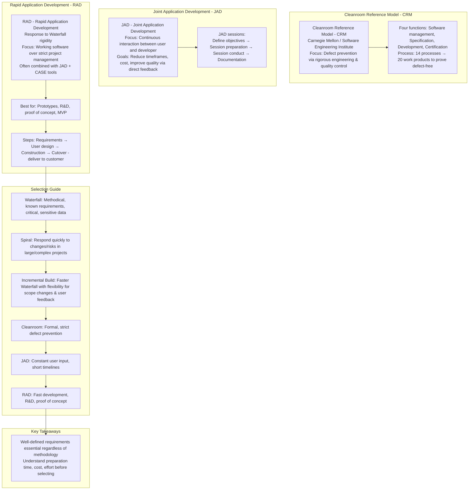
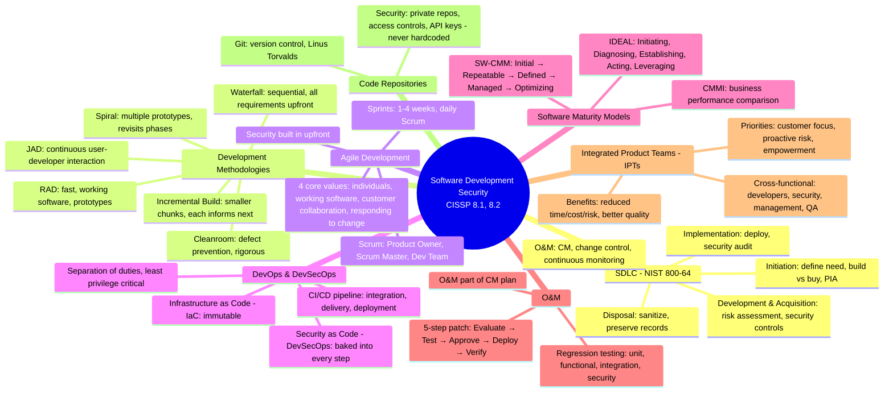

### Video V239: Software Development Lifecycle (SDLC)

```mermaid
graph TD
    subgraph Core Concept
        SDLC[SDLC - Software Development Lifecycle<br/>Series of phases moving software from inception to retirement<br/>Creation to recreation<br/>Goal: Increase software maturity through iterative phases<br/>Exam Focus: NIST SP 800-64<br/>Newer: NIST SP 800-160 - System Security Engineering]
    end

    subgraph NIST SP 800-64 - Five Phases
        P1[1. INITIATION<br/>Define need, purpose, requirements, objectives<br/>Identify privacy/data protection needs<br/>Decide build vs buy<br/>Conduct PIA & business impact assessment]
        
        P2[2. DEVELOPMENT & ACQUISITION<br/>Assess risks - especially for third-party/COTS<br/>Determine initial security & privacy controls<br/>Create/update security documentation & architecture<br/>Perform risk analysis]
        
        P3[3. IMPLEMENTATION<br/>Obtain stakeholder approval<br/>Securely deploy to operations/production<br/>Conduct security assessment/audit for compliance<br/>Integrate security into environment]
        
        P4[4. OPERATIONS & MAINTENANCE - O&M<br/>Provide designed functionality<br/>Apply configuration management & change control - CCB<br/>Continuously monitor security control effectiveness<br/>Adapt controls to new threats/vulnerabilities]
        
        P5[5. DISPOSAL<br/>Remove from operations<br/>Sanitize/declassify software and data<br/>Apply CM and change control during removal<br/>Preserve records for audit<br/>Dispose of hardware/software]
    end

    subgraph Cross-Cutting Principles
        Doc[Documentation: Continuously updated as changes occur]
        Risk[Risk & Privacy: Assessed from initiation through disposal]
        CC[Change Control: Critical from O&M phase onward, also during disposal]
        CM[Continuous Monitoring: Especially O&M and disposal phases]
    end

    SDLC --> P1 --> P2 --> P3 --> P4 --> P5
    P5 --> Doc --> Risk --> CC --> CM
```



---

### Video V240: Software Development Methodologies – Part 1

```mermaid
graph TD
    subgraph Waterfall Model
        WF[Waterfall Model - Winston Royce 1970<br/>Sequential, repetitive iterative, feedback loops allowed]
        WF_Phases[Phases: 1. Requirements → 2. Design → 3. Implementation → 4. Testing → 5. O&M]
        WF_Drawbacks[Drawbacks: All requirements upfront<br/>Structured process limits flexibility<br/>No disposal/retirement phase]
        WF_Best[Best for: Sensitive, high-risk, methodical applications]
    end

    subgraph Incremental Build Model
        IB[Incremental Build Model<br/>Build software in smaller, achievable chunks - increments]
        IB_Process[Per increment: Analysis → Design → Coding → Testing → Delivery]
        IB_Traits[System engineering upfront during analysis & design<br/>Each increment informs next - lessons learned, adaptation<br/>Predates but resembles agile]
    end

    subgraph Spiral Model
        Spiral[Spiral Model<br/>Product revisits development phases multiple times]
        Spiral_Steps[Typical steps per loop:<br/>Planning → Risk analysis - software risk, not security<br/>→ Engineering → Evaluation]
        Spiral_Visual[Multiple prototypes moving through phases<br/>Allows backward fixes and rework]
        Spiral_Drawback[Difficult to build security into process<br/>Due to parallel/iterative tracking]
    end

    subgraph Exam Takeaways
        TA1[Know each step of Waterfall model]
        TA2[Understand purpose of Incremental Build model]
        TA3[Understand purpose of Spiral model]
    end

    WF --> WF_Phases --> WF_Drawbacks --> WF_Best
    WF_Best --> IB --> IB_Process --> IB_Traits
    IB_Traits --> Spiral --> Spiral_Steps --> Spiral_Visual --> Spiral_Drawback
    Spiral_Drawback --> TA1 --> TA2 --> TA3
```



---

### Video V241: Software Development Methodologies – Part 2



---

### Video V242: Agile Development

```mermaid
graph TD
    subgraph Definition
        Agile[Agile = flexible, adaptive, collaborative approach<br/>A MINDSET focused on problem-solving, not rigid processes]
    end

    subgraph Four Core Values - Key for Exams
        V1[1. Individuals & interactions over processes & tools]
        V2[2. Working software over comprehensive documentation]
        V3[3. Customer collaboration over contract negotiation]
        V4[4. Responding to change over following a plan<br/>Origin of name Agile]
    end

    subgraph 12 Principles - Summarized
        P1[Customer satisfaction highest priority]
        P2[Welcome requirement changes, even late]
        P3[Deliver frequently - incremental]
        P4[Business & developers team together]
        P5[Build project around motivated people]
        P6[Face-to-face conversations]
        P7[Working software = primary progress measure]
        P8[Sustainable development - constant pace]
        P9[Technical excellence & good design enhance agility]
        P10[Simplicity - maximize work not done]
        P11[Self-organized teams]
        P12[Regular team reflection & tuning]
    end

    subgraph Scrum Methodology - Most Popular
        Roles[Three Roles:<br/>Product Owner - sets goals, objectives, scope<br/>Scrum Master - removes roadblocks, manages process<br/>Development Team - self-organized, creates work based on DoD]
        
        Sprint[Sprint = fixed timebox 1-4 weeks<br/>Steps: Sprint Planning → Backlog → Kanban → Development → Production → Review → Retrospective<br/>Daily Scrum - 5-15 min face-to-face]
    end

    subgraph Security in Agile
        Sec[Define security controls UPFRONT<br/>Integrate configuration management<br/>Regular security assessments & audits<br/>Links to DevOps / DevSecOps]
    end

    subgraph Exam Takeaways
        TA1[Understand purpose of Agile]
        TA2[Know the 4 core values - VERY IMPORTANT]
        TA3[Understand purpose of 12 principles - not memorize all]
        TA4[Know importance of integrating security into Agile]
    end

    Agile --> V1 --> V2 --> V3 --> V4
    V4 --> P1 --> P2 --> P3 --> P4 --> P5 --> P6 --> P7 --> P8 --> P9 --> P10 --> P11 --> P12
    P12 --> Roles
    Roles --> Sprint
    Sprint --> Sec
    Sec --> TA1 --> TA2 --> TA3 --> TA4
```



---

### Video V243: DevOps and DevSecOps

```mermaid
graph TD
    subgraph DevOps Basics
        DevOps[DevOps = Development + Operations<br/>Rapidly develop and deliver software<br/>Goal: Enable agile development → frequent delivery of MVP<br/>Iterative refinement<br/>Cycle: Plan → Develop → Deliver → Operate → Plan]
    end

    subgraph Pipeline - CI/CD
        Pipeline[Pipeline = automated workflow for CI/CD<br/>Continuous Integration / Continuous Delivery<br/>Includes: development, QA/QC, security testing, software testing<br/>Challenge: Maintaining separation of duties - hard due to integrated roles]
        
        CI[Continuous Integration: Automates integrating new code into existing codebase]
        CD[Continuous Delivery: Automates delivering integrated codebase]
        CDeploy[Continuous Deployment: Automated delivery to END USERS - final step]
    end

    subgraph Infrastructure as Code - IaC
        IaC[Infrastructure as Code - IaC<br/>Provision infrastructure via code - XML, Python<br/>Tools: Chef, Ansible, Terraform<br/>Increases speed, consistency, reduces risk & cost<br/>IMMUTABLE architecture = static, trusted, fully CM-controlled]
    end

    subgraph Security & Role Management
        Sec_Role[Key principles: Separation of duties, LEAST PRIVILEGE<br/>Risk: Privilege/authorization creep<br/>Especially with automation tools - Jenkins]
    end

    subgraph DevSecOps - Security as Code
        DevSecOps[DevSecOps = Development + Security + Operations<br/>Security as Code - built into pipeline<br/>Mindset shift: proactive, solution-focused, not rigid doctrine]
        
        Manifesto[DevSecOps Manifesto:<br/>Lean in / solve problems<br/>Data & science over fear<br/>Open collaboration<br/>24/7 proactive monitoring<br/>Shared threat intel]
    end

    subgraph Where Security Fits
        Fit1[Version control → Be on change control board]
        Fit2[Build → Build in controls & requirements]
        Fit3[Testing → Compliance checks]
        Fit4[Test environment → Security audits, compliance tests, vulnerability scans]
        Fit5[Production deployment → Security regression testing]
        Fit6[O&M → Continuous monitoring]
    end

    subgraph Benefits
        Benefits[Faster, consistent deliveries with proper security as code<br/>Faster customer feedback<br/>Rapid response to discovered vulnerabilities]
    end

    DevOps --> Pipeline
    Pipeline --> CI --> CD --> CDeploy
    CDeploy --> IaC
    IaC --> Sec_Role
    Sec_Role --> DevSecOps
    DevSecOps --> Manifesto
    Manifesto --> Fit1 --> Fit2 --> Fit3 --> Fit4 --> Fit5 --> Fit6
    Fit6 --> Benefits
```

---

### Video V244: Software Maturity Models

```mermaid
graph TD
    subgraph Core Concept
        Maturity[Maturity Model<br/>Evaluates and improves overall software development process<br/>Not just security controls<br/>Focus: Assessing the MATURITY of the process itself]
    end

    subgraph SW-CMM - Capability Maturity Model for Software
        Source[SEI at Carnegie Mellon 1993 - US DoD]
        
        L1[Level 1: INITIAL<br/>Few, undefined processes<br/>Success depends on effort]
        L2[Level 2: REPEATABLE<br/>Disciplined processes allow repeating past successes]
        L3[Level 3: DEFINED<br/>Standard, consistent processes integrated across all activities]
        L4[Level 4: MANAGED<br/>Predictable, quantitatively understood, controlled processes]
        L5[Level 5: OPTIMIZING<br/>Fully optimized with continuous improvement]
    end

    subgraph IDEAL Model
        IDEAL[IDEAL - Strategic planning for Software Process Improvement - SPI<br/>Phases spell IDEAL]
        I[Initiating - Create infrastructure, define roles/resources]
        D[Diagnosing - Review objectives, vision, past lessons]
        E[Establishing - Set measurable goals and outcomes]
        A[Acting - Test/evaluate new or improved processes]
        L[Leveraging - Use lessons/metrics to improve next cycle]
    end

    subgraph CMMI - Capability Maturity Model Integration
        CMMI[CMMI - Improves business performance by measuring key capabilities<br/>Allows organizations and consumers to compare current capability levels]
        Focus[Focus Areas:<br/>Development - product development & engineering processes<br/>Services - service management, best practices]
    end

    subgraph Exam Takeaways
        TA1[Know the five SW-CMM levels]
        TA2[Understand IDEAL model phases]
        TA3[Know CMMI purpose]
    end

    Maturity --> Source
    Source --> L1 --> L2 --> L3 --> L4 --> L5
    L5 --> IDEAL
    IDEAL --> I --> D --> E --> A --> L
    L --> CMMI --> Focus
    Focus --> TA1 --> TA2 --> TA3
```



---

### Video V245: Software Operations and Maintenance (O&M)

```mermaid
graph TD
    subgraph Definition
        OM[O&M - Operations and Maintenance<br/>Ensuring software application securely provides intended function<br/>After deployment in production<br/>Primary goal: Keep software operational while preventing CIA compromises]
    end

    subgraph Core Activity - Patch Management
        Why[Software flaws/bugs will inevitably arise post-deployment<br/>Key principle: Follow strict, consistent process<br/>Integrated into configuration management plan]
    end

    subgraph 5-Step Patch Management Process
        S1[1. EVALUATION<br/>Identify patches and assess risk to system<br/>Critical vs irrelevant]
        S2[2. TEST<br/>Evaluate patch in test environment for negative impacts]
        S3[3. APPROVAL<br/>Present to Change Control Board - CCB<br/>Part of configuration management]
        S4[4. ROLLOUT/DEPLOYMENT<br/>Install patch on production hosts]
        S5[5. VERIFICATION<br/>Confirm correct installation, proper functioning<br/>NO REGRESSIONS]
    end

    subgraph Regression & Regression Testing
        Regression[Regression = Unwanted changes caused by patch<br/>New vulnerabilities, broken functionality]
        Types[Types of regression tests:<br/>Unit test - individual functionality<br/>Functional test - operational requirements<br/>Integration test - interactions between technologies<br/>Security test - security requirements - MOST COMMON]
    end

    subgraph Implementation - DevOps / CI/CD
        Implement[Integrate O&M into CI/CD pipeline<br/>Automate testing: security scans, vulnerability scans within pipeline]
    end

    subgraph Exam Takeaways
        TA1[O&M must be part of Configuration Management - CM Plan]
        TA2[Evaluate O&M performance as part of CONTINUOUS MONITORING]
        TA3[Understand purpose of O&M, regressions/regression testing, and CM plan integration]
    end

    OM --> Why
    Why --> S1 --> S2 --> S3 --> S4 --> S5
    S5 --> Regression
    Regression --> Types
    Types --> Implement
    Implement --> TA1 --> TA2 --> TA3
```



---

### Video V246: Integrated Product Teams (IPTs)

```mermaid
graph TD
    subgraph Definition
        IPT[IPT - Integrated Product Team<br/>Cross-functional / multi-disciplinary team<br/>Goal: Deliver a customer product - software product]
    end

    subgraph Key Characteristics
        Members[Members from various roles:<br/>Developers, IT, project managers, architects<br/>Security, engineers, QA/QC, auditors, senior management]
        Approach[Works within integrated approach<br/>Tools, teams, development process]
    end

    subgraph Benefits
        B1[Reduces TIME and COST to deliver operational product]
        B2[Leverages DIVERSE SKILL SETS]
        B3[Reduces OPERATIONAL SECURITY RISK upfront<br/>Via solid planning & engineering]
        B4[Results in BETTER QUALITY + continuous improvement]
    end

    subgraph Priorities & Best Practices
        P1[Customer focus - TOP PRIORITY<br/>Drives project outcome, processes, schedule]
        P2[Proactive risk management<br/>For product & security - consider cost, schedule, technical impacts]
        P3[Seamless tools - tools that don't interfere with development process]
        P4[Concurrent development - develop products and processes together<br/>Improves lifecycle]
        P5[Early & continuous planning - identify risks/technical impacts early<br/>Be proactive]
        P6[Flexibility - use standardized, cost-effective approaches<br/>Optimize team efforts]
        P7[Empowerment - give team members authority + responsibility<br/>Improve lifecycle]
    end

    subgraph Exam Takeaways
        TA1[Understand PURPOSE of an IPT]
        TA2[Understand PRIORITIES for working in an IPT]
    end

    IPT --> Members --> Approach
    Approach --> B1 --> B2 --> B3 --> B4
    B4 --> P1 --> P2 --> P3 --> P4 --> P5 --> P6 --> P7
    P7 --> TA1 --> TA2
```



---

### Video V247: Code Repositories

```mermaid
graph TD
    subgraph Definition
        Repo[Code Repository - Code Repo<br/>Centralized storage location for software code<br/>Supports collaboration via: web hosting, notifications, wiki pages]
    end

    subgraph Key Features
        Features[Secure storage, code review, version control, flaw/bug tracking]
    end

    subgraph Git Overview
        Git[Git - Most common language for tracking changes in code files<br/>Created by Linus Torvalds 2005]
        Popular[Popular repos using Git:<br/>GitHub, GitLab, SourceForge, Bitbucket<br/>ProjectLocker, CodeCommit, Azure Repos]
    end

    subgraph Basic Workflow
        Init[git init - create new local repo]
        Clone[git clone - check out repo to work with it]
        Push[git push - send changes back to repo]
        API[All done over an API]
    end

    subgraph Security Considerations - Exam Focus
        S1[Do NOT store sensitive data in PUBLICLY accessible repos]
        S2[Most repos are PUBLIC by DEFAULT<br/>Set to PRIVATE if needed]
        S3[Use ACCESS CONTROLS for authorized access/modifications]
        S4[Use API KEYS for connections to private repos]
        S5[Securely store and protect API keys]
        S6[Do NOT hardcode API keys in software code stored in repo]
    end

    subgraph Exam Takeaways
        TA1[Understand PURPOSE of code repos]
        TA2[Know CODE REPOSITORY SECURITY CONCEPTS]
    end

    Repo --> Features
    Features --> Git
    Git --> Popular
    Popular --> Init --> Clone --> Push --> API
    API --> S1 --> S2 --> S3 --> S4 --> S5 --> S6
    S6 --> TA1 --> TA2
```



---

### Bonus: Session 32 Complete Concept Map

