### Video V249: Programming Languages

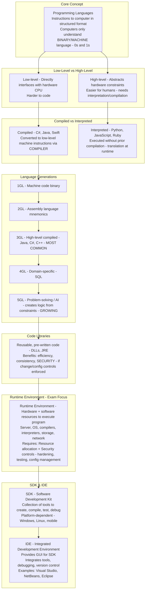

---

### Video V250: Application Security Testing

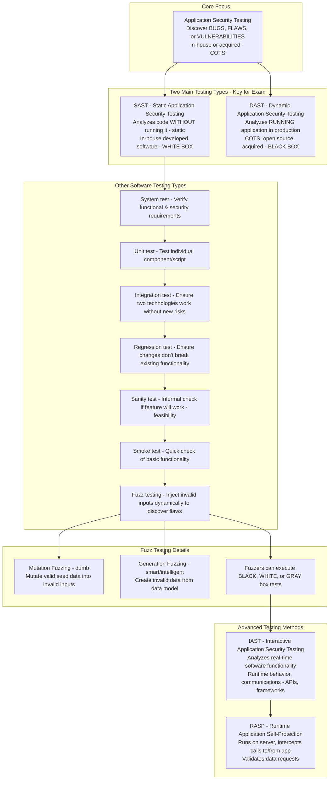

---

### Video V251: Software Assurance

```mermaid
graph TD
    subgraph Core Concept
        SWA[Software Assurance<br/>Level of confidence that software is secure<br/>Will function as designed<br/>Purpose: Assess effectiveness of software security]
    end

    subgraph Key Framework - OWASP ASVS
        ASVS[OWASP ASVS - Application Security Verification Standard<br/>Community-driven framework of security requirements and controls<br/>Helps organizations develop/maintain secure applications<br/>Based on desired assurance levels]
    end

    subgraph Three ASVS Assurance Levels
        L1[Level 1 - Low assurance - bare minimum<br/>Protection against: Low-effort threats, script kiddies<br/>Use case: First step in multi-phase effort]
        
        L2[Level 2 - Moderate assurance<br/>Protection against: Skilled & motivated hackers<br/>Most penetration testing<br/>Use case: Most applications needing robust defenses]
        
        L3[Level 3 - High assurance<br/>Protection against: Advanced threats - APT<br/>Use case: Applications whose compromise severely impacts operations]
    end

    subgraph Evaluation Criteria
        C1[SDLC - Effective built-in security process]
        C2[Risk Analysis - All risks known and accepted]
        C3[Change Control - Tightly controlled, authorized by CCB]
        C4[Continuous Monitoring - Ensuring controls remain effective & compliant]
        C5[Data Protection - Compliance with regulations - GDPR, SOX, HIPAA]
        C6[Logging - Transactions and changes on software]
    end

    SWA --> ASVS
    ASVS --> L1
    L1 --> L2
    L2 --> L3
    L3 --> C1 --> C2 --> C3 --> C4 --> C5 --> C6
```

---

### Video V252: Acquired Software Security

```mermaid
graph TD
    subgraph Definition
        Acquired[Acquired Software<br/>Purchased or leased from third party<br/>Organization has NO security control over development]
    end

    subgraph Types of Acquired Software
        COTS[COTS - Commercial Off-the-Shelf<br/>Purchased/leased, org manages installation, patching]
        OSS[OSS / FOSS - Open Source / Free Open Source<br/>No purchase, but acquired - GitHub, SourceForge]
        GOTS[GOTS - Government Off-the-Shelf<br/>From federal government, government-only license]
        NDI[NDI - Non-Developmental Items<br/>Third-party libraries/modules included in COTS/GOTS/OSS<br/>Introduces SUPPLY CHAIN RISK]
    end

    subgraph Leased Software in Cloud
        SaaS[SaaS - Software as a Service<br/>Provider owns OS & supporting apps<br/>Org controls only DATA & ACCESS CONTROLS]
        PaaS[PaaS - Platform as a Service<br/>Provider owns OS<br/>Org may own application - possibly no source code access]
    end

    subgraph Acquisition Policy - NIST SP 800-160 / 800-64
        A1[1. Preparation - define security requirements in request]
        A2[2. Advertise & select supplier - choose based on security criteria]
        A3[3. Establish security aspects of agreement - SLA/contract]
        A4[4. Monitor agreement - assess execution against SLA]
        A5[5. Accept product/service - confirm compliance before purchase]
    end

    subgraph Operational Best Practices
        OP1[Implement access controls to prevent unauthorized app installation]
        OP2[Follow vendor/industry hardening guides]
        OP3[TEST all acquired products for vulnerabilities BEFORE production]
        OP4[Monitor acquired apps for NEW threats and vulnerabilities]
    end

    Acquired --> COTS
    COTS --> OSS
    OSS --> GOTS
    GOTS --> NDI
    NDI --> SaaS
    SaaS --> PaaS
    PaaS --> A1 --> A2 --> A3 --> A4 --> A5
    A5 --> OP1 --> OP2 --> OP3 --> OP4
```

---

### Video V253: Application Attacks

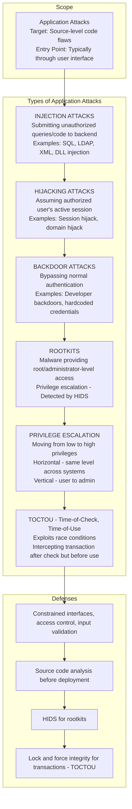

---

### Video V254: OWASP Top 10 – Part 1 (2017, Risks 1–5)

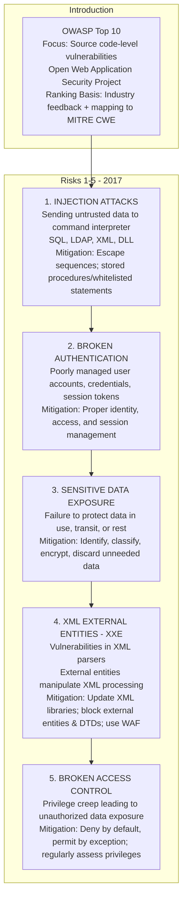

---

### Video V255: OWASP Top 10 – Part 2 (2017, Risks 6–10)

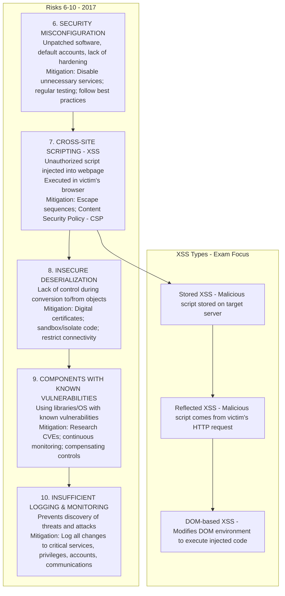

---

### Video V256: OWASP Top 10 – Part 3 (2021 Updates)

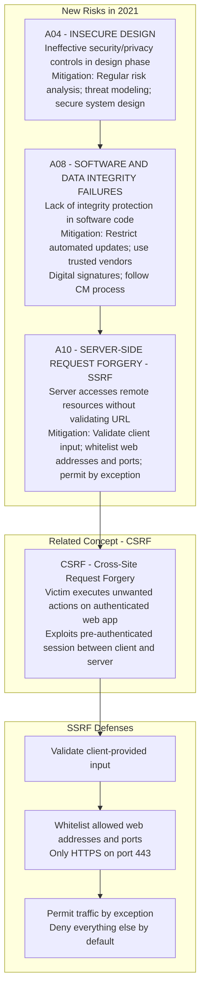

---

### Video V257: Software API Security

```mermaid
graph TD
    subgraph Definition
        API[API - Application Programming Interface<br/>Connects software applications and services directly<br/>Improves integration and user experience<br/>SSO, payment gateways, social media]
    end

    subgraph Common API Commands
        GET[GET - retrieve a resource]
        POST[POST - create a new resource]
        PUT[PUT - edit/update a resource]
        DELETE[DELETE - remove a resource]
    end

    subgraph Types of APIs
        Public[Public/Open - Anyone can connect via HTTP<br/>Security: HIGH RISK - open access]
        Private[Private/Internal - Internal use only behind firewall<br/>Security: LOWER RISK - controlled]
        Partner[Partner - Available only to selected entities<br/>Security: Requires authorization]
        Composite[Composite - Combines multiple requests into one call<br/>Security: Efficiency but complexity]
    end

    subgraph API Protocols
        SOAP[SOAP - older, XML only]
        REST[REST - common since 2000s]
        Other[JSON-RPC, gRPC, Protocol Buffers]
        Focus[Exam focus: SOAP and REST]
    end

    subgraph API Security Key Concepts
        S1[API keys - long, complex passwords for auth/authz]
        S2[Mutual authentication - can use SSH/TLS]
        S3[Protect data types - know sensitive data exchanged]
        S4[Testing - include APIs in software tests]
        S5[Least privilege - limit size/number of accessible resources]
        S6[Input validation - reject invalid inputs/requests]
        S7[Logging & monitoring - detect misuse or threats]
    end

    API --> GET --> POST --> PUT --> DELETE
    DELETE --> Public
    Public --> Private
    Private --> Partner
    Partner --> Composite
    Composite --> SOAP
    SOAP --> REST
    REST --> Other
    Other --> Focus
    Focus --> S1 --> S2 --> S3 --> S4 --> S5 --> S6 --> S7
```

---

### Video V258: Secure Coding Practices

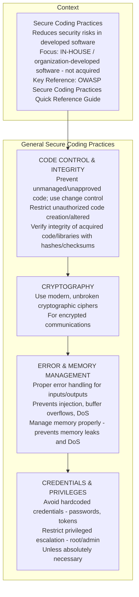

---

### Video V259: Software-Defined Security

```mermaid
graph TD
    subgraph Definition
        SDS[Software-Defined Security<br/>Security functions included as part of developed software - code<br/>Started with virtualizing security functions<br/>Firewalls, IDS/IPS, appliances]
    end

    subgraph Related Concepts
        SDN[SDN - Software-Defined Networking<br/>Virtualized network resources]
        IaC[Infrastructure as Code<br/>Software-defined infrastructure, provisioning, automation]
        SDDC[Software-Defined Data Center<br/>Virtualizes all infrastructure resources]
    end

    subgraph Security as Code - DevSecOps
        SecAsCode[Security as Code<br/>Building security processes into DevOps or other workflows<br/>Typically part of DevOps / CI/CD → called DEVSECOPS]
        
        ConfigAsCode[Configuration as Code<br/>Standardize and apply approved configurations<br/>Create GOLD IMAGE - hardened, compliant, immutable]
        
        PolicyAsCode[Policy as Code<br/>Combines infrastructure as code + configuration as code<br/>+ access controls/policies → ensures immutability<br/>Changes require proper change control and CM]
    end

    subgraph Best Practices
        BP1[Identify which security controls can be implemented as code - not all can]
        BP2[Insert GATES - security checks/tests at vulnerable points in pipeline]
        BP3[Gates do NOT slow the pipeline<br/>Identify and report issues for human review]
        BP4[Regularly test security-as-code products as part of SDLC/DevOps]
        BP5[Perform compliance assessments as part of continuous delivery]
    end

    SDS --> SDN
    SDN --> IaC
    IaC --> SDDC
    SDDC --> SecAsCode
    SecAsCode --> ConfigAsCode
    ConfigAsCode --> PolicyAsCode
    PolicyAsCode --> BP1 --> BP2 --> BP3 --> BP4 --> BP5
```

---

### Bonus: Session 33 Complete Concept Map

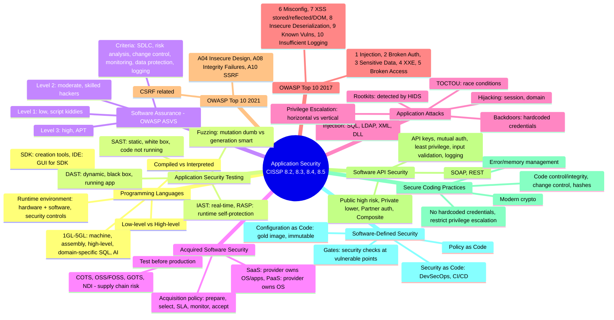