## Session 2: Security Management Concepts

### 1. The Four Canons of ISC2 Code of Ethics (PAPA)

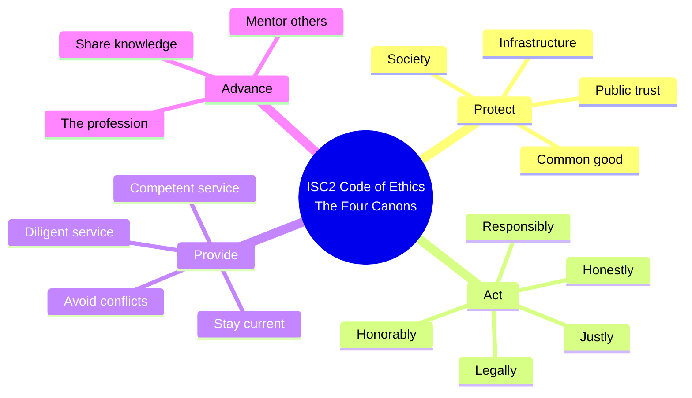

### 2. The CIA Triad

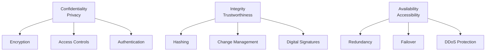

### 3. Social Engineering Attack Types

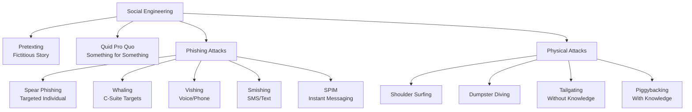

### 4. Personnel Security Lifecycle

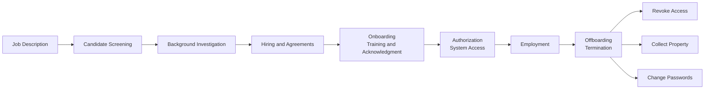

---

## Session 3: Security Governance and Compliance

### 1. Due Care vs. Due Diligence Workflow

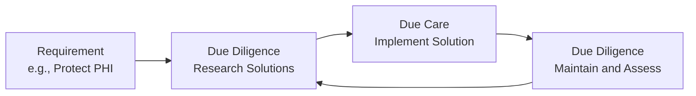

### 2. PCI DSS 12 High-Level Requirements

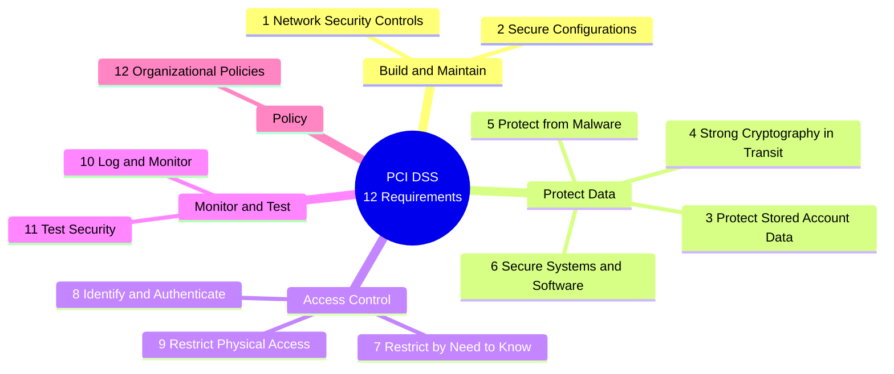

### 3. GDPR Roles and Subject Rights

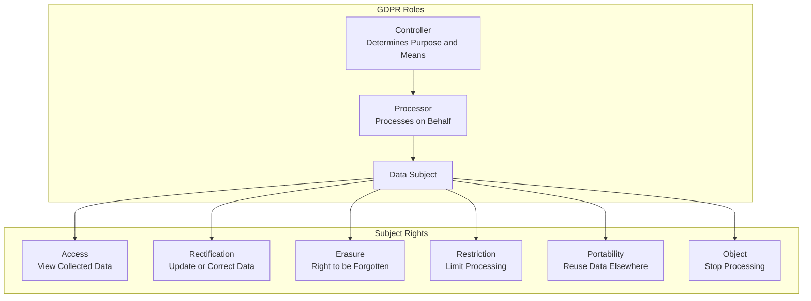

### 4. Intellectual Property Protection Types

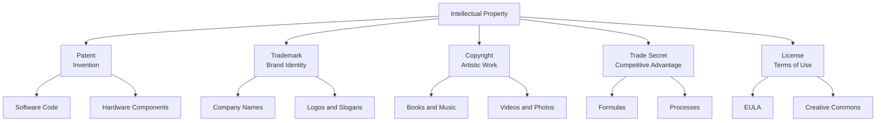

### 5. Documentation Hierarchy (Policies, Standards, Procedures, Guidelines, Baseline)

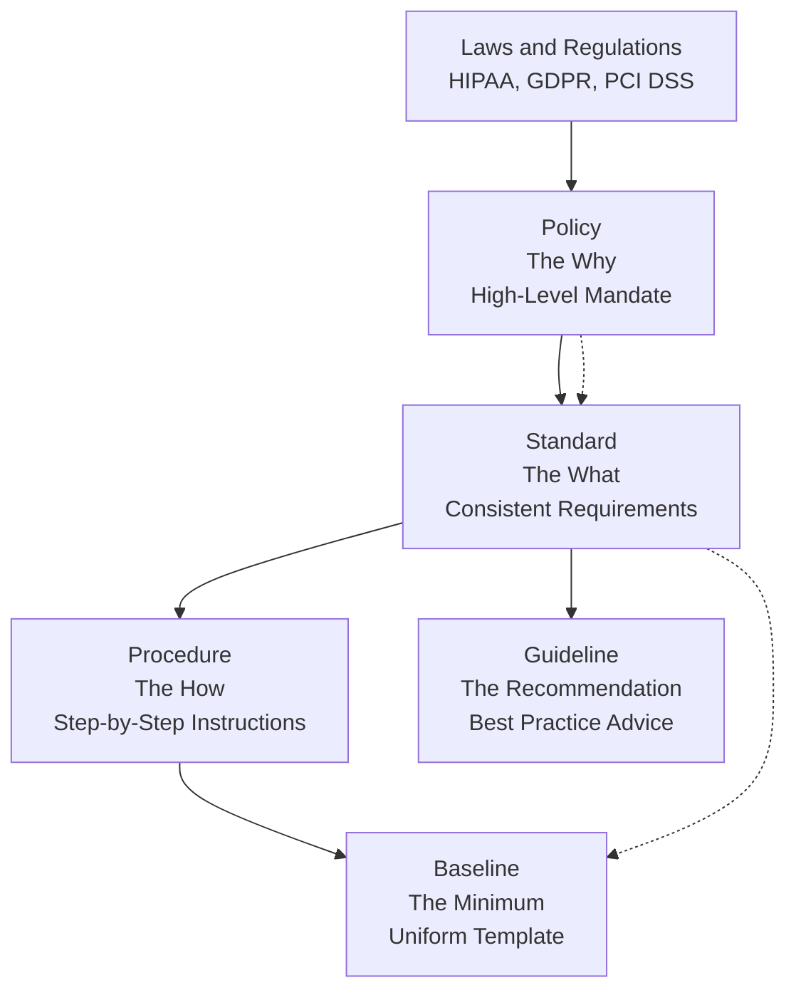

---

## Session 4: Risk Management

### 1. Risk Formula

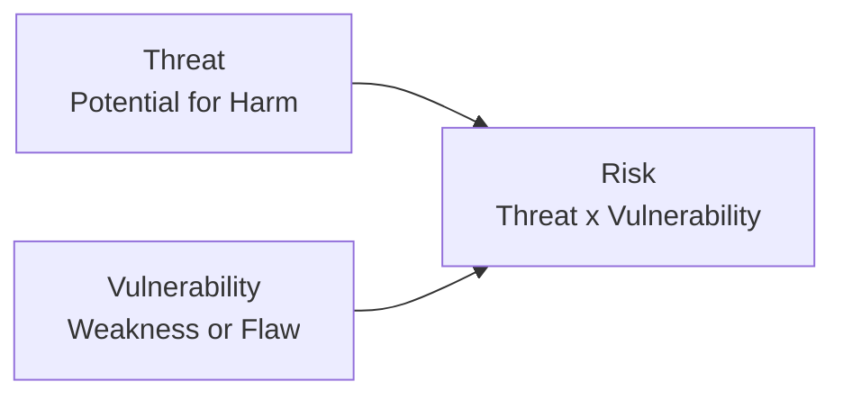

### 2. The Four-Step Risk Management Framework (NIST)

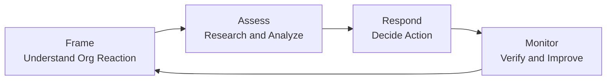

### 3. The Five Risk Responses

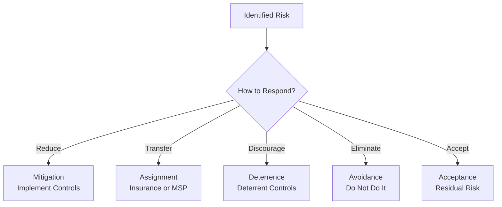

### 4. Defense in Depth: Control Categories and Types

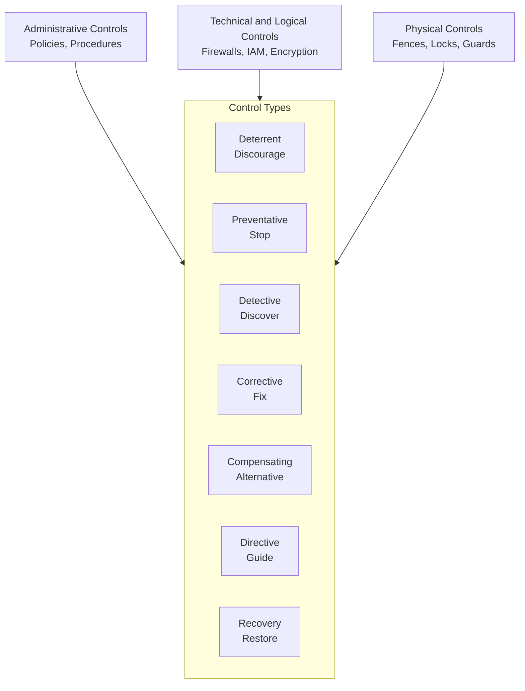

### 5. Supply Chain Risk Management (The Chain)

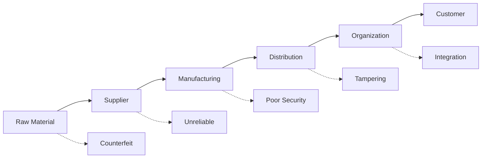

---

## Session 5: Risk Frameworks

### 1. NIST RMF 7-Step Process

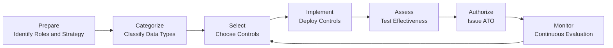

### 2. NIST CSF Five Core Functions

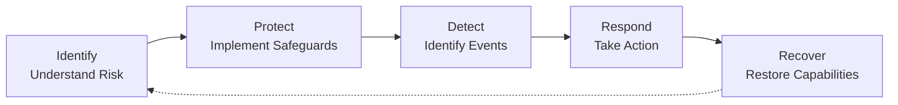

### 3. NIST CSF Tiers (Maturity Levels)

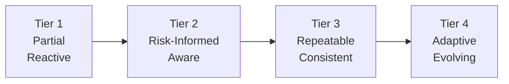

### 4. ISO 27001 Clauses Flow

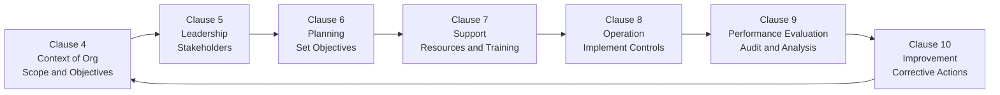

### 5. SABSA Six Architecture Layers

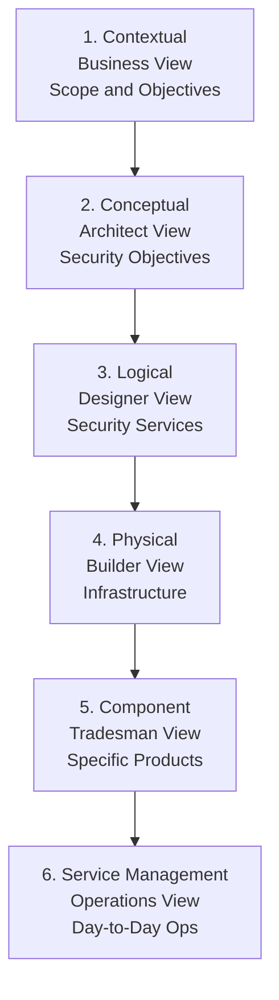

---

## Session 6: Risk Assessments and Threat Modeling

### 1. Quantitative Risk Analysis Formulas

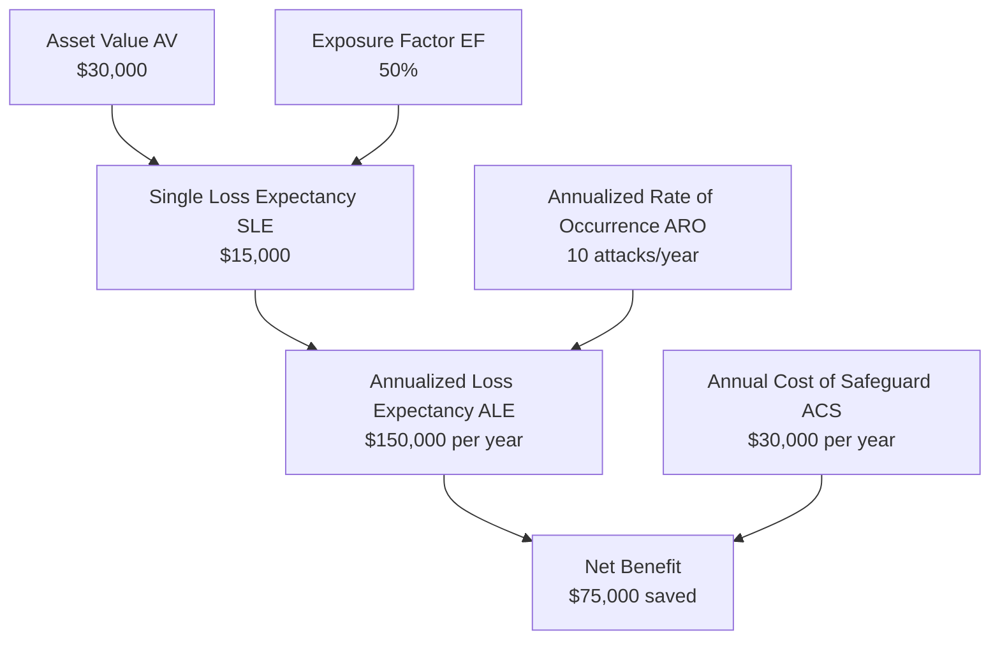

### 2. Quantitative vs. Qualitative Risk Analysis

```mermaid
flowchart LR
    subgraph Quantitative
        Q1[Uses Numbers and Money]
        Q2[Formulas: SLE, ALE]
        Q3[Time-Intensive]
        Q4[Example: $150,000 ALE]
    end
    
    subgraph Qualitative
        QL1[Uses Judgment and Rankings]
        QL2[High, Medium, Low]
        QL3[Fast and Simple]
        QL4[Example: High Risk]
    end
```

### 3. STRIDE Threat Model

```mermaid
mindmap
  root((STRIDE<br/>Microsoft Threat Model))
    S[Spoofing]
      Using others credentials
      Identity theft
    T[Tampering]
      Modify data
      Insert data
      Destroy data
    R[Repudiation]
      User denies action
      No proof otherwise
    I[Information Disclosure]
      Unauthorized data access
      Attacks confidentiality
    D[Denial of Service]
      Attacks availability
      Disrupts resources
    E[Elevation of Privilege]
      Gain higher privileges
      Admin or root access
```

### 4. PASTA Threat Model (7 Stages)

```mermaid
flowchart LR
    S1[Stage 1<br/>Define Objectives<br/>Business Goals] --> S2[Stage 2<br/>Define Technical Scope<br/>Infrastructure]
    S2 --> S3[Stage 3<br/>Decompose Application<br/>Data Flows]
    S3 --> S4[Stage 4<br/>Threat Analysis<br/>Attack Scenarios]
    S4 --> S5[Stage 5<br/>Vulnerability Analysis<br/>Flaws]
    S5 --> S6[Stage 6<br/>Attack Modeling<br/>Simulate]
    S6 --> S7[Stage 7<br/>Risk Analysis<br/>Mitigation]
```

### 5. NIST SP 800-154 Data-Centric Threat Modeling

```mermaid
flowchart LR
    A[Step 1<br/>Identify and Characterize<br/>Map Data Flow] --> B[Step 2<br/>Identify Attack Vectors<br/>Find Pathways]
    B --> C[Step 3<br/>Characterize and Mitigate<br/>Apply Controls]
    C --> D[Step 4<br/>Analyze Threat Model<br/>Continuous Improvement]
    D --> A
```

---

## Session 7: Asset Security

### 1. Data Classification Levels

```mermaid
flowchart TD
    subgraph National Security Military
        TS[Top Secret<br/>Grave Damage]
        S[Secret<br/>Serious Damage]
        C[Confidential<br/>Moderate Damage]
        U[Unclassified<br/>No Damage]
    end
    
    subgraph Civilian Business
        Prop[Proprietary and Confidential<br/>Grave Damage]
        Priv[Private<br/>Serious Damage]
        Sens[Sensitive<br/>Minimal Damage]
        Pub[Public<br/>No Damage]
    end
    
    TS --> Prop
    S --> Priv
    C --> Sens
    U --> Pub
```

### 2. Data Lifecycle (Cradle to Grave)

```mermaid
flowchart LR
    A[Create and Collect] --> B[Classify]
    B --> C[Store]
    C --> D[Use and Process]
    D --> E[Archive]
    E --> F[Destroy]
    
    F --> G[Sanitization]
```

### 3. Information System Lifecycle (NIST SP 800-64)

```mermaid
flowchart LR
    A[Initiation<br/>Stakeholder Needs] --> B[Development and Acquisition<br/>Build vs. Buy]
    B --> C[Implementation and Assessment<br/>Deploy and Test]
    C --> D[Operations and Maintenance<br/>Run and Improve]
    D --> E[Disposal<br/>Decommission]
    
    E --> F[Sanitization]
```

### 4. Data States and Protection

```mermaid
flowchart TD
    InUse[Data in Use<br/>In Memory and RAM]
    InTransit[Data in Transit<br/>Moving Across Network]
    AtRest[Data at Rest<br/>Stored on Media]
    
    InUse --> P1[Authentication<br/>Authorization<br/>Accounting AAA]
    InTransit --> P2[Encryption TLS and SSL<br/>Mutual Authentication]
    AtRest --> P3[Full Disk Encryption<br/>TPM]
```

---

## Session 8: Data Security Controls

### 1. Data Sanitization Methods

```mermaid
flowchart TD
    Erasing[Erasing<br/>Removes Pointers Only<br/>Low Effectiveness]
    Clearing[Clearing<br/>Overwrites Data<br/>High Effectiveness]
    Purging[Purging<br/>Repeated Clearing<br/>Very High Effectiveness]
    Sanitization[Sanitization<br/>Factory State<br/>Maximum Effectiveness]
    
    Degaussing[Degaussing<br/>Magnetic Field for Tapes]
    Zeroing[Zeroing<br/>Overwrite with Zeros]
    Overwriting[Overwriting<br/>Random Binary Patterns]
    
    Erasing --> Zeroing
    Clearing --> Overwriting
    Purging --> Degaussing
```

---

## Session 9: Secure Design Principles

### 1. Saltzer and Schroeder's 10 Principles

```mermaid
mindmap
  root((Saltzer and Schroeder<br/>Secure Design Principles))
    Economy of Mechanism
      Keep it simple
      No unnecessary complexity
    Fail Safe Defaults
      Deny by default
      Permit by exception
    Complete Mediation
      Authorize every access
      Every single time
    Open Design
      No security through obscurity
      Keep keys secret, not design
    Separation of Privilege
      Require two or more
      Example: Bank vault
    Least Privilege
      Minimum permissions
      Limit damage potential
    Least Common Mechanism
      Limit shared components
      Avoid transitive trust
    Psychological Acceptability
      Easy to use UX
      Prevents errors
    Work Factor
      Cost to defeat control
      Compare to asset value
    Compromise Recording
      Use detection mechanisms
      Audit logs, IDS, honeypots
```

### 2. Security Models Comparison

```mermaid
flowchart TD
    subgraph Confidentiality Models
        Bell[Bell-LaPadula<br/>No Read Up, No Write Down<br/>Confidentiality]
    end
    
    subgraph Integrity Models
        Biba[Biba<br/>No Read Down, No Write Up<br/>Integrity]
        Clark[Clark-Wilson<br/>Data Integrity via Access Triples]
    end
    
    subgraph Other Models
        Brewer[Brewer-Nash<br/>Conflict of Interest Prevention]
        TakeGrant[Take-Grant<br/>Rights Transfer]
        Graham[Graham-Denning<br/>Access Control Matrix]
    end
    
    Bell --> Biba
    Biba --> Clark
    Clark --> Brewer
    Brewer --> TakeGrant
    TakeGrant --> Graham
```

---

## Session 10: Secure Architecture Design

### 1. Common Criteria EAL Levels

```mermaid
flowchart LR
    EAL1[EAL 1<br/>Functionally Tested] --> EAL2[EAL 2<br/>Structurally Tested]
    EAL2 --> EAL3[EAL 3<br/>Methodically Tested<br/>First Independent Review]
    EAL3 --> EAL4[EAL 4<br/>Methodically Designed<br/>Typical OS]
    EAL4 --> EAL5[EAL 5<br/>Semi-Formally Designed<br/>Smart Cards]
    EAL5 --> EAL6[EAL 6<br/>Semi-Formally Verified<br/>Government and Military]
    EAL6 --> EAL7[EAL 7<br/>Formally Verified<br/>Life-Critical Systems]
```

### 2. ICS and SCADA Components

```mermaid
flowchart TD
    subgraph ICS Components
        PLC[PLC<br/>Programmable Logic Controller<br/>Automation]
        DCS[DCS<br/>Distributed Control System<br/>Same Facility]
        SCADA[SCADA<br/>Supervisory Control<br/>Data Acquisition]
    end
    
    subgraph SCADA Subcomponents
        RTU[RTU<br/>Remote Terminal Unit<br/>Connects to Sensors]
        HMI[HMI<br/>Human Machine Interface<br/>User Interaction]
        DNP[DNP<br/>Distributed Network Protocol<br/>Open Standard]
    end
    
    SCADA --> RTU
    SCADA --> HMI
    RTU --> DNP
```

### 3. Microservices Architecture

```mermaid
flowchart TD
    Client[Client<br/>Mobile or Web] --> API[API Gateway]
    
    API --> Service1[Microservice 1<br/>Database Access]
    API --> Service2[Microservice 2<br/>Authentication]
    API --> Service3[Microservice 3<br/>Messaging]
    
    subgraph Service Mesh
        Control[Control Plane<br/>Policies and Monitoring]
        Data[Data Plane<br/>Sidecar Proxies]
    end
    
    API --> Control
    Control --> Data
    Data --> Service1
    Data --> Service2
    Data --> Service3
```

---

## Session 11: Virtualization and Cloud Computing

### 1. Type 1 vs. Type 2 Hypervisors

```mermaid
flowchart TD
    subgraph Type 1 Bare Metal
        HW1[Hardware]
        HV1[Type 1 Hypervisor<br/>ESXi, Xen]
        VM1[Virtual Machines]
        OS1[Guest OS]
    end
    
    subgraph Type 2 Hosted
        HW2[Hardware]
        OS2[Host OS<br/>Windows or Linux]
        HV2[Type 2 Hypervisor<br/>VirtualBox, Workstation]
        VM2[Virtual Machines]
        OS3[Guest OS]
    end
    
    HW1 --> HV1 --> VM1 --> OS1
    HW2 --> OS2 --> HV2 --> VM2 --> OS3
```

### 2. Cloud Deployment Models

```mermaid
flowchart TD
    Public[Public Cloud<br/>Available to General Public<br/>Internet-Facing]
    Private[Private Cloud<br/>Single Organization<br/>Contained Risk]
    Community[Community Cloud<br/>Shared by Organizations<br/>SLA Governed]
    Hybrid[Hybrid Cloud<br/>Combination of Models<br/>Public and Private Common]
```

### 3. Cloud Service Models (Shared Responsibility)

```mermaid
flowchart TD
    subgraph IaaS Infrastructure as a Service
        IaaS_Cust[Customer: OS, Apps, IAM, Data]
        IaaS_Provider[Provider: Hardware, Hypervisor, Network]
    end
    
    subgraph PaaS Platform as a Service
        PaaS_Cust[Customer: Apps, IAM, Data]
        PaaS_Provider[Provider: Hardware, OS]
    end
    
    subgraph SaaS Software as a Service
        SaaS_Cust[Customer: Access Controls, Data]
        SaaS_Provider[Provider: Application down to Hardware]
    end
```

### 4. Virtual Private Cloud (VPC) Components

```mermaid
flowchart TD
    subgraph VPC Virtual Private Cloud
        Subnets[Subnets<br/>Logical Isolation]
        RouteTables[Route Tables<br/>Traffic Paths]
        SecurityGroups[Security Groups<br/>Virtual Firewalls]
        NACLs[Network ACLs<br/>Subnet-Level Firewall]
    end
    
    subgraph Connections
        Direct[Direct Connect<br/>Dedicated Circuit]
        Peering[Peering<br/>Connect VPCs]
        VPN[VPN Connection<br/>Secure Tunnel]
    end
```

---

## Session 12: Cryptographic Solutions

### 1. Symmetric vs. Asymmetric Encryption

```mermaid
flowchart LR
    subgraph Symmetric Encryption
        Plain1[Plaintext] -->|Same Key| Cipher1[Ciphertext]
        Cipher1 -->|Same Key| Plain1
        Key1[Secret Key<br/>Shared]
    end
    
    subgraph Asymmetric Encryption
        Plain2[Plaintext] -->|Public Key| Cipher2[Ciphertext]
        Cipher2 -->|Private Key| Plain2
        Pub[Public Key<br/>Shared]
        Priv[Private Key<br/>Secret]
    end
```

### 2. Digital Signature Creation and Verification

```mermaid
flowchart TD
    subgraph Signing Process
        Data1[Data] --> Hash1[Hash Function]
        Hash1 --> Digest1[Message Digest]
        Digest1 -->|Private Key| Signature[Digital Signature]
    end
    
    subgraph Verification Process
        Data2[Data] --> Hash2[Hash Function]
        Hash2 --> Digest2[Message Digest]
        Signature -->|Public Key| Digest3[Decrypted Hash]
        Digest2 --> Compare{Compare}
        Digest3 --> Compare
        Compare -->|Match| Valid[Valid Signature]
        Compare -->|No Match| Invalid[Invalid or Forged]
    end
```

### 3. PKI Components and Certificate Lifecycle

```mermaid
flowchart LR
    subgraph PKI Components
        CA[Certificate Authority<br/>Trusted Third Party]
        RA[Registration Authority<br/>Identity Verification]
        CRL[Certificate Revocation List<br/>Offline Check]
        OCSP[Online Certificate Status Protocol<br/>Real-Time Check]
    end
    
    subgraph Certificate Lifecycle
        Subject[Subject] -->|CSR| CA
        CA -->|Issues| Cert[Digital Certificate<br/>X.509]
        Cert -->|Validate| CRL
        Cert -->|Validate| OCSP
        CA -->|Revoke| CRL
    end
```

### 4. Hash Function Properties

```mermaid
flowchart LR
    Input["Hello World"] --> Hash[Hash Function<br/>SHA-256]
    Hash --> Output["a591a6d40bf420404a011733<br/>cfb7b190d62c65bf0bcda32b<br/>57b277d9ad9f146e"]
    
    Input2["Hello Worlds"] --> Hash2[Hash Function<br/>SHA-256]
    Hash2 --> Output2["b2e98ad6d11f2c2b8f2a<br/>d1967f6b12e5e9b2e6d3c8<br/>a5e7a1d9f4c3b2a1e0d5"]
```

---

## Session 13: Cryptanalytic Attacks

### 1. Known Plaintext Attack Types

```mermaid
mindmap
  root((Known Plaintext Attacks))
    Brute Force
      Try every combination
      Eventually successful
      Time and resources
    Linear Cryptanalysis
      Linear math equations
      Statistical analysis
      Deduce possible key
    Meet-in-the-Middle
      Two rounds of encryption
      Multiple keys
      Encrypt and decrypt with all keys
      Find matching pair
```

### 2. Hash-Based Attacks

```mermaid
flowchart TD
    subgraph Hash Attacks
        PassHash[Pass-the-Hash<br/>Use stolen hash for authentication]
        Kerberoast[Kerberoasting<br/>Harvest Kerberos hashes]
        Birthday[Birthday Attack<br/>Find hash collisions]
        Rainbow[Rainbow Table Attack<br/>Precomputed hash database]
    end
    
    subgraph Targets
        PassHash --> Windows[Windows LANMAN and NTLM]
        Kerberoast --> Kerberos[Kerberos TGT and TGS]
        Birthday --> Collision[Hash Collisions]
        Rainbow --> Common[Common Passwords]
    end
```

---

## Session 14: Physical Security

### 1. The Five Control Functions

```mermaid
flowchart LR
    Deter[Deter<br/>Discourage<br/>Fences, Signs, Guards] --> Deny[Deny<br/>Prevent<br/>Turnstiles, Mantraps]
    Deny --> Detect[Detect<br/>Identify<br/>Cameras, Sensors]
    Detect --> Delay[Delay<br/>Slow Down<br/>Barbed Wire, Locks]
    Delay --> Determine[Determine and Decide<br/>Analyze and Respond<br/>PACS, Security Personnel]
```

### 2. Fire Classes and Extinguishers

```mermaid
flowchart TD
    A[Class A<br/>Common Combustibles<br/>Wood, Paper, Cloth] --> Water[Water, Soda Acid]
    B[Class B<br/>Flammable Liquids<br/>Gasoline, Oil] --> CO2[CO2, Halon Substitute]
    C[Class C<br/>Electrical Fires<br/>Motors, Appliances] --> CO2
    D[Class D<br/>Combustible Metals<br/>Magnesium, Titanium] --> Dry[Dry Powder Only]
    K[Class K<br/>Commercial Kitchens<br/>Fats, Greases]
```

### 3. UPS Types Comparison

```mermaid
flowchart LR
    Offline[Offline and Standby<br/>Basic Protection<br/>Most Common] --> Low[Low Cost]
    Line[Line-Interactive<br/>Automatic Voltage Regulation<br/>Corrects Fluctuations] --> Medium[Medium Cost]
    Online[Online and Double-Conversion<br/>Cleanest Power<br/>Always Online] --> High[Highest Cost]
```

---

## Session 15: Network Components and Media

### 1. OSI Model Layers with PDU

```mermaid
flowchart TD
    L7[7 Application<br/>Data]
    L6[6 Presentation<br/>Data]
    L5[5 Session<br/>Data]
    L4[4 Transport<br/>Segments]
    L3[3 Network<br/>Packets]
    L2[2 Data Link<br/>Frames]
    L1[1 Physical<br/>Bits]
    
    L7 --> L6 --> L5 --> L4 --> L3 --> L2 --> L1
```

### 2. Network Topologies

```mermaid
flowchart TD
    subgraph Ring Topology
        R1[Device] --- R2[Device]
        R2 --- R3[Device]
        R3 --- R4[Device]
        R4 --- R1
    end
    
    subgraph Star Topology
        S1[Device] --> Hub[Switch or Hub]
        S2[Device] --> Hub
        S3[Device] --> Hub
    end
    
    subgraph Mesh Topology
        M1[Device] --- M2[Device]
        M1 --- M3[Device]
        M2 --- M3[Device]
    end
```

---

## Session 16: Networking Concepts and Protocols

### 1. TCP 3-Way Handshake

```mermaid
sequenceDiagram
    participant Client
    participant Server
    
    Client->>Server: SYN (Synchronize)
    Note over Client,Server: Client requests communication
    Server->>Client: SYN-ACK (Synchronize Acknowledge)
    Note over Client,Server: Server acknowledges
    Client->>Server: ACK (Acknowledge)
    Note over Client,Server: Session established
    
    Note over Client,Server: Data Transfer
    
    Client->>Server: FIN (Finish)
    Server->>Client: ACK
    Server->>Client: FIN
    Client->>Server: ACK
    Note over Client,Server: Session terminated
```

### 2. VLAN Hopping Attack and Mitigation

```mermaid
flowchart LR
    subgraph VLAN Hopping Attack
        Attacker[Attacker<br/>VLAN 20 Only] -->|Double Tag| Switch1[Switch 1]
        Switch1 -->|Strips Outer Tag| Tag[Inner Tag VLAN 10 Exposed]
        Tag --> Switch2[Switch 2]
        Switch2 -->|Routes to| Target[Target<br/>VLAN 10]
    end
    
    subgraph Mitigation
        M1[Set Endpoint Ports to Access Mode]
        M2[Change Native VLAN from VLAN 1]
        M3[Enforce Native VLANs on Trunk Ports]
    end
```

### 3. Secure vs. Unsecure Protocols

```mermaid
flowchart LR
    subgraph Unsecure Protocols
        HTTP[HTTP :80]
        FTP[FTP :20 and 21]
        Telnet[Telnet :23]
        POP3[POP3 :110]
        IMAP[IMAP :143]
        SNMP[SNMP :161 and 162]
    end
    
    subgraph Secure Protocols
        HTTPS[HTTPS :443]
        SFTP[SFTP :22]
        SSH[SSH :22]
        POP3S[POP3S :1109]
        IMAPS[IMAPS :993]
        SNMPv3[SNMPv3 :10161 and 10162]
    end
    
    HTTP -.-> HTTPS
    FTP -.-> SFTP
    Telnet -.-> SSH
```

---

## Session 17: Network Architectures and APIs

### 1. SDN Architecture (Three Planes)

```mermaid
flowchart TD
    subgraph Application Plane
        Apps[Applications<br/>Load Balancing, IDS and IPS<br/>Orchestration, Monitoring]
    end
    
    subgraph Control Plane
        Controller[SDN Controller<br/>Central Intelligence<br/>ONOS]
        NBI[Northbound API<br/>A-CPI]
        SBI[Southbound API<br/>D-CPI]
    end
    
    subgraph Data Plane
        Elements[Network Elements<br/>Routers, Switches<br/>Access Points]
    end
    
    Apps -->|NBI| Controller
    Controller -->|SBI| Elements
```

### 2. API Types Comparison

```mermaid
mindmap
  root((API Types))
    SOAP
      Simple Object Access Protocol
      Uses XML
      Older technology
    REST
      Representational State Transfer
      Uses HTTP methods GET POST PUT DELETE
      Stateless
      Most prevalent today
    RPC
      Remote Procedure Call
      Execute remote code as local
      Simplifies distributed computing
    WebSocket
      Web API
      Uses HTTP and HTTPS
      Transmits JSON or XML
    GraphQL
      Query Language
      Client requests specific data
      Flexible and efficient
```

### 3. NFV Architecture Blocks

```mermaid
flowchart TD
    OSS_BSS[OSS and BSS<br/>Operations and Business Support]
    
    subgraph MANO
        Orchestrator[NFV Orchestrator]
        VNFM[VNF Manager]
        VIM[Virtualized Infrastructure Manager]
    end
    
    subgraph VNFs
        VNF1[Firewall]
        VNF2[Router]
        VNF3[Load Balancer]
        VNF4[Gateway]
    end
    
    subgraph NFVI
        Virtual[Virtual Compute, Storage, Network]
        Hypervisor[Hypervisor]
        Hardware[Physical Hardware]
    end
    
    OSS_BSS --> MANO
    MANO --> VNFs
    VNFs --> NFVI
```