## Session 18: Secure Network Design

### 1. Architecture Planes (V129)

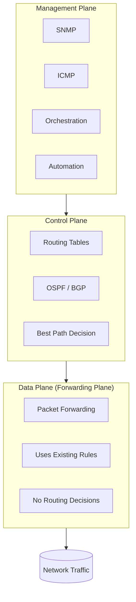

### 2. Network Topologies Comparison

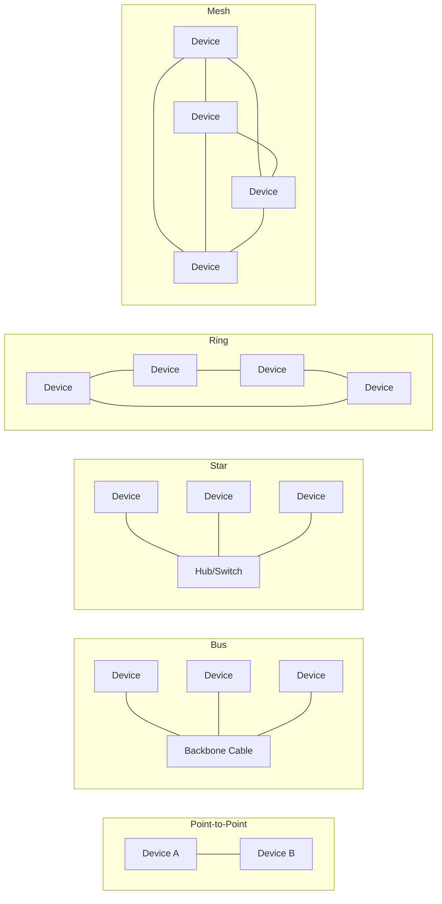

### 3. Physical vs. Logical Segmentation

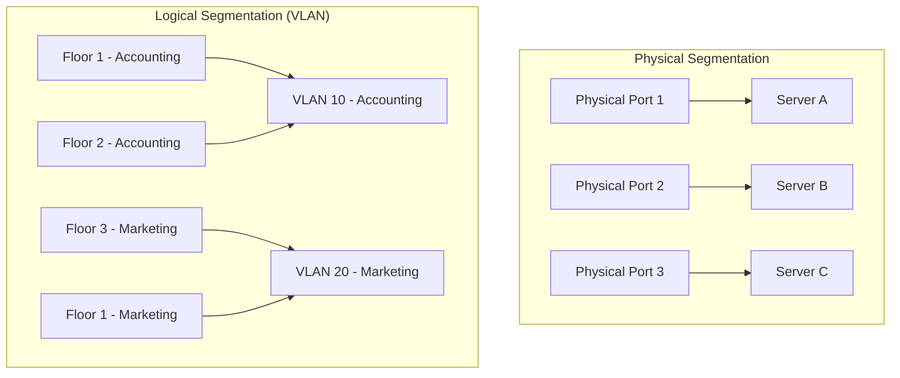

### 4. North-South vs. East-West Traffic (V131)

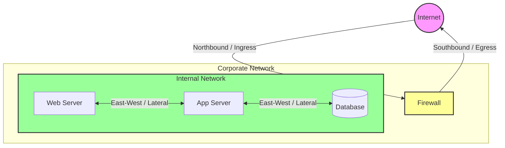

---

## Session 19: Firewall Architectures (V139)

### 1. Four Firewall Architectures Comparison

```mermaid
flowchart TB
    subgraph Multihomed["1. Multihomed Firewall"]
        direction LR
        M_Internet((Internet)) --> M_FW[Firewall]
        M_FW --> M_Trusted[Trusted LAN]
        M_FW --> M_Semi[Guest Wi-Fi]
    end

    subgraph Bastion["2. Bastion Host"]
        direction LR
        B_Internet((Internet)) --> B_Bastion[Bastion Host\n(Hardened Server)]
        B_Bastion --> B_Private[Private Cloud]
    end

    subgraph ScreenedHost["3. Screened Host"]
        direction TB
        SH_Internet((Internet)) --> SH_FW[Firewall]
        SH_FW --> SH_Trusted[Trusted Network]
        SH_Trusted --> SH_Host[Screened Host\n(Inspects Inbound)]
        SH_Host --> SH_Server[Internal Server]
    end

    subgraph ScreenedSubnet["4. Screened Subnet (DMZ)"]
        direction LR
        SS_Internet((Internet)) --> SS_FW1[External Firewall]
        SS_FW1 --> SS_DMZ[DMZ\n(Semi-Trusted)]
        SS_DMZ --> SS_FW2[Internal Firewall]
        SS_FW2 --> SS_LAN[Trusted LAN]
    end
```

### 2. Screened Subnet (DMZ) Detailed

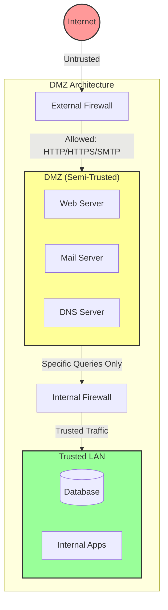

---

## Session 21: Wireless Security (V155)

### 1. Wireless Encryption Standards Evolution

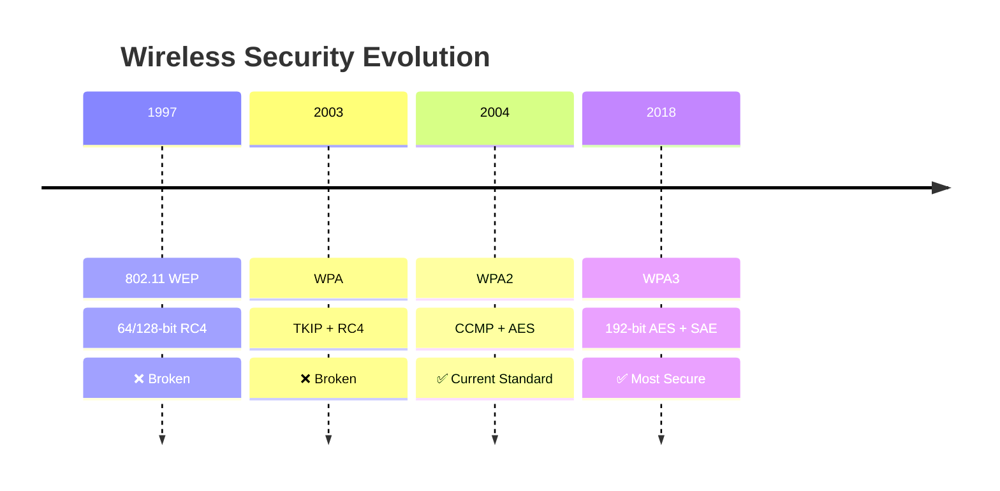

### 2. Wireless Attack Types

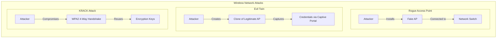

---

## Session 22: Identity and Access Lifecycle (V162)

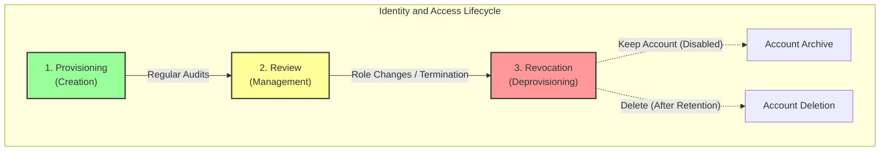

---

## Session 23: Access Control Models (V172, V173)

```mermaid
flowchart TB
    subgraph DAC["DAC - Discretionary Access Control"]
        Owner[Object Owner] -->|Decides| ACL[Access Control List]
        ACL -->|"Read/Write/Execute"| Subject[Subject]
    end

    subgraph MAC["MAC - Mandatory Access Control"]
        Policy[Security Policy] -->|Labels| Object[Object: Secret]
        Policy -->|Clearance| Subject2[Subject: Secret Clearance]
        Object <-->|"Access Granted (Secret = Secret)"| Subject2
    end

    subgraph RBAC["RBAC - Role-Based Access Control"]
        Roles[Roles: Admin, Engineer, Analyst] -->|Assigned to| Subject3[Subject]
        Roles -->|Permissions| Resources[Resources]
    end

    subgraph ABAC["ABAC - Attribute-Based Access Control"]
        Attributes[Attributes: Role, Clearance, Location, Time] -->|Policy| Decision{Access Decision}
        Subject4[Subject] --> Attributes
        Object2[Object] --> Attributes
        Decision -->|Permit/Deny| Access
    end
```

---

## Session 24: Session Management (V178)

### Session Hijacking Attack Flow

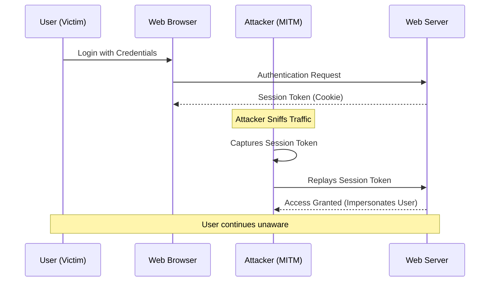

---

## Session 25: Security Test vs. Assessment (V181)

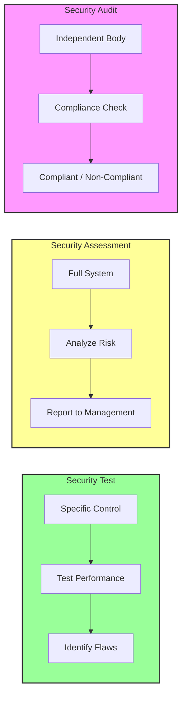

---

## Session 26: Penetration Testing Phases (V191)

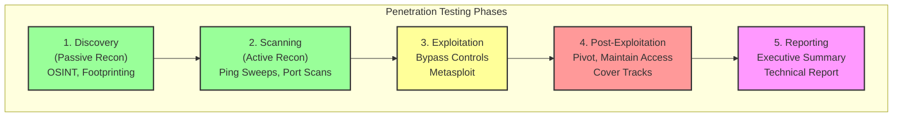

---

## Session 27: IDS/IPS Deployment (V203)

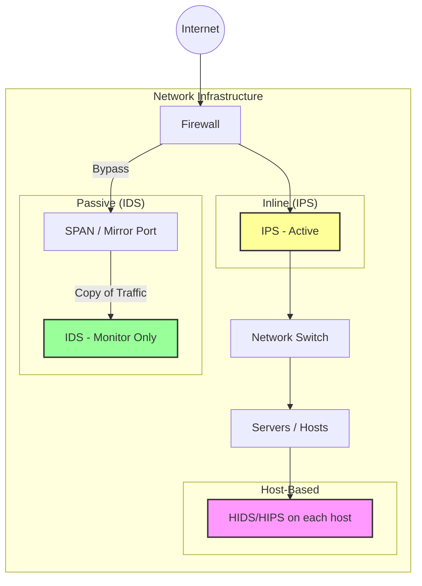

---

## Session 28: MITRE ATT&CK Framework (V212)

```mermaid
flowchart LR
    subgraph ATTACK["MITRE ATT&CK Framework"]
        direction LR
        R[Reconnaissance] --> RD[Resource Development] --> IA[Initial Access] --> EX[Execution] --> P[Persistence] --> PE[Privilege Escalation] --> DE[Defense Evasion] --> CA[Credential Access] --> D[Discovery] --> C[Collection] --> C2[Command & Control] --> E[Exfiltration] --> I[Impact]
    end
    
    style R fill:#9f9,stroke:#333,stroke-width:2px
    style IA fill:#ff9,stroke:#333,stroke-width:2px
    style PE fill:#f99,stroke:#333,stroke-width:2px
    style C2 fill:#f9f,stroke:#333,stroke-width:2px
```

---

## Session 29: Configuration Management Process (V217)

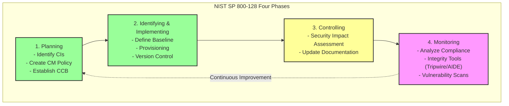

---

## Session 30: Incident Response Lifecycle (V223)

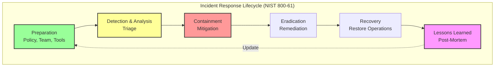

---

## Session 31: BIA Metrics (MTD, RTO, RPO, WRT) (V231)

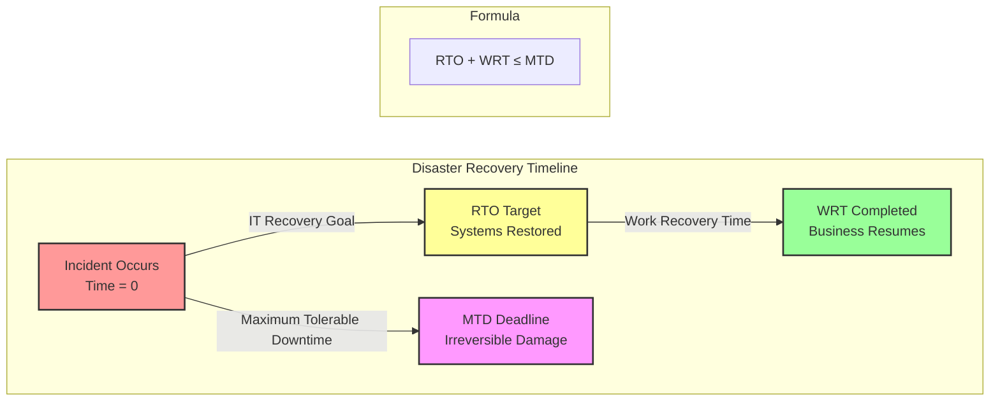

### Recovery Site Types Comparison

```mermaid
flowchart TB
    subgraph Sites["Disaster Recovery Sites"]
        direction LR
        
        subgraph Cold["Cold Site"]
            C1[Empty Building]
            C2[No Equipment]
            C3[No Data]
            C4[Cost: Lowest]
            C5[Activation: Days to Weeks]
        end
        
        subgraph Warm["Warm Site"]
            W1[Pre-configured Equipment]
            W2[Basic Infrastructure]
            W3[No Operational Data]
            W4[Cost: Moderate]
            W5[Activation: ~12 Hours]
        end
        
        subgraph Hot["Hot Site"]
            H1[Full Suite Equipment]
            H2[Full Infrastructure]
            H3[Near Real-Time Data]
            H4[Cost: Highest]
            H5[Activation: Minutes to Hours]
        end
    end
    
    Cold -->|More Cost, Faster Recovery| Warm -->|More Cost, Faster Recovery| Hot
    
    style Cold fill:#9f9,stroke:#333,stroke-width:2px
    style Warm fill:#ff9,stroke:#333,stroke-width:2px
    style Hot fill:#f99,stroke:#333,stroke-width:2px
```

---

## Session 32: SDLC Phases (V239)

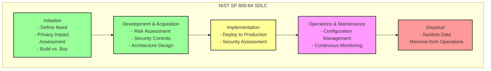

### DevOps / DevSecOps CI/CD Pipeline (V243)

```mermaid
flowchart LR
    subgraph Pipeline["CI/CD Pipeline"]
        direction LR
        Code[Code Commit] --> Build[Build]
        Build --> Unit[Unit Test]
        Unit --> SAST[SAST Scan]
        SAST --> DeployTest[Deploy to Test]
        DeployTest --> DAST[DAST Scan]
        DAST --> Approve{Approval Gate}
        Approve -->|Approved| DeployProd[Deploy to Production]
        DeployProd --> Monitor[Continuous Monitoring]
    end
    
    style SAST fill:#9f9,stroke:#333,stroke-width:2px
    style DAST fill:#ff9,stroke:#333,stroke-width:2px
    style Approve fill:#f99,stroke:#333,stroke-width:2px
    style Monitor fill:#f9f,stroke:#333,stroke-width:2px
```

---

## Session 33: SAST vs. DAST (V250)

```mermaid
flowchart TB
    subgraph SAST["SAST - Static Application Security Testing"]
        direction TB
        S_Code[Source Code] --> S_Analysis[Analyze Without Execution]
        S_Analysis --> S_Findings[Find: Bugs, Flaws, Vulnerabilities]
        S_When[When: Early in SDLC]
        S_Type[White Box - Internal Testers]
    end

    subgraph DAST["DAST - Dynamic Application Security Testing"]
        direction TB
        D_App[Running Application] --> D_Analysis[Test in Production/Test Environment]
        D_Analysis --> D_Findings[Find: Runtime Issues, Injection Flaws]
        D_When[When: Late in SDLC / Production]
        D_Type[Black Box - External Testers]
    end

    style SAST fill:#9f9,stroke:#333,stroke-width:2px
    style DAST fill:#ff9,stroke:#333,stroke-width:2px
```

### OWASP Top 10 2017 vs. 2021 (V254–V256)

```mermaid
flowchart LR
    subgraph OWASP2017["OWASP Top 10 (2017)"]
        direction TB
        A1_2017["A1: Injection"]
        A2_2017["A2: Broken Authentication"]
        A3_2017["A3: Sensitive Data Exposure"]
        A4_2017["A4: XXE"]
        A5_2017["A5: Broken Access Control"]
        A6_2017["A6: Security Misconfiguration"]
        A7_2017["A7: XSS"]
        A8_2017["A8: Insecure Deserialization"]
        A9_2017["A9: Components with Known Vulns"]
        A10_2017["A10: Insufficient Logging"]
    end

    subgraph OWASP2021["OWASP Top 10 (2021)"]
        direction TB
        A1_2021["A1: Broken Access Control"]
        A2_2021["A2: Cryptographic Failures"]
        A3_2021["A3: Injection"]
        A4_2021["A4: Insecure Design"]
        A5_2021["A5: Security Misconfiguration"]
        A6_2021["A6: Vulnerable Components"]
        A7_2021["A7: Identification Failures"]
        A8_2021["A8: Software/Data Integrity Failures"]
        A9_2021["A9: Security Logging Failures"]
        A10_2021["A10: SSRF"]
    end

    OWASP2017 -->|"New/Updated"| OWASP2021
    
    style A4_2021 fill:#f99,stroke:#333,stroke-width:2px
    style A8_2021 fill:#f99,stroke:#333,stroke-width:2px
    style A10_2021 fill:#f99,stroke:#333,stroke-width:2px
```

---

## Session 34: CISSP Exam Domain Weights

```mermaid
pie title CISSP Exam Domain Weights
    "Domain 1: Security and Risk Management (16%)" : 16
    "Domain 2: Asset Security (10%)" : 10
    "Domain 3: Security Architecture (13%)" : 13
    "Domain 4: Network Security (13%)" : 13
    "Domain 5: IAM (13%)" : 13
    "Domain 6: Assessment/Testing (12%)" : 12
    "Domain 7: Security Operations (13%)" : 13
    "Domain 8: Software Security (10%)" : 10
```