## Session 1: Course Introduction (V1, V3)

### V1 - Exam Domains Breakdown
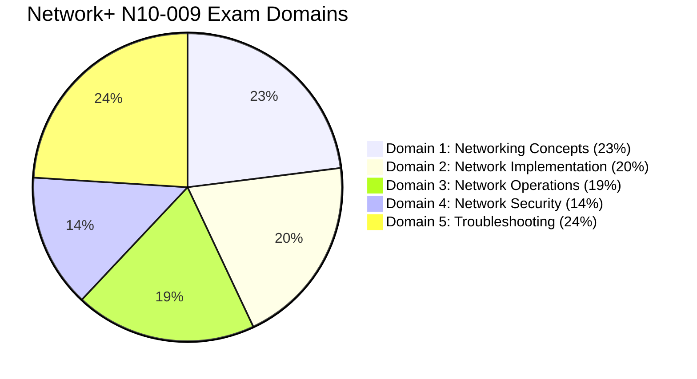

### V3 - Study Timeline
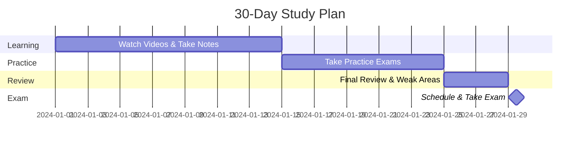

---

## Session 2: Network Fundamentals (V4-V11)

### V5 - Network Components Hierarchy
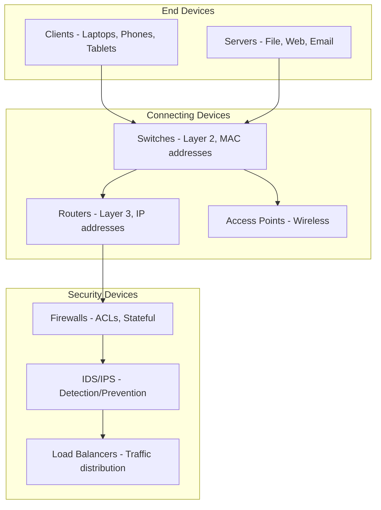

### V6 - Client-Server vs. Peer-to-Peer
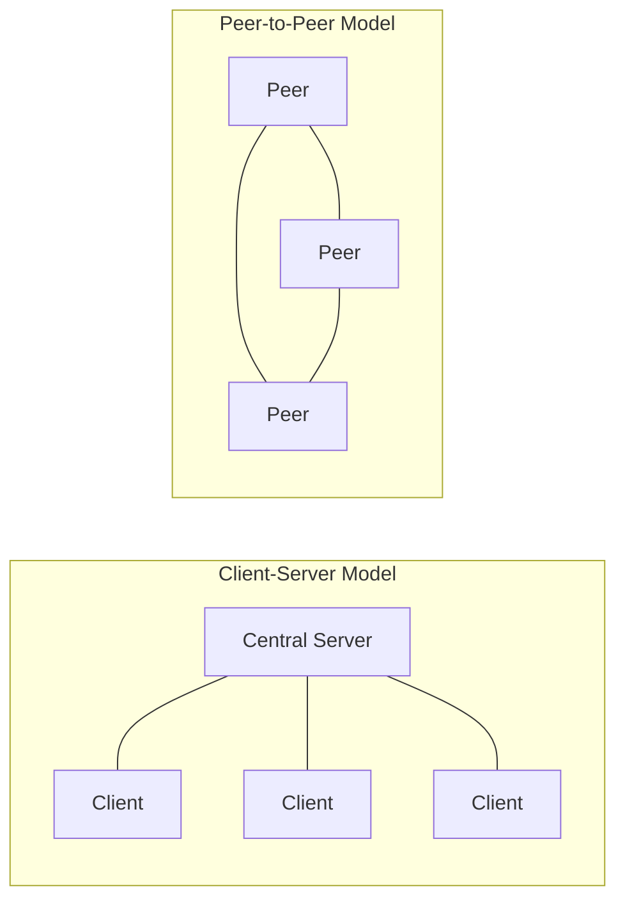

### V7 - Network Geography (PAN to WAN)
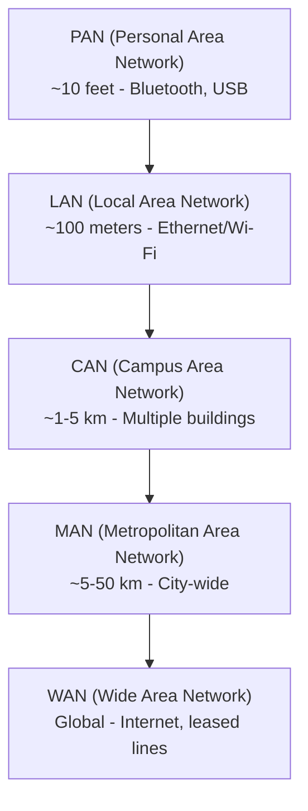

### V9 - Network Topologies
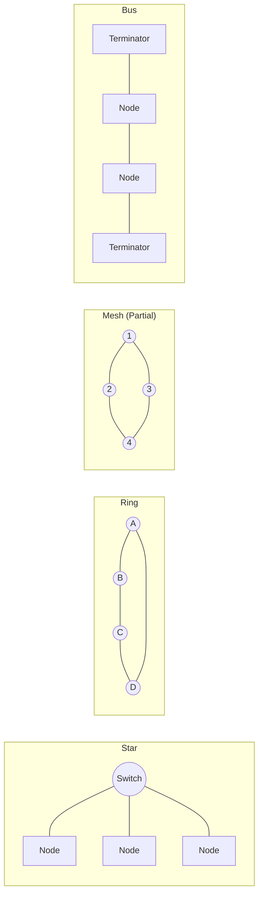

### V10 - Wireless Topologies
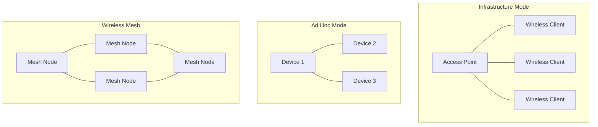

### V11 - Datacenter Topologies
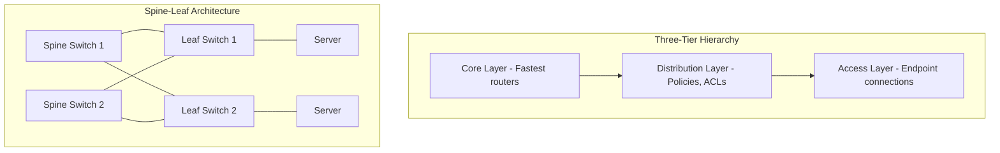

---

## Session 3: OSI Model (V12-V21)

### V12 - OSI 7 Layers
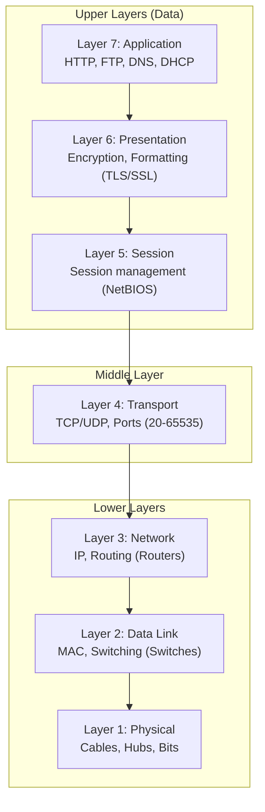

### V13 - Physical Layer (L1) Media
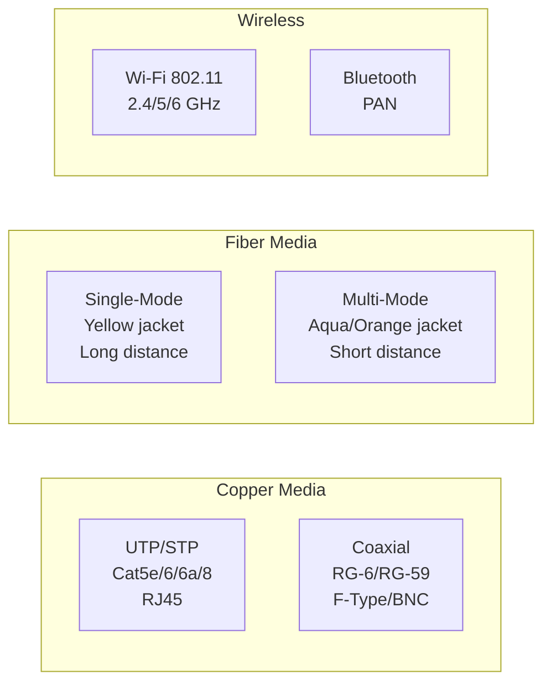

### V16 - TCP Three-Way Handshake
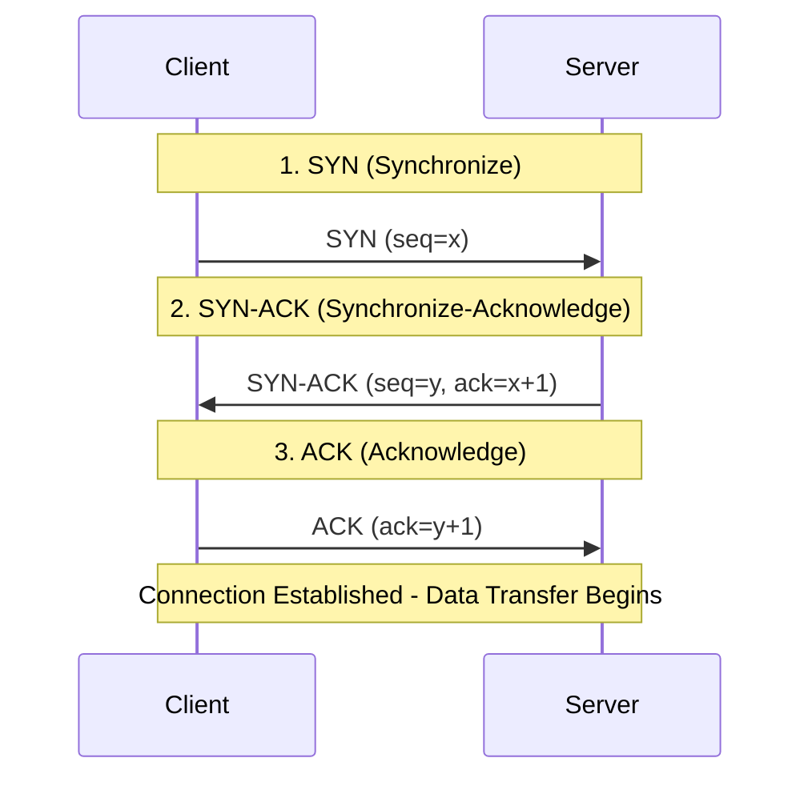

### V16 - TCP vs. UDP Comparison
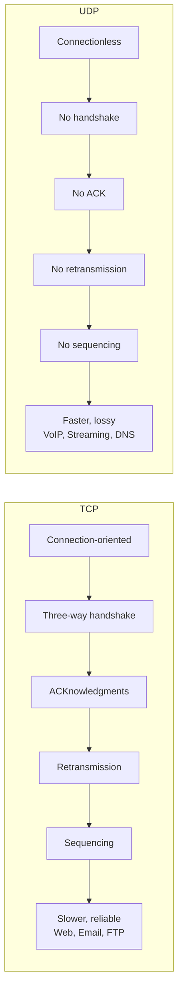

### V18 - Encryption Types
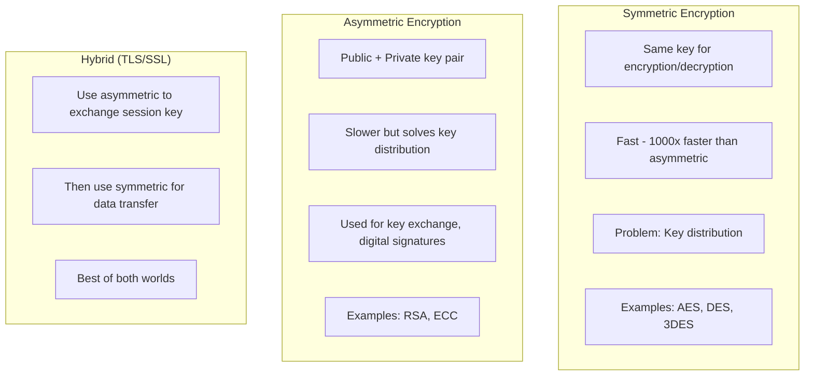

### V20 - Encapsulation (PDUs)
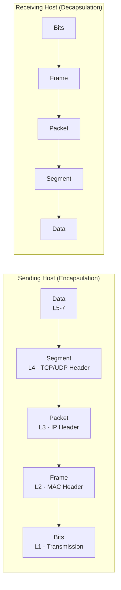

---

## Session 4: Ports and Protocols (V22-V33)

### V22 - Port Ranges
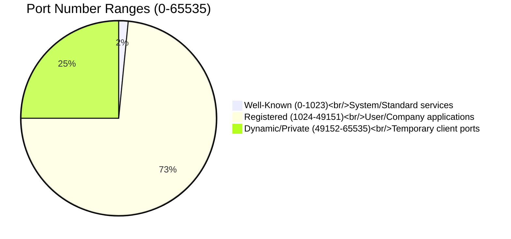

### V23 - Port Communication Flow
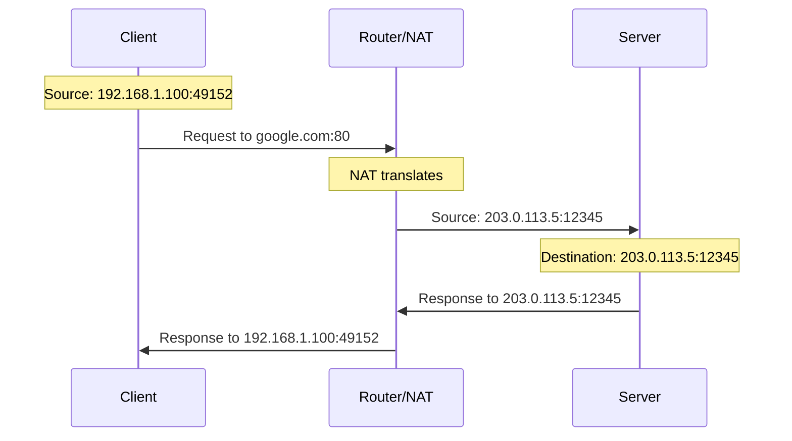

### V27 - HTTP vs. HTTPS
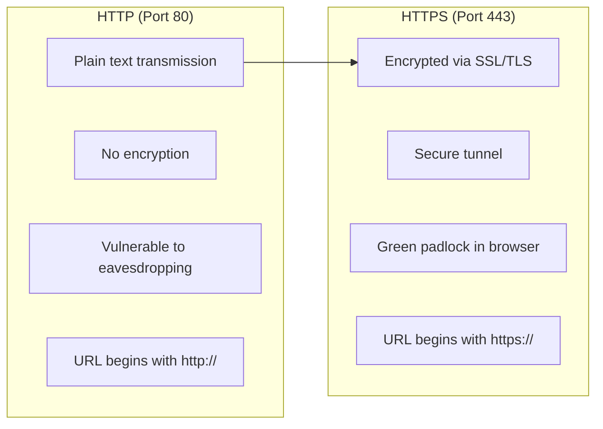

### V28 - Email Protocols
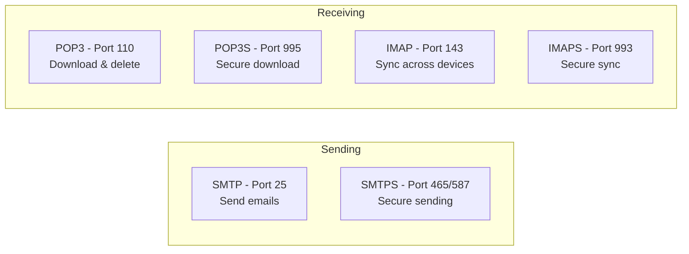

### V30 - Remote Access Protocols
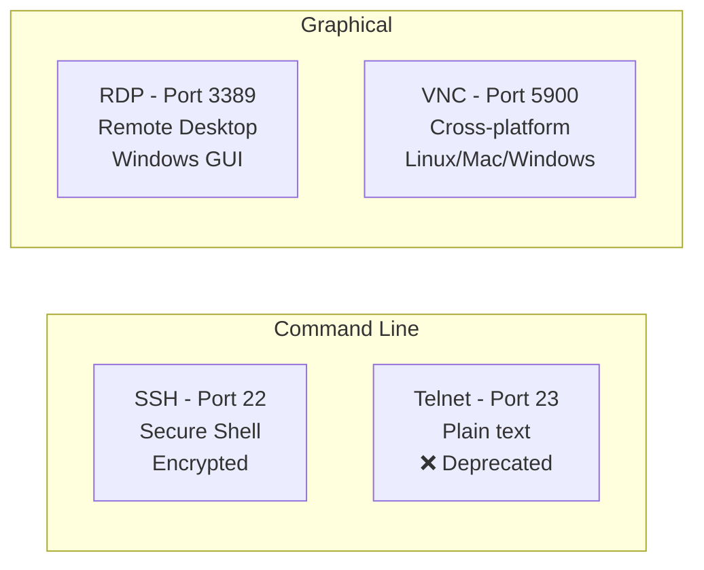

### V31 - Network Service Ports
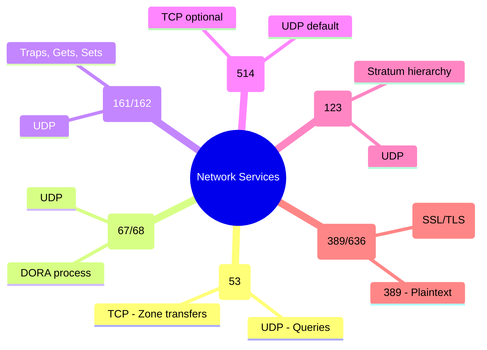

---

## Session 5: Media and Cabling (V34-V40)

### V35 - Copper Cable Categories
```mermaid
graph LR
    subgraph "Twisted Pair Categories"
        CAT5["CAT 5<br/>100 Mbps @ 100m"]
        CAT5e["CAT 5e<br/>1 Gbps @ 100m"]
        CAT6["CAT 6<br/>1 Gbps @ 100m<br/>10 Gbps @ 55m"]
        CAT6a["CAT 6a/7<br/>10 Gbps @ 100m"]
        CAT8["CAT 8<br/>25-40 Gbps @ 30m"]
    end
    
    CAT5 --> CAT5e --> CAT6 --> CAT6a --> CAT8
```

### V36 - Connector Types
```mermaid
graph LR
    subgraph "Twisted Pair"
        RJ45[RJ45 - 8P8C<br/>Ethernet networks]
        RJ11[RJ11 - 6P2C<br/>Telephone lines]
    end
    
    subgraph "Coaxial"
        FType[F-Type - Screw-on<br/>Cable TV/Satellite]
        BNC[BNC - Bayonet<br/>Video/RF applications]
    end
    
    subgraph "Fiber"
        SC[SC - Stick & Click<br/>Square, push-pull]
        LC[LC - Lucent<br/>Compact, high density]
        ST[ST - Stick & Twist<br/>Round, twist lock]
        MPO[MPO - Multi-fiber<br/>12+ fibers, data centers]
    end
```

### V37 - Straight-Through vs. Crossover
```mermaid
graph LR
    subgraph "Straight-Through (Patch Cable)"
        ST1["End 1: 568B"] --- ST2["End 2: 568B"]
        ST1_Note["Pin1→Pin1, Pin2→Pin2..."]
        ST_Use["Use: DTE → DCE<br/>PC to Switch"]
    end
    
    subgraph "Crossover Cable"
        CR1["End 1: 568B"] --- CR2["End 2: 568A"]
        CR1_Note["Pin1→Pin3, Pin2→Pin6<br/>Swaps TX/RX"]
        CR_Use["Use: DTE → DTE or DCE → DCE<br/>Switch to Switch"]
    end
```

### V38 - Fiber Types (Single-Mode vs. Multi-Mode)
```mermaid
graph LR
    subgraph "Single-Mode Fiber (SMF)"
        SM1[Core: 8.3-10 microns]
        SM2[Light path: Single path]
        SM3[Distance: Up to 100+ km]
        SM4[Color: Yellow jacket]
        SM5[Use: Long-haul, WAN]
    end
    
    subgraph "Multi-Mode Fiber (MMF)"
        MM1[Core: 50-100 microns]
        MM2[Light path: Multiple paths]
        MM3[Distance: Up to 2 km]
        MM4[Color: Aqua/Orange jacket]
        MM5[Use: LAN, Data centers]
    end
```

### V40 - Transceiver Form Factors
```mermaid
graph LR
    subgraph "SFP Family (Small Form-factor Pluggable)"
        SFP[SFP<br/>4.25 Gbps]
        SFPp[SFP+<br/>16 Gbps]
    end
    
    subgraph "QSFP Family (Quad SFP)"
        QSFP[QSFP<br/>4 Gbps]
        QSFPp[QSFP+<br/>40 Gbps]
        QSFP28[QSFP28<br/>100 Gbps]
        QSFP56[QSFP56<br/>200 Gbps]
    end
    
    SFP --> SFPp
    QSFP --> QSFPp --> QSFP28 --> QSFP56
```

---

## Session 6: Distribution Systems (V41-V47)

### V42 - MDF/IDF Cabling Hierarchy
```mermaid
flowchart TB
    Demark[Demarcation Point<br/>ISP responsibility ends]
    MDF[Main Distribution Frame<br/>Core router, backbone switch]
    IDF1[IDF - Floor 1<br/>Edge switches]
    IDF2[IDF - Floor 2<br/>Edge switches]
    IDF3[IDF - Floor 3<br/>Edge switches]
    Users[End Users<br/>Wall jacks, desktops]
    
    Demark --> MDF
    MDF --> IDF1
    MDF --> IDF2
    MDF --> IDF3
    IDF1 --> Users
    IDF2 --> Users
    IDF3 --> Users
```

### V45 - Power Distribution Hierarchy
```mermaid
flowchart LR
    subgraph "Primary Power Sources"
        Grid[Electrical Grid]
        Solar[Solar Panels]
        Generator[Diesel/Propane Generator]
    end
    
    subgraph "Power Protection"
        ATS[Automatic Transfer Switch]
        UPS[Uninterruptible Power Supply<br/>Battery backup - 15-30 min]
        PDU[Power Distribution Unit<br/>Advanced power strip]
    end
    
    subgraph "End Devices"
        Servers[Servers]
        Switches[Switches]
        Routers[Routers]
    end
    
    Grid --> ATS
    Solar --> ATS
    Generator --> ATS
    ATS --> UPS --> PDU --> Servers
    PDU --> Switches
    PDU --> Routers
```

### V46 - Hot/Cold Aisle Configuration
```mermaid
graph TB
    subgraph "Cold Aisle"
        CA[CRAC Unit - Cold Air] --> R1[Server Rack]
        CA --> R2[Server Rack]
    end
    
    subgraph "Hot Aisle"
        R1 --> HA[Hot Air Return]
        R2 --> HA
        HA --> CRAC[CRAC Unit]
    end
    
    subgraph "Airflow Direction"
        direction LR
        Front[Front - Cold Air Intake] --> Server[Server]
        Server --> Back[Back - Hot Air Exhaust]
    end
```

### V47 - Fire Suppression Systems
```mermaid
graph LR
    subgraph "Water-Based (Not recommended for data centers)"
        Wet[Wet Pipe<br/>Always water in pipes]
        Pre[Pre-Action<br/>Requires smoke + sprinkler]
    end
    
    subgraph "Clean Agent (Recommended)"
        Inert[Inert Gas<br/>Displaces oxygen<br/>FM-200, Novec]
        Halocarbon[Halocarbon<br/>Interrupts chemical reaction]
    end
    
    Wet --> Pre
    Inert --> Clean
    Halocarbon --> Clean
```

---

## Session 7: Wireless Networks (V48-V57)

### V49 - Wireless Network Types
```mermaid
graph TB
    subgraph "Infrastructure Mode"
        AP[Access Point] --- C1[Client]
        AP --- C2[Client]
        AP --- C3[Client]
    end
    
    subgraph "Ad Hoc Mode"
        A1[Device] --- A2[Device]
        A1 --- A3[Device]
    end
    
    subgraph "Point-to-Point"
        P1[Building A] ---|Microwave Link| P2[Building B]
    end
    
    subgraph "Wireless Mesh"
        M1[Node] --- M2[Node]
        M1 --- M3[Node]
        M2 --- M4[Node]
        M3 --- M4
        M2 --- M5[Node]
    end
```

### V50 - Antenna Types
```mermaid
graph LR
    subgraph "Omnidirectional"
        O[Radiation: 360° equally<br/>Use: Home/Office Wi-Fi<br/>Example: Whip antenna]
    end
    
    subgraph "Unidirectional"
        U[Radiation: Single direction<br/>Use: Point-to-point links<br/>Example: Panel antenna]
    end
    
    subgraph "Yagi"
        Y[Radiation: Very narrow beam<br/>Use: Long distance P2P<br/>Example: TV antenna]
    end
    
    subgraph "Parabolic"
        P[Radiation: Focused beam<br/>Use: Satellite/microwave<br/>Example: Satellite dish]
    end
```

### V52 - Wireless Frequency Bands
```mermaid
graph LR
    subgraph "2.4 GHz"
        G24[Range: Long<br/>Penetration: Best<br/>Speed: Slowest<br/>Channels: 3 non-overlapping<br/>Ch 1, 6, 11]
    end
    
    subgraph "5 GHz"
        G5[Range: Medium<br/>Penetration: Moderate<br/>Speed: Faster<br/>Channels: 24 non-overlapping<br/>Channel bonding supported]
    end
    
    subgraph "6 GHz (Wi-Fi 6E)"
        G6[Range: Short<br/>Penetration: Least<br/>Speed: Fastest<br/>Channels: 59 (20 MHz)<br/>Less congestion]
    end
    
    G24 --> G5 --> G6
```

### V53 - 802.11 Standards Evolution
```mermaid
timeline
    title Wi-Fi Generations
    1997 : 802.11
          : 2 Mbps
    1999 : 802.11b
          : 11 Mbps
    2003 : 802.11g
          : 54 Mbps
    2009 : 802.11n (Wi-Fi 4)
          : 600 Mbps, MIMO
    2013 : 802.11ac (Wi-Fi 5)
          : 1.3+ Gbps, MU-MIMO
    2019 : 802.11ax (Wi-Fi 6/6E)
          : 10 Gbps, OFDMA
```

### V54 - Wireless Security Evolution
```mermaid
graph LR
    subgraph "❌ Never Use"
        WEP[WEP - 1999<br/>RC4 + Static IV<br/>Crackable in minutes]
    end
    
    subgraph "⚠️ Deprecated"
        WPA[WPA - 2003<br/>TKIP + RC4<br/>Weak encryption]
    end
    
    subgraph "✅ Current"
        WPA2[WPA2 - 2004<br/>CCMP + AES<br/>Still widely used]
    end
    
    subgraph "⭐ Recommended"
        WPA3[WPA3 - 2018<br/>SAE + GCMP-256<br/>Forward secrecy]
    end
    
    WEP --> WPA --> WPA2 --> WPA3
```

---

## Session 8: Ethernet Switching (V58-V67)

### V59 - CSMA/CD Process
```mermaid
flowchart TD
    Start[Device wants to transmit] --> Listen[Listen for carrier]
    Listen -->|Carrier idle| Transmit[Transmit data]
    Listen -->|Carrier busy| Wait[Wait random backoff]
    Wait --> Listen
    
    Transmit --> Detect{Detect collision?}
    Detect -->|No| Success[Transmission successful]
    Detect -->|Yes| Jam[Send jam signal]
    Jam --> Backoff[Random backoff timer]
    Backoff --> Listen
```

### V60 - Hub vs. Switch Collision Domains
```mermaid
graph LR
    subgraph "Hub (Single Collision Domain)"
        H[Hub] --- H1[PC1]
        H --- H2[PC2]
        H --- H3[PC3]
        H --- H4[PC4]
        Note1[All devices share one domain<br/>Half-duplex only]
    end
    
    subgraph "Switch (Per-Port Collision Domains)"
        S[Switch] --- S1[PC1 - Domain 1]
        S --- S2[PC2 - Domain 2]
        S --- S3[PC3 - Domain 3]
        S --- S4[PC4 - Domain 4]
        Note2[Each port = own domain<br/>Full-duplex capable]
    end
```

### V62 - VLAN Segmentation
```mermaid
graph TB
    subgraph "Physical Switch"
        SW[Switch]
    end
    
    subgraph "VLAN 10 - HR (192.168.10.0/24)"
        SW --- H1[HR PC1]
        SW --- H2[HR PC2]
        SW --- H3[HR Printer]
    end
    
    subgraph "VLAN 20 - IT (192.168.20.0/24)"
        SW --- I1[IT PC1]
        SW --- I2[IT PC2]
        SW --- I3[IT Server]
    end
    
    subgraph "VLAN 30 - Guest (192.168.30.0/24)"
        SW --- G1[Guest Laptop]
        SW --- G2[Guest Phone]
    end
    
    R[Router with Sub-interfaces] --- SW
    R --- Internet[(Internet)]
```

### V65 - Spanning Tree Protocol (STP)
```mermaid
graph TD
    subgraph "Root Bridge"
        RB[Switch A - Root Bridge<br/>All ports Designated]
    end
    
    subgraph "Non-Root Bridges"
        SB1[Switch B<br/>Root Port: Port 1<br/>Designated: Port 2<br/>Alternate: Port 3 - Blocked]
        SB2[Switch C<br/>Root Port: Port 1<br/>Designated: Port 2<br/>Alternate: Port 3 - Blocked]
    end
    
    RB ---|Cost 19| SB1
    RB ---|Cost 19| SB2
    SB1 ---|Blocked| SB2
    
    style RB fill:#c8e6c9
    style SB1 fill:#e1f5fe
    style SB2 fill:#e1f5fe
```

---

## Session 9: IP Addressing (V68-V79)

### V69 - IPv4 Address Classes
```mermaid
graph LR
    subgraph "Class A (1-127)"
        A[Network.Host.Host.Host<br/>Default: /8 (255.0.0.0)]
    end
    
    subgraph "Class B (128-191)"
        B[Network.Network.Host.Host<br/>Default: /16 (255.255.0.0)]
    end
    
    subgraph "Class C (192-223)"
        C[Network.Network.Network.Host<br/>Default: /24 (255.255.255.0)]
    end
    
    subgraph "Class D (224-239)"
        D[Multicast - No subnet mask]
    end
    
    subgraph "Class E (240-255)"
        E[Experimental - Not for production]
    end
```

### V70 - Private IP Ranges (RFC 1918)
```mermaid
mindmap
  root((Private IP Ranges<br/>Not routable on internet))
    Class A
      10.0.0.0 to 10.255.255.255
      /8 prefix
      16.7M addresses
    Class B
      172.16.0.0 to 172.31.255.255
      /12 prefix
      1M addresses
    Class C
      192.168.0.0 to 192.168.255.255
      /16 prefix
      65,536 addresses
    Special
      Loopback: 127.0.0.0/8
      APIPA: 169.254.0.0/16
```

### V74 - Subnetting CIDR Chart (/24 to /30)
```mermaid
graph LR
    D24["/24<br/>256 IPs<br/>254 Usable<br/>1 Subnet"]
    D25["/25<br/>128 IPs<br/>126 Usable<br/>2 Subnets"]
    D26["/26<br/>64 IPs<br/>62 Usable<br/>4 Subnets"]
    D27["/27<br/>32 IPs<br/>30 Usable<br/>8 Subnets"]
    D28["/28<br/>16 IPs<br/>14 Usable<br/>16 Subnets"]
    D29["/29<br/>8 IPs<br/>6 Usable<br/>32 Subnets"]
    D30["/30<br/>4 IPs<br/>2 Usable<br/>64 Subnets"]
    
    D24 --> D25 --> D26 --> D27 --> D28 --> D29 --> D30
```

### V77 - IPv6 Address Types
```mermaid
graph LR
    subgraph "IPv6 Address Types"
        U[Unicast - Single interface]
        M[Multicast - Group of interfaces<br/>Starts with FF]
        A[Anycast - Nearest in group<br/>Replaces broadcast]
    end
    
    subgraph "Unicast Subtypes"
        G[Global Unicast<br/>Starts: 2000-3999<br/>Public internet routable]
        L[Link-Local<br/>Starts: FE80<br/>Autoconfigured, local only]
        ULA[Unique Local<br/>Starts: FC00/FD00<br/>Private like IPv4 RFC 1918]
    end
```

### V79 - IPv4/IPv6 Transition Mechanisms
```mermaid
graph LR
    subgraph "Dual Stack"
        DS[Device runs both<br/>IPv4 and IPv6 stacks<br/>Prefers IPv6, falls back to IPv4]
    end
    
    subgraph "Tunneling"
        T[IPv6 packet encapsulated<br/>inside IPv4 packet<br/>6to4, Teredo, ISATAP]
    end
    
    subgraph "NAT64"
        N[NAT64 gateway<br/>Translates IPv6 ↔ IPv4<br/>Allows IPv6-only to reach IPv4]
    end
```

---

## Session 10: Routing (V80-V89)

### V81 - Basic Routing Process
```mermaid
sequenceDiagram
    participant PC1 as PC1 (192.168.1.10)
    participant SW as Switch
    participant R1 as Router1
    participant R2 as Router2
    participant PC2 as PC2 (10.0.0.20)
    
    Note over PC1,SW: Layer 2 - MAC addressing
    PC1->>SW: ARP Request (Who has 192.168.1.1?)
    SW->>R1: Forward ARP
    R1->>SW: ARP Reply (MAC of Router1)
    SW->>PC1: Forward ARP Reply
    
    Note over R1,R2: Layer 3 - IP routing
    PC1->>R1: Data frame (dest IP: 10.0.0.20)
    R1->>R2: IP Packet (routed via routing table)
    
    Note over R2,PC2: Layer 2 again
    R2->>PC2: Data frame (dest MAC of PC2)
```

### V83 - Routing Protocol Classification
```mermaid
flowchart TB
    RP[Routing Protocols]
    
    RP --> IGP[Interior Gateway Protocols<br/>Within Autonomous System]
    RP --> EGP[Exterior Gateway Protocols<br/>Between AS]
    
    IGP --> DV[Distance Vector]
    IGP --> LS[Link State]
    IGP --> Hybrid[Hybrid]
    
    DV --> RIP[RIP<br/>Hop count, max 15<br/>Slow convergence]
    LS --> OSPF[OSPF<br/>Cost, link speed<br/>Fast convergence]
    LS --> IS-IS[IS-IS<br/>Similar to OSPF]
    Hybrid --> EIGRP[EIGRP<br/>Cisco proprietary<br/>Bandwidth + delay]
    
    EGP --> BGP[BGP<br/>Path vector, AS hops<br/>Internet backbone]
```

### V85 - NAT/PAT Translation Types
```mermaid
graph LR
    subgraph "Static NAT (1:1)"
        SNAT[Private IP 192.168.1.10<br/>maps to<br/>Public IP 203.0.113.10<br/>Permanent mapping]
    end
    
    subgraph "Dynamic NAT (1:1 from pool)"
        DNAT[Private IP 192.168.1.10<br/>maps to<br/>First available public IP<br/>Temporary lease]
    end
    
    subgraph "PAT (Many:1)"
        PAT1[192.168.1.10:12345 → 203.0.113.5:10001]
        PAT2[192.168.1.11:12346 → 203.0.113.5:10002]
        PAT3[192.168.1.12:12347 → 203.0.113.5:10003]
    end
```

### V86 - FHRP (First Hop Redundancy)
```mermaid
graph LR
    subgraph "HSRP/VRRP (Active-Standby)"
        Active[Active Router<br/>Virtual IP: 192.168.1.1]
        Standby[Standby Router<br/>Takes over if active fails]
        Clients[Clients use Virtual IP as gateway]
    end
    
    subgraph "GLBP (Active-Active with Load Balancing)"
        GLBP1[Gateway 1 - VMAC 1<br/>Handles 50% of traffic]
        GLBP2[Gateway 2 - VMAC 2<br/>Handles 50% of traffic]
        Clients2[Clients distributed via different VMACs]
    end
```

---

## Session 11: Network Services (V90-V101)

### V91 - DHCP DORA Process
```mermaid
sequenceDiagram
    participant Client as DHCP Client
    participant Server as DHCP Server
    
    Note over Client,Server: Step 1: DISCOVER (Broadcast)
    Client->>Server: DHCPDISCOVER (0.0.0.0 → 255.255.255.255)
    
    Note over Client,Server: Step 2: OFFER (Broadcast or Unicast)
    Server->>Client: DHCPOFFER (Offers IP 192.168.1.100)
    
    Note over Client,Server: Step 3: REQUEST (Broadcast)
    Client->>Server: DHCPREQUEST (I accept 192.168.1.100)
    
    Note over Client,Server: Step 4: ACKNOWLEDGE
    Server->>Client: DHCPACK (Confirmed + Lease info)
    
    Note over Client: Client can now use IP 192.168.1.100 for lease duration
```

### V94 - DNS Resolution Flow
```mermaid
sequenceDiagram
    participant Client
    participant LocalDNS as Local DNS Resolver
    participant Root as Root DNS Server
    participant TLD as TLD DNS (.com)
    participant Auth as Authoritative DNS
    
    Client->>LocalDNS: Query: www.example.com?
    LocalDNS->>Root: Query (recursive)
    Root-->>LocalDNS: Refer to .com TLD servers
    LocalDNS->>TLD: Query example.com
    TLD-->>LocalDNS: Refer to example.com NS servers
    LocalDNS->>Auth: Query www.example.com
    Auth-->>LocalDNS: A record: 93.184.216.34
    LocalDNS-->>Client: IP address: 93.184.216.34
    Client->>WebServer: HTTP request to 93.184.216.34
```

### V95 - DNS Record Types
```mermaid
mindmap
  root((DNS Records))
    A (Address)
      Hostname → IPv4
      Example: www → 192.0.2.1
    AAAA (Quad A)
      Hostname → IPv6
      Example: www → 2001:db8::1
    CNAME (Canonical)
      Alias → Another domain
      Example: www → @
    MX (Mail Exchange)
      Email routing
      Priority values
    NS (Name Server)
      Authoritative DNS servers
    TXT (Text)
      SPF, DKIM, domain verification
    PTR (Pointer)
      IP → Hostname (reverse lookup)
    SOA (Start of Authority)
      Zone metadata, serial number
```

### V99 - QoS Categories
```mermaid
graph LR
    subgraph "Best Effort"
        BE[No QoS<br/>First-in, first-out<br/>No prioritization]
    end
    
    subgraph "IntServ (Hard QoS)"
        IS[Strict bandwidth reservations<br/>Guaranteed but inefficient<br/>Example: VoIP gets 25% fixed]
    end
    
    subgraph "DiffServ (Soft QoS)"
        DS[Priority markings (DSCP)<br/>Dynamic allocation<br/>Most common in enterprise]
    end
    
    BE --> IS
    BE --> DS
```

---

## Session 12: WAN Technologies (V102-V111)

### V103 - Fiber to the X (FTTx)
```mermaid
graph LR
    subgraph "FTTH (Fiber to the Home)"
        FTH[ISP Fiber --- Home<br/>Fastest, most reliable]
    end
    
    subgraph "FTTB (Fiber to the Building)"
        FTB[ISP Fiber --- Building<br/>Copper to units<br/>Multi-dwelling]
    end
    
    subgraph "FTTC (Fiber to the Curb)"
        FTC[ISP Fiber --- Curb/Cabinet<br/>Copper to home<br/>Balance cost/performance]
    end
    
    subgraph "FTTN (Fiber to the Node)"
        FTN[ISP Fiber --- Neighborhood node<br/>Copper to home<br/>Slower, uses existing copper]
    end
    
    FTTH --- FTTB --- FTTC --- FTTN
```

### V104 - DOCSIS (Cable Internet)
```mermaid
graph LR
    subgraph "HFC Network (Hybrid Fiber-Coaxial)"
        ISP[ISP Fiber] --> Node[Fiber Node]
        Node --> Coax1[Coaxial Cable - Home 1]
        Node --> Coax2[Coaxial Cable - Home 2]
        Node --> Coax3[Coaxial Cable - Home 3]
    end
    
    subgraph "Frequency Allocation"
        Upstream[Upstream: 5-42 MHz<br/>Slower upload]
        Downstream[Downstream: 50-860 MHz<br/>Faster download]
    end
```

### V105 - DSL Types
```mermaid
graph LR
    subgraph "ADSL (Asymmetric)"
        ADSL_D[Download: Up to 8 Mbps]
        ADSL_U[Upload: Up to 1.5 Mbps]
        ADSL_Use[Home users, more download than upload]
    end
    
    subgraph "SDSL (Symmetric)"
        SDSL_S[Speed: Equal up/down<br/>Example: 4 Mbps up, 4 Mbps down]
        SDSL_Use[Business, dedicated access]
    end
    
    subgraph "VDSL (Very High Bit Rate)"
        VDSL_D[Download: 50+ Mbps]
        VDSL_U[Upload: 10+ Mbps]
        VDSL_Limit[Distance limit: 4,000 ft from DSLAM]
    end
```

### V107 - Cellular Generations (1G to 5G)
```mermaid
timeline
    title Cellular Evolution
    1980s : 1G
          : Analog voice
          : ~2 kbps
    1990s : 2G
          : Digital voice + SMS
          : 14.4-64 kbps
    2000s : 3G
          : Mobile data
          : 384 kbps - 2 Mbps
    2010s : 4G/LTE
          : Mobile broadband
          : 100 Mbps - 1 Gbps
    2019+ : 5G
          : Ultra-fast, low latency
          : 10 Gbps
```

### V110 - MPLS Label Switching
```mermaid
graph LR
    subgraph "Traditional IP Routing"
        IP1[Router 1] -->|IP lookup| IP2[Router 2]
        IP2 -->|IP lookup| IP3[Router 3]
        IP3 -->|IP lookup| IP4[Router 4]
    end
    
    subgraph "MPLS Label Switching"
        M1[Ingress Router] -->|Adds label| M2[LSR]
        M2 -->|Swaps label| M3[LSR]
        M3 -->|Removes label| M4[Egress Router]
        Note[Faster - simple label lookup vs. IP route lookup]
    end
```

---

## Session 13: Cloud and Datacenter (V112-V123)

### V114 - Cloud Service Models (IaaS, PaaS, SaaS)
```mermaid
graph TB
    subgraph On-Premise
        O[Applications<br/>Data<br/>Runtime<br/>Middleware<br/>OS<br/>Virtualization<br/>Servers<br/>Storage<br/>Networking]
    end
    
    subgraph IaaS
        I[Applications<br/>Data<br/>Runtime<br/>Middleware<br/>OS]
        I_Provider[Virtualization<br/>Servers<br/>Storage<br/>Networking]
    end
    
    subgraph PaaS
        P[Applications<br/>Data]
        P_Provider[Runtime<br/>Middleware<br/>OS<br/>Virtualization<br/>Servers<br/>Storage<br/>Networking]
    end
    
    subgraph SaaS
        S_Provider[Everything<br/>Applications<br/>Data<br/>Runtime<br/>Middleware<br/>OS<br/>Virtualization<br/>Servers<br/>Storage<br/>Networking]
    end
    
    O --> I
    I --> P
    P --> S
```

### V115 - Cloud Deployment Models
```mermaid
graph LR
    subgraph "Public Cloud"
        Pub[Resources shared<br/>Multi-tenant<br/>Internet access<br/>Examples: AWS, Azure, GCP]
    end
    
    subgraph "Private Cloud"
        Priv[Dedicated resources<br/>Single tenant<br/>On-premise or hosted<br/>Example: GovCloud]
    end
    
    subgraph "Hybrid Cloud"
        Hyb[Combines public + private<br/>Orchestration between them<br/>Most enterprises]
    end
    
    subgraph "Community Cloud"
        Com[Shared among organizations<br/>Common compliance needs<br/>Example: Healthcare, Government]
    end
```

### V118 - Virtual Private Cloud (VPC) Components
```mermaid
flowchart TB
    subgraph "VPC (Virtual Private Cloud)"
        IGW[Internet Gateway<br/>Public access]
        
        subgraph "Public Subnet"
            Web[Web Server<br/>Public IP]
            NAT[NAT Gateway<br/>For private subnet egress]
        end
        
        subgraph "Private Subnet"
            App[App Server<br/>Private IP]
            DB[Database<br/>Private IP]
        end
        
        IGW --> Web
        NAT --> IGW
        App --> NAT
        DB --> App
    end
    
    subgraph "Security"
        SG[Security Groups<br/>Instance-level firewall]
        NACL[Network ACLs<br/>Subnet-level firewall]
    end
```

### V120 - SDN Architecture (Control/Data/Management Planes)
```mermaid
flowchart TB
    subgraph "Management Plane"
        MP[SDN Controller<br/>Policies & Orchestration<br/>APIs for configuration]
    end
    
    subgraph "Control Plane"
        CP[Control Software<br/>Routing decisions<br/>Topology discovery]
    end
    
    subgraph "Data Plane"
        DP1[Switch - Forwards packets]
        DP2[Router - Forwards packets]
        DP3[Firewall - Filters packets]
    end
    
    MP -->|Southbound API<br/>OpenFlow, NETCONF| CP
    CP -->|Packet forwarding rules| DP1
    CP -->|Packet forwarding rules| DP2
    CP -->|Packet forwarding rules| DP3
```

---

## Session 14: Network Security Fundamentals (V124-V132)

### V125 - CIA Triad
```mermaid
graph TD
    CIA[Security Goals]
    
    C[Confidentiality<br/>Encryption<br/>Access Controls<br/>Steganography]
    I[Integrity<br/>Hashing<br/>Digital Signatures<br/>Checksums]
    A[Availability<br/>Redundancy<br/>Backups<br/>RAID, Clustering]
    
    CIA --- C
    CIA --- I
    CIA --- A
```

### V127 - Risk Management Process
```mermaid
flowchart LR
    subgraph "Risk Assessment"
        ID[Identify Assets & Threats]
        VULN[Identify Vulnerabilities]
        IMPACT[Determine Impact & Likelihood]
    end
    
    subgraph "Risk Response"
        AVOID[Avoid - Eliminate risk]
        TRANSFER[Transfer - Insurance, contracts]
        MITIGATE[Mitigate - Controls, safeguards]
        ACCEPT[Accept - Acknowledge, monitor]
    end
    
    subgraph "Continuous"
        MON[Monitor & Review]
        AUDIT[Audit Compliance]
    end
    
    ID --> VULN --> IMPACT
    IMPACT --> AVOID
    IMPACT --> TRANSFER
    IMPACT --> MITIGATE
    IMPACT --> ACCEPT
    AVOID --> MON
    TRANSFER --> MON
    MITIGATE --> MON
    ACCEPT --> MON
    MON --> AUDIT
    AUDIT --> ID
```

### V131 - Physical Security Layers
```mermaid
flowchart TB
    subgraph "Perimeter"
        Fence[Fencing/Gates]
        Camera[Surveillance Cameras]
        Lighting[Security Lighting]
    end
    
    subgraph "Building Entry"
        Guards[Security Guards]
        Badge[Badge Readers]
        Mantrap[Mantrap / Access Vestibule]
        Biometric[Biometric Scanners]
    end
    
    subgraph "Data Center"
        LockRack[Locking Racks/Cabinets]
        Motion[Motion Detectors]
        SmartLockers[Smart Lockers for devices]
    end
    
    subgraph "Workstation"
        CableLock[Cable Locks]
        PrivacyScreen[Privacy Screens]
        CleanDesk[Clean Desk Policy]
    end
    
    Perimeter --> Building Entry --> Data Center --> Workstation
```

---

## Session 15: Network Attacks (V133-V144)

### V134 - DoS vs. DDoS Attack
```mermaid
graph LR
    subgraph "DoS (Denial of Service)"
        Attacker[Single Attacker] --> Target[Target Server]
        Note1[One source, one target]
    end
    
    subgraph "DDoS (Distributed DoS)"
        C2[Command & Control Server]
        Bot1[Bot/Zombie 1] --> Target2[Target Server]
        Bot2[Bot/Zombie 2] --> Target2
        Bot3[Bot/Zombie 3] --> Target2
        BotN[Bot/Zombie N] --> Target2
        Attacker2[Attacker] --> C2
        C2 --> Bot1
        C2 --> Bot2
        C2 --> Bot3
        C2 --> BotN
        Note2[Multiple sources, one target<br/>Botnet of compromised devices]
    end
```

### V136 - ARP Spoofing / Poisoning
```mermaid
sequenceDiagram
    participant Attacker
    participant Client
    participant Gateway as Default Gateway (192.168.1.1)
    
    Note over Attacker: Attacker sends fake ARP replies
    
    Attacker->>Client: 192.168.1.1 is at MAC-Attacker
    Attacker->>Gateway: 192.168.1.100 is at MAC-Attacker
    
    Note over Client: Client updates ARP cache
    Client->>Attacker: Traffic intended for gateway
    
    Note over Gateway: Gateway updates ARP cache
    Gateway->>Attacker: Traffic intended for client
    
    Note over Attacker: Attacker can intercept, modify, or drop traffic
    Attacker->>Client: Forward modified traffic
    Attacker->>Gateway: Forward modified traffic
```

### V141 - Social Engineering Attack Types
```mermaid
mindmap
  root((Social Engineering))
    Phishing
      Mass email attacks
      Generic targets
      Link to fake login pages
    Spear Phishing
      Targeted individuals
      Personalized content
      Research on victim
    Whaling
      C-level executives
      High-value targets
    Tailgating
      Following authorized person
      Without their knowledge
    Piggybacking
      With employee's consent
      "Hold the door" scenario
    Shoulder Surfing
      Observing passwords
      Watching screens
    Dumpster Diving
      Searching trash
      Finding sensitive documents
```

### V143 - Malware Types
```mermaid
mindmap
  root((Malware))
    Virus
      Requires user action
      Self-replicates
      Attaches to files
    Worm
      No user action needed
      Self-propagates
      Exploits vulnerabilities
    Trojan Horse
      Disguised as legitimate
      Creates backdoor
      RAT (Remote Access Trojan)
    Ransomware
      Encrypts files
      Demands payment
      Examples: WannaCry, Samsam
    Spyware
      Gathers information
      Keyloggers
      Screen capture
    Rootkit
      Administrator-level access
      Hides from OS
      Bootkit (BIOS/UEFI)
```

---

## Session 16: Logical Security (V145-V155)

### V147 - MFA Authentication Factors
```mermaid
mindmap
  root((Multi-Factor Authentication))
    Something You Know
      Password
      PIN
      Security questions
    Something You Have
      Smart card
      RSA token
      Mobile phone (SMS/App)
      RFID badge
    Something You Are
      Fingerprint
      Retina scan
      Facial recognition
      Voice print
    Something You Do
      Signature dynamics
      Typing rhythm
      Gait analysis
    Somewhere You Are
      GPS location
      IP geolocation
      Network ID
```

### V149 - Access Control Models
```mermaid
graph LR
    subgraph "DAC (Discretionary)"
        DAC_Owner[Resource Owner<br/>sets permissions]
        DAC_Example[File owner decides who can read/write]
    end
    
    subgraph "MAC (Mandatory)"
        MAC_System[System sets permissions<br/>based on labels]
        MAC_Example[Military: Top Secret > Secret > Confidential]
    end
    
    subgraph "RBAC (Role-Based)"
        RBAC_Role[Roles defined by job function]
        RBAC_User[Users assigned to roles]
        RBAC_Perm[Permissions assigned to roles]
        RBAC_Example[HR group has HR file access]
    end
```

### V150 - Data States (At Rest, In Transit, In Use)
```mermaid
graph LR
    subgraph "Data at Rest"
        DAR[Stored on:<br/>Hard drive, SSD, USB, Tape<br/>Protection: Full-disk encryption, File encryption]
    end
    
    subgraph "Data in Transit (In Motion)"
        DIT[Traveling over:<br/>Network, Internet, between systems<br/>Protection: TLS, IPSec, VPN, WPA2/3]
    end
    
    subgraph "Data in Use (Processing)"
        DIU[Loaded in:<br/>RAM, CPU caches, registers<br/>Protection: Secure enclave, TPM, Intel SGX]
    end
    
    DAR -->|Read into memory| DIU
    DIU -->|Save to disk| DAR
    DIU -->|Send over network| DIT
    DIT -->|Receive| DIU
```

### V152 - PKI (Public Key Infrastructure)
```mermaid
graph LR
    subgraph "Certificate Authority (CA)"
        RootCA[Root CA - Trusted anchor]
        Intermediate[Intermediate CA]
    end
    
    subgraph "Registration Authority (RA)"
        RA[Verifies identity<br/>Forwards CSR to CA]
    end
    
    subgraph "End Entities"
        Server[Web Server<br/>Gets certificate]
        Client[Browser<br/>Verifies certificate]
    end
    
    RootCA --> Intermediate
    Intermediate --> Server
    RA --> Server
    Client -->|Requests public key| RootCA
    Server -->|Presents certificate| Client
```

### V153 - Digital Certificate Chain of Trust
```mermaid
graph TD
    Root[Root CA Certificate<br/>Self-signed, trusted by OS/Browser]
    Intermediate[Intermediate CA Certificate<br/>Signed by Root CA]
    Server[Server Certificate<br/>Signed by Intermediate CA<br/>for www.example.com]
    
    Browser[Web Browser]
    
    Root --> Intermediate --> Server
    Browser -->|Verifies chain| Root
    Browser -->|Checks| Server
    
    style Root fill:#c8e6c9
    style Intermediate fill:#e1f5fe
    style Server fill:#fff3e0
```

---

## Session 17: Network Segmentation & Security (V156-V169)

### V157 - Firewall Types
```mermaid
flowchart TB
    subgraph "Packet Filtering (Stateless)"
        PF[Inspects packet headers<br/>Source/dest IP & port<br/>No session tracking]
    end
    
    subgraph "Stateful"
        SF[Inspects headers +<br/>Tracks session state<br/>Allows return traffic]
    end
    
    subgraph "NGFW (Next-Gen)"
        NGFW[Deep Packet Inspection (DPI)<br/>Application awareness (L7)<br/>User identity]
    end
    
    subgraph "UTM (Unified Threat Management)"
        UTM[NGFW + IPS + AV +<br/>Web filtering + Anti-spam<br/>All-in-one appliance]
    end
    
    PF --> SF --> NGFW --> UTM
```

### V159 - Security Zones (Trusted/Untrusted/Screened Subnet)
```mermaid
graph TB
    subgraph "Untrusted Zone (Outside)"
        Internet[(Internet)]
    end
    
    subgraph "Screened Subnet (DMZ)"
        Web[Web Server<br/>Port 80/443 open]
        Email[Email Server<br/>Port 25/110/143 open]
        DNS[DNS Server<br/>Port 53 open]
    end
    
    subgraph "Trusted Zone (Inside)"
        Internal[Internal Network<br/>Workstations, Printers<br/>File servers]
        Jumpbox[Jumpbox/Bastion Host<br/>Management access]
    end
    
    Internet -->|Limited inbound| Web
    Internet -->|Limited inbound| Email
    Internet -->|Limited inbound| DNS
    Internal -->|Outbound only| Internet
    Internal -->|Through Jumpbox| Screened
```

### V160 - Jumpbox / Bastion Host Architecture
```mermaid
graph LR
    subgraph "Secure Admin Workstation"
        Admin[Admin Laptop<br/>Hardened, limited software]
    end
    
    subgraph "Management Network"
        Jump[Jumpbox / Bastion Host<br/>Only authorized admins<br/>Logs all commands]
    end
    
    subgraph "Production Network"
        Router[Router]
        Switch[Switch]
        Firewall[Firewall]
    end
    
    Admin -->|SSH/RDP| Jump
    Jump -->|Management access| Router
    Jump -->|Management access| Switch
    Jump -->|Management access| Firewall
```

### V166 - Zero Trust Architecture
```mermaid
graph LR
    subgraph "Traditional (Perimeter-Based)"
        Trust[Trusted Inside<br/>Everything inside is trusted]
        Untrust[Untrusted Outside<br/>Firewall at boundary]
    end
    
    subgraph "Zero Trust Model"
        Verify[Verify Every Request<br/>No implicit trust]
        Micro[Micronetworks/Microsegmentation]
        Least[Least Privilege Access]
        Monitor[Continuous Monitoring]
    end
    
    subgraph "Zero Trust Components"
        PDP[Policy Decision Point<br/>Control Plane]
        PEP[Policy Enforcement Point<br/>Data Plane]
    end
```

### V167 - VPN Types (Site-to-Site vs. Client-to-Site)
```mermaid
graph TB
    subgraph "Site-to-Site VPN"
        HQ[Headquarters<br/>Router with VPN]
        Branch[Branch Office<br/>Router with VPN]
        Internet1((Internet))
        HQ --- Internet1 --- Branch
    end
    
    subgraph "Client-to-Site VPN (Remote Access)"
        Corp[Corporate Network<br/>VPN Concentrator]
        Home[Home User<br/>VPN Client on laptop]
        Hotel[Hotel User<br/>VPN Client on laptop]
        Internet2((Internet))
        Corp --- Internet2 --- Home
        Corp --- Internet2 --- Hotel
    end
    
    subgraph "Clientless VPN (SSL/TLS)"
        WebServer[Web Server<br/>HTTPS only]
        Browser[Web Browser]
        Browser ---|Port 443| WebServer
    end
```

### V168 - Full Tunnel vs. Split Tunnel VPN
```mermaid
graph LR
    subgraph "Full Tunnel"
        FT_Laptop[Remote Laptop] --> FT_VPN[VPN Tunnel]
        FT_VPN --> FT_HQ[Headquarters]
        FT_HQ --> FT_Internet[(Internet)]
        FT_Note[All traffic goes through HQ<br/>More secure, slower]
    end
    
    subgraph "Split Tunnel"
        ST_Laptop[Remote Laptop] --> ST_VPN[VPN Tunnel - Work traffic]
        ST_Laptop --> ST_ISP[ISP - Internet traffic]
        ST_VPN --> ST_HQ[Headquarters]
        ST_ISP --> ST_Internet[(Internet)]
        ST_Note[Only work traffic through VPN<br/>Faster, less secure]
    end
```

---

## Session 18: Network Monitoring (V170-V180)

### V171 - IDS vs. IPS Placement
```mermaid
graph TB
    subgraph "IDS (Passive - Monitor Only)"
        Internet1((Internet)) --> FW1[Firewall]
        FW1 --> SW1[Switch]
        SW1 --> IDS[IDS Sensor<br/>TAP/SPAN port]
        SW1 --> Clients1[Workstations/Servers]
        IDS --> Alert1[Alert Admin]
    end
    
    subgraph "IPS (Active - In-line)"
        Internet2((Internet)) --> FW2[Firewall]
        FW2 --> IPS[IPS Sensor<br/>In-line traffic]
        IPS --> SW2[Switch]
        SW2 --> Clients2[Workstations/Servers]
        IPS --> Block[Block/Drop Malicious Traffic]
    end
```

### V172 - SNMP Architecture
```mermaid
graph LR
    subgraph "SNMP Manager"
        NMS[Network Management Station<br/>SolarWinds, PRTG, Nagios<br/>Port 161 - Polling<br/>Port 162 - Traps]
    end
    
    subgraph "SNMP Agents"
        Router[Router<br/>MIB]
        Switch[Switch<br/>MIB]
        Server[Server<br/>MIB]
        Printer[Printer<br/>MIB]
    end
    
    NMS -->|Get/Set requests| Router
    NMS -->|Get/Set requests| Switch
    NMS -->|Get/Set requests| Server
    Router -->|Trap (unsolicited)| NMS
    Switch -->|Trap (unsolicited)| NMS
    Server -->|Trap (unsolicited)| NMS
```

### V176 - Syslog Severity Levels
```mermaid
graph TB
    subgraph "Most Severe (Log Always)"
        L0["Level 0: Emergency<br/>System unusable"]
        L1["Level 1: Alert<br/>Immediate action needed"]
        L2["Level 2: Critical<br/>Critical condition"]
        L3["Level 3: Error<br/>Error condition"]
    end
    
    subgraph "Moderate (Log Based on Policy)"
        L4["Level 4: Warning<br/>Warning condition"]
        L5["Level 5: Notice<br/>Normal but significant"]
    end
    
    subgraph "Least Severe (Often Filtered)"
        L6["Level 6: Informational<br/>Normal operational messages"]
        L7["Level 7: Debug<br/>Debug-level messages"]
    end
    
    L0 --> L1 --> L2 --> L3 --> L4 --> L5 --> L6 --> L7
```

### V177 - SIEM (Security Information and Event Management)
```mermaid
flowchart TB
    subgraph "Data Sources"
        FW[Firewall Logs]
        IDS[IDS/IPS Alerts]
        SW[Switch/Router Logs]
        Servers[Server Logs]
        Apps[Application Logs]
        AV[Antivirus Alerts]
    end
    
    subgraph "SIEM Platform"
        Collect[Log Collection<br/>Syslog, Agents, APIs]
        Normalize[Normalization<br/>Common data format]
        Correlate[Correlation<br/>Link related events]
        Aggregate[Aggregation<br/>Remove duplicates]
        Analyze[Analysis<br/>Rules, ML, Threat Intel]
    end
    
    subgraph "Output"
        Alerts[Real-time Alerts]
        Dashboard[Dashboards & Visualization]
        Reports[Compliance Reports]
        Incidents[Incident Tickets]
    end
    
    FW --> Collect
    IDS --> Collect
    SW --> Collect
    Servers --> Collect
    Apps --> Collect
    AV --> Collect
    Collect --> Normalize --> Correlate --> Aggregate --> Analyze
    Analyze --> Alerts
    Analyze --> Dashboard
    Analyze --> Reports
    Analyze --> Incidents
```

### V179 - Performance Metrics (Latency, Jitter, Throughput)
```mermaid
graph LR
    subgraph "Latency (Delay)"
        L1[Send Time]
        L2[Propagation Delay]
        L3[Processing Delay]
        L4[Queuing Delay]
        L5[Receive Time]
        Total[Total = RTT - Round Trip Time<br/>Measured in ms]
    end
    
    subgraph "Jitter (Variation)"
        J1[Packet 1: 10ms delay]
        J2[Packet 2: 15ms delay]
        J3[Packet 3: 12ms delay]
        J4[Packet 4: 25ms delay]
        J_Var[Variation = Jitter<br/>Bad for real-time applications]
    end
    
    subgraph "Throughput vs. Bandwidth"
        BW[Bandwidth = Theoretical maximum<br/>Example: 1 Gbps]
        TP[Throughput = Actual measured<br/>Example: 850 Mbps]
        Loss[Loss due to overhead, congestion, errors]
    end
```

---

## Session 19: Orchestration and Automation (V181-V190)

### V181 - Infrastructure as Code (IaC) Lifecycle
```mermaid
graph LR
    subgraph "Traditional (Manual)"
        Manual[Manual server config<br/>Manual network config<br/>Prone to errors<br/>"Snowflake" servers]
    end
    
    subgraph "IaC (Infrastructure as Code)"
        Code[Code/Configuration Files]
        Version[Version Control (Git)]
        CI[CI/CD Pipeline]
        Deploy[Automated Deployment]
    end
    
    subgraph "Benefits"
        Consistent[Consistent configuration]
        Repeatable[Repeatable deployments]
        Versioned[Versioned infrastructure]
        Testable[Test before production]
    end
    
    Manual --> IaC
    Code --> Version --> CI --> Deploy
    Deploy --> Consistent
    Deploy --> Repeatable
    Deploy --> Versioned
    Deploy --> Testable
```

### V185 - Incident Response Playbook (NIST Framework)
```mermaid
flowchart LR
    subgraph "Preparation"
        Prep[Train team<br/>Tools ready<br/>Playbooks written]
    end
    
    subgraph "Detection & Analysis"
        Detect[Detect incident<br/>Analyze indicators<br/>Determine scope]
    end
    
    subgraph "Containment"
        Contain[Isolate affected systems<br/>Preserve evidence<br/>Block IOCs]
    end
    
    subgraph "Eradication"
        Erad[Remove malware<br/>Patch vulnerabilities<br/>Rebuild systems]
    end
    
    subgraph "Recovery"
        Recover[Restore from backup<br/>Monitor for re-infection<br/>Return to operations]
    end
    
    subgraph "Lessons Learned"
        Learn[Root cause analysis<br/>Update playbooks<br/>Improve controls]
    end
    
    Prep --> Detect --> Contain --> Erad --> Recover --> Learn
    Learn -.->|Continuous improvement| Prep
```

### V189 - Git Workflow
```mermaid
graph LR
    subgraph "Local Repository"
        WD[Working Directory<br/>Edit files]
        Staging[Staging Area<br/>git add]
        LocalRepo[Local Git Repo<br/>git commit]
    end
    
    subgraph "Remote Repository"
        Remote[Remote Repo<br/>GitHub/GitLab/Bitbucket<br/>git push / git pull]
    end
    
    subgraph "Branching"
        Master[master/main branch<br/>Production code]
        Feature[feature branch<br/>New development]
        Hotfix[hotfix branch<br/>Emergency fixes]
    end
    
    WD --> Staging --> LocalRepo
    LocalRepo --> Remote
    Remote --> LocalRepo
    LocalRepo --> WD
    
    Master --> Feature
    Feature -->|git merge| Master
    Master --> Hotfix
    Hotfix -->|git merge| Master
```

---

## Session 20: Documentation and Processes (V191-V199)

### V191 - Documentation Hierarchy
```mermaid
graph TB
    Policies[Policies<br/>High-level, broad<br/>Why and What<br/>Management approved]
    Standards[Standards<br/>Mandatory requirements<br/>How to implement policies]
    Baselines[Baselines<br/>Reference configurations<br/>Minimum security level]
    Guidelines[Guidelines<br/>Recommended, not required<br/>Allow exceptions]
    Procedures[Procedures<br/>Step-by-step instructions<br/>Daily operations]
    
    Policies --> Standards --> Baselines --> Guidelines --> Procedures
```

### V193 - Asset Management Lifecycle
```mermaid
graph LR
    subgraph "Procurement"
        P1[Requirements]
        P2[Budget]
        P3[Vendor selection]
        P4[Purchase]
    end
    
    subgraph "Deployment"
        D1[Asset tagging]
        D2[Configuration]
        D3[Installation]
        D4[User assignment]
    end
    
    subgraph "Operations"
        O1[Maintenance]
        O2[Updates/Patching]
        O3[Monitoring]
        O4[Support]
    end
    
    subgraph "Disposal"
        DIS1[Data sanitization]
        DIS2[Wipe/degauss]
        DIS3[Recycle/Sell/Donate]
        DIS4[Certificate of destruction]
    end
    
    P1 --> P2 --> P3 --> P4
    P4 --> D1 --> D2 --> D3 --> D4
    D4 --> O1 --> O2 --> O3 --> O4
    O4 --> DIS1 --> DIS2 --> DIS3 --> DIS4
```

### V197 - Change Management Process
```mermaid
flowchart LR
    subgraph "Request"
        R1[Submit Change Request<br/>RFC - Reason, scope, impact]
    end
    
    subgraph "Review"
        R2[CAB Review<br/>Change Advisory Board]
        R3[Risk Assessment]
        R4[Impact Analysis]
    end
    
    subgraph "Approval"
        A1[Approve]
        A2[Deny]
        A3[Defer/Conditional]
    end
    
    subgraph "Implementation"
        I1[Schedule change window]
        I2[Implement change]
        I3[Test and verify]
    end
    
    subgraph "Review"
        P1[Post-implementation review]
        P2[Documentation update]
        P3[Close RFC]
    end
    
    R1 --> R2 --> R3 --> R4 --> A1
    R4 --> A2
    R4 --> A3
    A1 --> I1 --> I2 --> I3 --> P1 --> P2 --> P3
```

---

## Session 21: Disaster Recovery (V200-V205)

### V201 - High Availability Architectures
```mermaid
graph LR
    subgraph "Active-Active"
        AA1[Load Balancer]
        AA2[Server 1 - Active]
        AA3[Server 2 - Active]
        AA1 --> AA2
        AA1 --> AA3
        AA_Note[Both servers handle traffic<br/>Load sharing<br/>No idle resources]
    end
    
    subgraph "Active-Passive"
        AP1[Virtual IP]
        AP2[Primary - Active]
        AP3[Secondary - Standby]
        AP1 --> AP2
        AP2 -.->|Heartbeat| AP3
        AP_Note[One server idle<br/>Fails over on detection<br/>Resource waste]
    end
    
    subgraph "N+1 Clustering"
        N1[N Servers active]
        N2[1 Spare server]
        N_Note[Extra capacity for failover<br/>Common in data centers]
    end
```

### V203 - Disaster Recovery Metrics (RPO/RTO)
```mermaid
graph LR
    subgraph "Timeline"
        T0[Incident Occurs<br/>Time = 0]
        T1[RPO - Recovery Point Objective<br/>Max acceptable data loss]
        T2[RTO - Recovery Time Objective<br/>Max acceptable downtime]
        T3[Full Recovery]
    end
    
    subgraph "Example"
        E_Backup[Last backup: 12:00 AM]
        E_Incident[Incident: 6:00 AM]
        E_RPO[RPO = 6 hours of data loss]
        E_RTO[RTO = 4 hours to restore]
    end
    
    T0 --- T1 --- T2 --- T3
```

### V204 - Recovery Site Types (Cold/Warm/Hot)
```mermaid
graph LR
    subgraph "Cold Site"
        C_Bldg[Building/Shell only]
        C_Power[Basic power/AC]
        C_Time[Recovery: Weeks]
        C_Cost[Cost: Low]
    end
    
    subgraph "Warm Site"
        W_Bldg[Building with infrastructure]
        W_Network[Network/Phones]
        W_Time[Recovery: Days]
        W_Cost[Cost: Medium]
    end
    
    subgraph "Hot Site"
        H_Bldg[Fully equipped facility]
        H_Hardware[Hardware ready]
        H_Data[Real-time data sync]
        H_Time[Recovery: Minutes/Hours]
        H_Cost[Cost: High]
    end
    
    C_Bldg --> W_Bldg --> H_Bldg
```

---

## Session 22: Troubleshooting Methodology (V206-V213)

### V206 - CompTIA 7-Step Troubleshooting Process
```mermaid
flowchart TD
    S1["Step 1: Identify the Problem<br/>- Gather information<br/>- Question user<br/>- Perform backups"]
    S2["Step 2: Establish Theory<br/>- Question obvious<br/>- Research symptoms"]
    S3["Step 3: Test Theory<br/>- Determine cause<br/>- If not confirmed, new theory"]
    S4["Step 4: Plan of Action<br/>- Identify solution<br/>- Assess impact"]
    S5["Step 5: Implement/Escalate<br/>- Execute plan<br/>- Escalate if needed"]
    S6["Step 6: Verify Functionality<br/>- Confirm fix<br/>- Implement preventative measures"]
    S7["Step 7: Document Findings<br/>- Actions, outcomes<br/>- Lessons learned"]
    
    S1 --> S2 --> S3
    S3 -->|Theory confirmed| S4
    S3 -->|Theory not confirmed| S2
    S4 --> S5 --> S6 --> S7
```

### V208 - OSI Model Troubleshooting Approaches
```mermaid
graph TB
    subgraph "Top-Down (L7 → L1)"
        TD7[Start: Application - L7]
        TD6[Presentation - L6]
        TD5[Session - L5]
        TD4[Transport - L4]
        TD3[Network - L3]
        TD2[Data Link - L2]
        TD1[Physical - L1]
        TD7 --> TD6 --> TD5 --> TD4 --> TD3 --> TD2 --> TD1
    end
    
    subgraph "Bottom-Up (L1 → L7)"
        BU1[Start: Physical - L1]
        BU2[Data Link - L2]
        BU3[Network - L3]
        BU4[Transport - L4]
        BU5[Session - L5]
        BU6[Presentation - L6]
        BU7[Application - L7]
        BU1 --> BU2 --> BU3 --> BU4 --> BU5 --> BU6 --> BU7
    end
    
    subgraph "Divide & Conquer"
        DC4[Test Layer 4 - Transport<br/>ping 8.8.8.8]
        DC_Lower[If fails: L1-L3 issue]
        DC_Higher[If works: L5-L7 issue]
        DC4 --> DC_Lower
        DC4 --> DC_Higher
    end
```

### V210 - Troubleshooting Decision Tree
```mermaid
flowchart TD
    Start[Problem Reported] --> Q1{Is it a known issue?}
    Q1 -->|Yes| KB[Check Knowledge Base]
    Q1 -->|No| S1[Step 1: Identify Problem]
    
    KB -->|Solution found| Implement
    KB -->|No solution| S1
    
    S1 --> S2[Step 2: Theory of Cause]
    S2 --> S3[Step 3: Test Theory]
    
    S3 -->|Confirmed| S4[Step 4: Plan Action]
    S3 -->|Not confirmed| S2
    
    S4 --> S5[Step 5: Implement]
    
    S5 -->|Success| S6[Step 6: Verify]
    S5 -->|Need escalation| Escalate[Escalate to higher tier]
    Escalate --> S2
    
    S6 -->|Working| S7[Step 7: Document]
    S6 -->|Not working| S2
    
    S7 --> Resolved[Issue Resolved]
```

---

## Session 23: Troubleshooting Tools (V214-V226)

### V215 - Cable Testing Tools
```mermaid
mindmap
  root((Cable Testing Tools))
    Cable Tester
      Continuity testing
      Pin mapping
      Length measurement
    Wire Mapper
      Identifies opens/shorts
      Reverse/cross pairs
      Split pairs
    Cable Certifier
      Category verification
      Frequency test
      Attenuation & NEXT
    TDR (Time Domain Reflectometer)
      Copper cable breaks
      Distance to fault
    OTDR (Optical TDR)
      Fiber breaks
      Splice loss
      Connector reflection
    Toner Probe (Fox & Hound)
      Trace cables
      Identify unlabeled jacks
```

### V217 - IP Configuration Commands (ipconfig/ifconfig/ip)
```mermaid
graph LR
    subgraph "Windows - ipconfig"
        IP1[ipconfig - Basic info]
        IP2[ipconfig /all - Detailed info]
        IP3[ipconfig /release - Release DHCP]
        IP4[ipconfig /renew - Renew DHCP]
        IP5[ipconfig /flushdns - Clear DNS cache]
    end
    
    subgraph "Linux/macOS - ifconfig (legacy)"
        IF1[ifconfig - Display all]
        IF2[ifconfig eth0 - Specific interface]
        IF3[ifconfig eth0 down - Disable]
        IF4[ifconfig eth0 up - Enable]
    end
    
    subgraph "Linux/macOS - ip (modern)"
        IP6[ip a - Show addresses]
        IP7[ip link set eth0 up/down]
        IP8[ip route show - Routing table]
        IP9[ip neigh - ARP cache]
    end
```

### V218 - Ping Troubleshooting Flow
```mermaid
flowchart TD
    Start[Connectivity Issue] --> P1[ping google.com]
    P1 -->|Success| P1_Res[Internet works<br/>DNS works<br/>Likely application issue]
    P1 -->|Fails| P2[ping 8.8.8.8]
    
    P2 -->|Success| P2_Res[DNS issue<br/>Check DNS settings<br/>Flush DNS cache]
    P2 -->|Fails| P3[ping default gateway<br/>e.g., 192.168.1.1]
    
    P3 -->|Success| P3_Res[Internet/ISP issue<br/>Check modem<br/>Contact ISP]
    P3 -->|Fails| P4[ping local IP address<br/>e.g., 192.168.1.100]
    
    P4 -->|Success| P4_Res[Issue between client and gateway<br/>Check cabling, switch, Wi-Fi]
    P4 -->|Fails| P5[ping 127.0.0.1 (localhost)]
    
    P5 -->|Success| P5_Res[NIC/driver issue<br/>Check cable, Wi-Fi adapter<br/>Reinstall drivers]
    P5 -->|Fails| P5_Res2[TCP/IP stack corrupt<br/>Reinstall network stack<br/>Restart computer]
```

### V224 - Network Device Commands (show)
```mermaid
mindmap
  root((Cisco show Commands))
    show interface
      Link status (up/down)
      Speed & duplex
      MAC address
      IP address
      Errors & collisions
      MTU size
    show ip route
      Routing table
      Gateway of last resort
      Administrative distance
      Metrics
      Next-hop routers
    show running-config
      Current device configuration
      ACLs, VLANs, protocols
      Passwords (encrypted)
    show startup-config
      Saved configuration
      After reload
    show vlan
      VLAN IDs & names
      Port assignments
      Status (active/suspended)
    show mac address-table
      MAC to port mapping
      VLAN association
      Dynamic/static entries
    show arp
      IP to MAC mapping
      Interface association
    show power
      PoE status per port
      Power budget
      Device class
```

---

## Session 24: Physical Network Troubleshooting (V227-V234)

### V228 - Cable Specifications Summary
```mermaid
graph LR
    subgraph "Twisted Pair (100m max)"
        T5[CAT5: 100 Mbps]
        T5e[CAT5e: 1 Gbps]
        T6[CAT6: 1 Gbps @ 100m<br/>10 Gbps @ 55m]
        T6a[CAT6a/7: 10 Gbps]
        T8[CAT8: 25-40 Gbps @ 30m]
    end
    
    subgraph "Coaxial"
        CX[RG-6: Up to 500m<br/>Cable TV/Internet<br/>~100 Mbps]
    end
    
    subgraph "Fiber"
        FX[100BASE-FX: 2 km]
        SX[1000BASE-SX: 220-500m]
        LX[1000BASE-LX: 5 km]
        SR[10GBASE-SR: 400m]
        LR[10GBASE-LR: 10 km]
    end
```

### V229 - Attenuation and Interference
```mermaid
graph LR
    subgraph "Attenuation (Signal Loss)"
        A1[Signal Strength decreases with distance]
        A2[Causes: Cable length, poor connectors, splices]
        A3[Solution: Shorter cables, repeaters, better quality]
    end
    
    subgraph "Interference"
        I1[EMI - Electromagnetic Interference]
        I2[RFI - Radio Frequency Interference]
        I3[Crosstalk - Between adjacent wires]
        I4[Solution: Shielding (STP), fiber, separation]
    end
    
    subgraph "Decibel Loss (dB)"
        D1[Measured signal loss]
        D2[Copper: Voltage decrease]
        D3[Fiber: Light loss]
        D4[Higher dB = more loss]
    end
```

### V233 - Interface Error Types
```mermaid
mindmap
  root((Interface Errors))
    CRC Errors
      Checksum mismatch
      Data corruption
      EMI, bad cable, hardware
    Runts
      Frame < 64 bytes
      Collisions
      NIC malfunction
    Giants
      Frame > 1518 bytes
      Misconfiguration
      Device malfunction
    Collisions
      Half-duplex only
      Should be 0 on switch
      Indicates hub or duplex mismatch
    Late Collisions
      After 512 bits
      Bad cable, too many hubs
    Drops
      Buffer full
      Congestion
      Oversubscription
```

---

## Session 25: Wireless Troubleshooting (V235-V241)

### V236 - Wireless Coverage Solutions
```mermaid
graph LR
    subgraph "Poor Coverage Solutions"
        S1[Upgrade Antenna<br/>Higher dBi = longer range]
        S2[Add Repeater/Extender<br/>Receives & retransmits]
        S3[Add Access Point<br/>ESS - same SSID]
        S4[Wireless Mesh<br/>Multiple nodes]
        S5[Move AP location<br/>Central position]
    end
```

### V237 - 2.4 GHz Channel Planning (1,6,11)
```mermaid
graph LR
    subgraph "Channel Overlap"
        CH1[Channel 1<br/>2401-2423 MHz]
        CH2[Channel 2<br/>2406-2428 MHz]
        CH3[Channel 3<br/>2411-2433 MHz]
        CH4[Channel 4<br/>2416-2438 MHz]
        CH5[Channel 5<br/>2421-2443 MHz]
        CH6[Channel 6<br/>2426-2448 MHz]
        CH7[Channel 7<br/>2431-2453 MHz]
        CH8[Channel 8<br/>2436-2458 MHz]
        CH9[Channel 9<br/>2441-2463 MHz]
        CH10[Channel 10<br/>2446-2468 MHz]
        CH11[Channel 11<br/>2451-2473 MHz]
    end
    
    subgraph "Non-Overlapping"
        N1[Channel 1]
        N6[Channel 6]
        N11[Channel 11]
    end
    
    Note1[Only 1,6,11 do not overlap in 2.4 GHz]
```

### V240 - Captive Portal Troubleshooting
```mermaid
flowchart TD
    Start[Can't reach captive portal] --> Step1[Open browser, go to http://google.com]
    Step1 -->|Redirected| Success[Login page appears]
    Step1 -->|No redirect| Step2[Find default gateway IP<br/>ipconfig / ip route]
    
    Step2 --> Step3[Enter http://gateway-IP in browser]
    Step3 -->|Page loads| Success
    Step3 -->|No page| Step4[Check DNS settings]
    
    Step4 -->|Static DNS| Step5[Change to DHCP/Dynamic]
    Step4 -->|DHCP| Step6[Check connectivity to gateway]
    
    Step5 --> Step1
    Step6 --> Step7[Physical connectivity issues<br/>Check cabling, Wi-Fi, link lights]
```

---

## Session 26: Network Service Troubleshooting (V242-V250)

### V243 - Duplicate IP Address Conflict
```mermaid
sequenceDiagram
    participant DHCP as DHCP Server (192.168.1.1)
    participant PC1 as PC1 (Static: 192.168.1.100)
    participant PC2 as PC2 (DHCP)
    
    Note over PC1: Static IP configured
    PC1->>Network: Announce: I am 192.168.1.100
    
    Note over PC2: DHCP request
    PC2->>DHCP: DHCPDISCOVER
    DHCP->>PC2: DHCPOFFER - 192.168.1.100
    PC2->>DHCP: DHCPREQUEST - Accept 192.168.1.100
    
    Note over PC1,PC2: CONFLICT! Two devices same IP
    PC2->>Network: ARP Probe: Who has 192.168.1.100?
    PC1->>Network: I have 192.168.1.100
    
    Note over PC2: Conflict detected
    PC2->>DHCP: DHCPDECLINE (IP in use)
    PC2->>DHCP: New DHCPDISCOVER
```

### V244 - Rogue DHCP Server
```mermaid
graph LR
    subgraph "Legitimate DHCP Server"
        Legit[DHCP Server<br/>192.168.1.10<br/>Scope: 192.168.1.100-200]
    end
    
    subgraph "Rogue DHCP Server"
        Rogue[Rogue Device<br/>192.168.1.250<br/>Scope: 192.168.1.100-200<br/>Malicious gateway]
    end
    
    subgraph "Clients"
        C1[Client 1]
        C2[Client 2]
        C3[Client 3]
    end
    
    Legit -.->|Valid offers| C1
    Legit -.->|Valid offers| C2
    Rogue -.->|Rogue offers| C1
    Rogue -.->|Rogue offers| C2
    Rogue -.->|Rogue offers| C3
    
    Note1[First response wins<br/>Client may get rogue IP<br/>DNS/ gateway redirected]
```

### V246 - Switching Loops vs. STP
```mermaid
graph LR
    subgraph "Switching Loop (No STP)"
        SW1[Switch A] --- SW2[Switch B]
        SW1 --- SW3[Switch C]
        SW2 --- SW3
        Loop_Note[BROADCAST STORM!<br/>Frame loops forever<br/>Network crash]
    end
    
    subgraph "STP Enabled"
        STP1[Switch A - Root Bridge]
        STP2[Switch B - Designated Ports]
        STP3[Switch C - Blocked Port]
        STP1 --- STP2
        STP1 --- STP3
        STP2 -.-|Blocked| STP3
        STP_Note[Loop prevented<br/>Blocked port remains standby]
    end
```

### V247 - Firewall ACL Order
```mermaid
graph LR
    subgraph "Incorrect Order (Blocks Everything)"
        R1[Rule 10: Deny all TCP]
        R2[Rule 20: Permit HTTP to 8.8.8.8]
        R3[Rule 30: Permit HTTPS to 8.8.8.8]
        R1 -->|Traffic blocked| R2
        R2 -->|Never reached| R3
    end
    
    subgraph "Correct Order (Specific First)"
        R4[Rule 10: Permit HTTP to 8.8.8.8]
        R5[Rule 20: Permit HTTPS to 8.8.8.8]
        R6[Rule 30: Deny all TCP]
        R4 -->|HTTP allowed| R5
        R5 -->|HTTPS allowed| R6
        R6 -->|Other TCP blocked| End
    end
```

---

## Session 27: Performance Troubleshooting (V251-V256)

### V252 - Collision Domains vs. Broadcast Domains
```mermaid
graph LR
    subgraph "Hub (Single Collision Domain)"
        H[Hub] --- HA[PC A]
        H --- HB[PC B]
        H --- HC[PC C]
        H_CD[One collision domain for all devices]
    end
    
    subgraph "Switch (Per-Port Collision Domains)"
        S[Switch] --- SA[PC A - CD 1]
        S --- SB[PC B - CD 2]
        S --- SC[PC C - CD 3]
        S_CD[Each port = separate collision domain]
    end
    
    subgraph "Router (Per-Interface Broadcast Domains)"
        R1[Router] --- LAN1[LAN 1 - Broadcast Domain 1]
        R1 --- LAN2[LAN 2 - Broadcast Domain 2]
        R_BD[Router breaks broadcast domains]
    end
```

### V253 - VoIP Quality Issues (Latency, Jitter, Packet Loss)
```mermaid
graph LR
    subgraph "Good VoIP"
        G1[Packet 1] --> G2[Packet 2] --> G3[Packet 3] --> G4[Packet 4]
        G_Note[Even spacing, low latency, no loss<br/>Clear audio]
    end
    
    subgraph "High Latency"
        L1[Packet 1] --> L2[Delay...] --> L3[Packet 2]
        L_Note[Echo, long pauses, conversation overlap]
    end
    
    subgraph "Jitter"
        J1[Packet 1] --> J3[Packet 3] --> J2[Packet 2]
        J_Note[Out of order, robotic voice, glitches]
    end
    
    subgraph "Packet Loss"
        P1[Packet 1] --> PX[Packet 2 - LOST] --> P3[Packet 3]
        P_Note[Dropped words, choppy audio, call drops]
    end
```

### V254 - Packet Loss Causes and Solutions
```mermaid
mindmap
  root((Packet Loss))
    Network Congestion
      Too much traffic
      Solution: Increase bandwidth, QoS
    Faulty Hardware
      Bad cables
      Failing switch/router
      Solution: Replace hardware
    Configuration Errors
      MTU mismatch
      Duplex mismatch
      Solution: Verify settings
    Wireless Interference
      Channel overlap
      Physical obstacles
      Solution: Change channel, move AP
    Security Attacks
      DoS/DDoS
      Solution: Rate limiting, IPS
```

---

## Session 28: Course Conclusion (V257)

### V257 - Exam Domain Weighting
```mermaid
pie title Network+ N10-009 Exam Domains
    "Domain 1: Networking Concepts (23%)" : 23
    "Domain 2: Network Implementation (20%)" : 20
    "Domain 3: Network Operations (19%)" : 19
    "Domain 4: Network Security (14%)" : 14
    "Domain 5: Troubleshooting (24%)" : 24
```

### V257 - Final Exam Tips Summary
```mermaid
mindmap
  root((Exam Success Tips))
    Before the Exam
      Set study schedule (30-60 days)
      Take practice exams
      Review weak areas
      Get 8 hours sleep
    During the Exam
      Skip PBQs initially
      Answer easy questions first
      Mark uncertain for review
      Watch for distractors
      Eliminate wrong answers
    Time Management
      90 minutes for ~90 questions
      ~1 minute per question
      Save 15 min for PBQs
      Don't dwell on hard questions
    Answer Strategy
      Read twice before answering
      Look for keywords (bold/italics)
      Select "best" answer
      No penalty for guessing
      Trust your first instinct
```

---

These Mermaid diagrams provide visual representations of the key concepts from all 28 sessions of the CompTIA Network+ (N10-009) certification course. Each diagram is organized by session and video number for easy reference during study.